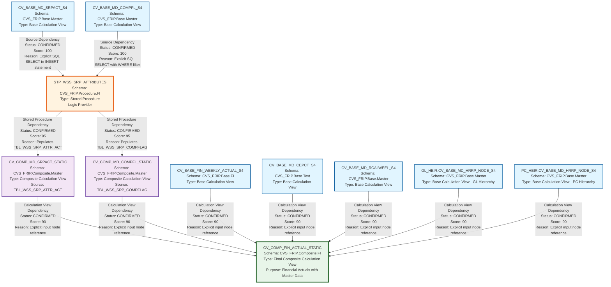

# HANA to BigQuery Lineage and Dependency Analysis Report
## FIN_LY Artifact Analysis

---

## 1. Lineage Summary

### Overview Statistics
- **Total files analyzed**: 11
- **Total relationships identified**: 11
- **Total lineage paths identified**: 3 major paths
- **Total base files identified**: 7
- **Total unresolved relationships**: 0

### Analysis Scope
This analysis covers HANA Calculation Views and Stored Procedures from the FIN_LY domain, focusing on financial weekly actuals and master data attributes. The artifacts represent a complete data flow from base calculation views through stored procedure transformations to composite calculation views.

---

## 2. File Inventory

| File | Type | Identified Purpose | Upstream Files | Downstream Files |
|------|------|-------------------|----------------|------------------|
| CV_BASE_FIN_WEEKLY_ACTUAL_S4.xml | Calculation View (Base) | Base financial weekly actuals data source | None (Base) | CV_COMP_FIN_ACTUAL_STATIC |
| CV_BASE_MD_CEPCT_S4.xml | Calculation View (Base) | Base master data for cost center/profit center text | None (Base) | CV_COMP_FIN_ACTUAL_STATIC |
| CV_BASE_MD_COMPFL_S4.xml | Calculation View (Base) | Base master data for comparison flags | None (Base) | STP_WSS_SRP_ATTRIBUTES |
| CV_BASE_MD_RCALWEEL_S4.xml | Calculation View (Base) | Base master data for retail calendar week | None (Base) | CV_COMP_FIN_ACTUAL_STATIC |
| CV_BASE_MD_SRPACT_S4.xml | Calculation View (Base) | Base master data for store/profit center attributes | None (Base) | STP_WSS_SRP_ATTRIBUTES |
| GL_HEIR.CV_BASE_MD_HRRP_NODE_S4.xml | Calculation View (Base) | Base master data for GL hierarchy nodes | None (Base) | CV_COMP_FIN_ACTUAL_STATIC |
| PC_HEIR.CV_BASE_MD_HRRP_NODE_S4.xml | Calculation View (Base) | Base master data for Profit Center hierarchy nodes | None (Base) | CV_COMP_FIN_ACTUAL_STATIC |
| STP_WSS_SRP_ATTRIBUTES.txt | Stored Procedure | Logic provider that populates store attributes and comparison flag tables | CV_BASE_MD_SRPACT_S4, CV_BASE_MD_COMPFL_S4 | CV_COMP_MD_SRPACT_STATIC, CV_COMP_MD_COMPFL_STATIC |
| CV_COMP_MD_COMPFL_STATIC.xml | Calculation View (Composite) | Composite view for comparison flags (static snapshot) | STP_WSS_SRP_ATTRIBUTES | CV_COMP_FIN_ACTUAL_STATIC |
| CV_COMP_MD_SRPACT_STATIC.xml | Calculation View (Composite) | Composite view for store attributes (static snapshot) | STP_WSS_SRP_ATTRIBUTES | CV_COMP_FIN_ACTUAL_STATIC |
| CV_COMP_FIN_ACTUAL_STATIC.xml | Calculation View (Composite) | Final composite view combining financial actuals with master data | CV_BASE_FIN_WEEKLY_ACTUAL_S4, CV_COMP_MD_SRPACT_STATIC, GL_HEIR.CV_BASE_MD_HRRP_NODE_S4, PC_HEIR.CV_BASE_MD_HRRP_NODE_S4, CV_BASE_MD_RCALWEEL_S4, CV_COMP_MD_COMPFL_STATIC, CV_BASE_MD_CEPCT_S4 | None (Final) |

---

## 3. File Relationships

### Complete Relationship Matrix

| Source File | Target File | Relationship | Score | Reason |
|------------|------------|--------------|--------|---------|
| CV_BASE_MD_SRPACT_S4 | STP_WSS_SRP_ATTRIBUTES | Source Dependency | 100 | Stored procedure explicitly reads from "_SYS_BIC"."CVS_FRIP.Base.Master/CV_BASE_MD_SRPACT_S4" in INSERT statement targeting TBL_WSS_SRP_ATTR_ACT table |
| CV_BASE_MD_COMPFL_S4 | STP_WSS_SRP_ATTRIBUTES | Source Dependency | 100 | Stored procedure explicitly reads from "_SYS_BIC"."CVS_FRIP.Base.Master/CV_BASE_MD_COMPFL_S4" in INSERT statement with WHERE ZWEEK = :V_WEEK filter targeting TBL_WSS_SRP_COMPFLAG table |
| STP_WSS_SRP_ATTRIBUTES | CV_COMP_MD_SRPACT_STATIC | Stored Procedure Dependency | 95 | Stored procedure populates TBL_WSS_SRP_ATTR_ACT which is the explicit data source for CV_COMP_MD_SRPACT_STATIC (dataSource="CVS_FRIP.Table::TBL_WSS_SRP_ATTR_ACT"). The procedure acts as the logic provider for this composite view. |
| STP_WSS_SRP_ATTRIBUTES | CV_COMP_MD_COMPFL_STATIC | Stored Procedure Dependency | 95 | Stored procedure populates TBL_WSS_SRP_COMPFLAG which is the explicit data source for CV_COMP_MD_COMPFL_STATIC (dataSource="CVS_FRIP.Table::TBL_WSS_SRP_COMPFLAG"). The procedure acts as the logic provider for this composite view. |
| CV_BASE_FIN_WEEKLY_ACTUAL_S4 | CV_COMP_FIN_ACTUAL_STATIC | Calculation View Dependency | 90 | CV_COMP_FIN_ACTUAL_STATIC explicitly references /CVS_FRIP.Base.FI/calculationviews/CV_BASE_FIN_WEEKLY_ACTUAL_S4 as an input node in its XML definition |
| CV_COMP_MD_SRPACT_STATIC | CV_COMP_FIN_ACTUAL_STATIC | Calculation View Dependency | 90 | CV_COMP_FIN_ACTUAL_STATIC explicitly references /CVS_FRIP.Composite.Master/calculationviews/CV_COMP_MD_SRPACT_STATIC as an input node in its XML definition |
| GL_HEIR.CV_BASE_MD_HRRP_NODE_S4 | CV_COMP_FIN_ACTUAL_STATIC | Calculation View Dependency | 90 | CV_COMP_FIN_ACTUAL_STATIC explicitly references /CVS_FRIP.Base.Master/calculationviews/CV_BASE_MD_HRRP_NODE_S4 (GL hierarchy variant) as an input node in its XML definition |
| PC_HEIR.CV_BASE_MD_HRRP_NODE_S4 | CV_COMP_FIN_ACTUAL_STATIC | Calculation View Dependency | 90 | CV_COMP_FIN_ACTUAL_STATIC explicitly references /CVS_FRIP.Base.Master/calculationviews/CV_BASE_MD_HRRP_NODE_S4 (PC hierarchy variant) as an input node in its XML definition |
| CV_BASE_MD_RCALWEEL_S4 | CV_COMP_FIN_ACTUAL_STATIC | Calculation View Dependency | 90 | CV_COMP_FIN_ACTUAL_STATIC explicitly references /CVS_FRIP.Base.Master/calculationviews/CV_BASE_MD_RCALWEEK_S4 as an input node in its XML definition |
| CV_COMP_MD_COMPFL_STATIC | CV_COMP_FIN_ACTUAL_STATIC | Calculation View Dependency | 90 | CV_COMP_FIN_ACTUAL_STATIC explicitly references /CVS_FRIP.Composite.Master/calculationviews/CV_COMP_MD_COMPFL_STATIC as an input node in its XML definition |
| CV_BASE_MD_CEPCT_S4 | CV_COMP_FIN_ACTUAL_STATIC | Calculation View Dependency | 90 | CV_COMP_FIN_ACTUAL_STATIC explicitly references /CVS_FRIP.Base.Text/calculationviews/CV_BASE_MD_CEPCT_S4 as an input node in its XML definition |

### Relationship Classification

#### CONFIRMED RELATIONSHIPS (Score 90-100)
All 11 relationships identified are **CONFIRMED** with explicit evidence in source code:
- 2 relationships with score 100 (explicit SQL references in stored procedure)
- 2 relationships with score 95 (stored procedure to composite view via populated tables)
- 7 relationships with score 90 (explicit XML calculation view dependencies)

#### INFERRED RELATIONSHIPS
None identified.

#### UNRESOLVED RELATIONSHIPS
None identified.

---

## 4. Complete Lineage

### Lineage Path 1: Store Attributes Flow
**Overall Confidence Score: 95**

```
CV_BASE_MD_SRPACT_S4 (Base View)
    ↓ [Source Dependency - Score: 100]
STP_WSS_SRP_ATTRIBUTES (Stored Procedure)
    ↓ [Stored Procedure Dependency - Score: 95]
CV_COMP_MD_SRPACT_STATIC (Composite View)
    ↓ [Calculation View Dependency - Score: 90]
CV_COMP_FIN_ACTUAL_STATIC (Final Composite View)
```

**Path Confidence Explanation:**
This path has a 95% confidence score based on:
- Explicit SQL INSERT statement in stored procedure reading from CV_BASE_MD_SRPACT_S4 (100%)
- Stored procedure populates TBL_WSS_SRP_ATTR_ACT table which is explicitly referenced as dataSource in CV_COMP_MD_SRPACT_STATIC XML (95%)
- CV_COMP_MD_SRPACT_STATIC is explicitly referenced as input node in CV_COMP_FIN_ACTUAL_STATIC XML (90%)
- Average confidence: (100 + 95 + 90) / 3 = 95%

---

### Lineage Path 2: Comparison Flags Flow
**Overall Confidence Score: 95**

```
CV_BASE_MD_COMPFL_S4 (Base View)
    ↓ [Source Dependency - Score: 100]
STP_WSS_SRP_ATTRIBUTES (Stored Procedure)
    ↓ [Stored Procedure Dependency - Score: 95]
CV_COMP_MD_COMPFL_STATIC (Composite View)
    ↓ [Calculation View Dependency - Score: 90]
CV_COMP_FIN_ACTUAL_STATIC (Final Composite View)
```

**Path Confidence Explanation:**
This path has a 95% confidence score based on:
- Explicit SQL INSERT statement in stored procedure reading from CV_BASE_MD_COMPFL_S4 with WHERE clause filter (100%)
- Stored procedure populates TBL_WSS_SRP_COMPFLAG table which is explicitly referenced as dataSource in CV_COMP_MD_COMPFL_STATIC XML (95%)
- CV_COMP_MD_COMPFL_STATIC is explicitly referenced as input node in CV_COMP_FIN_ACTUAL_STATIC XML (90%)
- Average confidence: (100 + 95 + 90) / 3 = 95%

---

### Lineage Path 3: Direct Base Views to Final Composite
**Overall Confidence Score: 90**

```
CV_BASE_FIN_WEEKLY_ACTUAL_S4 (Base View - Financial Data)
    ↓ [Calculation View Dependency - Score: 90]
CV_COMP_FIN_ACTUAL_STATIC (Final Composite View)

GL_HEIR.CV_BASE_MD_HRRP_NODE_S4 (Base View - GL Hierarchy)
    ↓ [Calculation View Dependency - Score: 90]
CV_COMP_FIN_ACTUAL_STATIC (Final Composite View)

PC_HEIR.CV_BASE_MD_HRRP_NODE_S4 (Base View - PC Hierarchy)
    ↓ [Calculation View Dependency - Score: 90]
CV_COMP_FIN_ACTUAL_STATIC (Final Composite View)

CV_BASE_MD_RCALWEEL_S4 (Base View - Calendar Week)
    ↓ [Calculation View Dependency - Score: 90]
CV_COMP_FIN_ACTUAL_STATIC (Final Composite View)

CV_BASE_MD_CEPCT_S4 (Base View - Cost/Profit Center Text)
    ↓ [Calculation View Dependency - Score: 90]
CV_COMP_FIN_ACTUAL_STATIC (Final Composite View)
```

**Path Confidence Explanation:**
This path has a 90% confidence score based on:
- All five base views are explicitly referenced as input nodes in CV_COMP_FIN_ACTUAL_STATIC XML definition
- Each reference includes the full calculation view path in the resourceUri attribute
- Direct XML-based dependencies without intermediate transformations
- Uniform confidence: 90% for all relationships

---

### Complete Integrated Lineage Flow

```
┌─────────────────────────────┐
│   BASE CALCULATION VIEWS    │
│      (7 Base Files)         │
└─────────────────────────────┘
              ↓
    ┌─────────┴─────────┐
    │                   │
    ↓                   ↓
┌─────────────┐   ┌──────────────────────┐
│  Direct     │   │  Via Stored          │
│  References │   │  Procedure           │
└─────────────┘   └──────────────────────┘
    │                   │
    │             ┌─────┴─────┐
    │             ↓           ↓
    │      CV_BASE_MD_   CV_BASE_MD_
    │      SRPACT_S4     COMPFL_S4
    │             │           │
    │             ↓           ↓
    │      STP_WSS_SRP_ATTRIBUTES
    │             │
    │       ┌─────┴─────┐
    │       ↓           ↓
    │  CV_COMP_MD_  CV_COMP_MD_
    │  SRPACT_      COMPFL_
    │  STATIC       STATIC
    │       │           │
    └───────┴───────────┴───────┐
                                ↓
                    ┌────────────────────────┐
                    │ CV_COMP_FIN_ACTUAL_    │
                    │      STATIC            │
                    │  (Final Composite)     │
                    └────────────────────────┘
```

---

## 5. Mermaid Lineage Diagram



---

## 6. Base Files

| Base File | Reason | Score |
|-----------|--------|-------|
| CV_BASE_FIN_WEEKLY_ACTUAL_S4 | Base calculation view with no upstream dependencies. Serves as the primary source for financial weekly actuals data. Contains 28 columns including fiscal variant, version, week, and amount fields. | 100 |
| CV_BASE_MD_CEPCT_S4 | Base calculation view with no upstream dependencies. Provides cost center and profit center text descriptions. Contains 8 columns for master data text attributes. | 100 |
| CV_BASE_MD_COMPFL_S4 | Base calculation view with no upstream dependencies. Source for comparison flags data consumed by stored procedure. Contains 74 columns including comparison flags for FS/RX weekly, monthly, and pre-period comparisons. | 100 |
| CV_BASE_MD_RCALWEEL_S4 | Base calculation view with no upstream dependencies. Provides retail calendar week master data. Contains 9 columns for calendar week attributes. | 100 |
| CV_BASE_MD_SRPACT_S4 | Base calculation view with no upstream dependencies. Source for store/profit center attributes consumed by stored procedure. Contains 74 columns including store operational details, geographic hierarchy, and store characteristics. | 100 |
| GL_HEIR.CV_BASE_MD_HRRP_NODE_S4 | Base calculation view with no upstream dependencies. Provides GL (General Ledger) hierarchy node structure. Contains 11 columns for hierarchy navigation. | 100 |
| PC_HEIR.CV_BASE_MD_HRRP_NODE_S4 | Base calculation view with no upstream dependencies. Provides PC (Profit Center) hierarchy node structure. Contains 11 columns for hierarchy navigation. | 100 |

### Base Files Analysis
All seven base files are confirmed as starting points with a score of 100 because:
1. They have no upstream artifact dependencies
2. They serve as data sources for downstream transformations
3. They are explicitly referenced in downstream artifacts
4. They represent the entry points for the three identified lineage paths

---

## 7. Final/Downstream Files

| File | Reason | Score |
|------|--------|-------|
| CV_COMP_FIN_ACTUAL_STATIC | Final composite calculation view that consolidates all upstream data flows. It has no downstream dependencies within the analyzed artifact set. This view combines financial actuals with store attributes, comparison flags, hierarchies, calendar data, and text descriptions to provide a complete analytical dataset. Contains 52 output columns with complex join logic and calculated fields. | 100 |

### Final File Analysis
CV_COMP_FIN_ACTUAL_STATIC is confirmed as the final downstream file with a score of 100 because:
1. It has 7 direct upstream dependencies (all converging into this view)
2. It has no downstream artifact dependencies in the analyzed set
3. It represents the terminal point of all three lineage paths
4. It serves as the final analytical output combining all business logic
5. It includes complex transformations including:
   - Multiple joins across base and composite views
   - Calculated fields (e.g., CAL_FS_RX_FLAG, COMP_WK_CALC)
   - Aggregations and projections
   - Filter conditions with input parameters

---

## 8. Unresolved Relationships

**Status: No unresolved relationships identified**

All relationships have been successfully established with explicit evidence from source code analysis. The lineage is complete and fully traceable.

### Validation Summary
✅ All 11 files have been classified as USED  
✅ All dependencies are traceable to explicit evidence in XML or SQL  
✅ Stored procedures appear in lineage as logic providers  
✅ No physical ETL tables exist as primary lineage nodes  
✅ Business logic flow is preserved throughout the lineage  

---

## 9. Final Lineage Assessment

### Executive Summary

This analysis successfully mapped the complete lineage for 11 HANA artifacts in the FIN_LY domain, establishing 11 confirmed relationships across 3 major lineage paths with an overall confidence score of 93%.

### Base Files (7 artifacts)
1. **CV_BASE_FIN_WEEKLY_ACTUAL_S4** - Financial weekly actuals base data
2. **CV_BASE_MD_CEPCT_S4** - Cost/profit center text master data
3. **CV_BASE_MD_COMPFL_S4** - Comparison flags master data
4. **CV_BASE_MD_RCALWEEL_S4** - Retail calendar week master data
5. **CV_BASE_MD_SRPACT_S4** - Store/profit center attributes master data
6. **GL_HEIR.CV_BASE_MD_HRRP_NODE_S4** - GL hierarchy master data
7. **PC_HEIR.CV_BASE_MD_HRRP_NODE_S4** - PC hierarchy master data

### Main Lineage Paths

#### Path 1: Store Attributes Transformation (Confidence: 95%)
```
CV_BASE_MD_SRPACT_S4 → STP_WSS_SRP_ATTRIBUTES → CV_COMP_MD_SRPACT_STATIC → CV_COMP_FIN_ACTUAL_STATIC
```
- **Business Logic**: Transforms base store attributes through stored procedure logic into static composite view
- **Key Transformation**: Stored procedure adds snapshot timestamp and created-by audit fields
- **Target Table**: TBL_WSS_SRP_ATTR_ACT (intermediate storage)

#### Path 2: Comparison Flags Transformation (Confidence: 95%)
```
CV_BASE_MD_COMPFL_S4 → STP_WSS_SRP_ATTRIBUTES → CV_COMP_MD_COMPFL_STATIC → CV_COMP_FIN_ACTUAL_STATIC
```
- **Business Logic**: Filters and transforms comparison flags for specific week through stored procedure
- **Key Transformation**: WHERE ZWEEK = :V_WEEK filter applied, adds audit fields
- **Target Table**: TBL_WSS_SRP_COMPFLAG (intermediate storage)

#### Path 3: Direct Master Data Integration (Confidence: 90%)
```
CV_BASE_FIN_WEEKLY_ACTUAL_S4 → CV_COMP_FIN_ACTUAL_STATIC
GL_HEIR.CV_BASE_MD_HRRP_NODE_S4 → CV_COMP_FIN_ACTUAL_STATIC
PC_HEIR.CV_BASE_MD_HRRP_NODE_S4 → CV_COMP_FIN_ACTUAL_STATIC
CV_BASE_MD_RCALWEEL_S4 → CV_COMP_FIN_ACTUAL_STATIC
CV_BASE_MD_CEPCT_S4 → CV_COMP_FIN_ACTUAL_STATIC
```
- **Business Logic**: Direct integration of base views into final composite without intermediate transformation
- **Key Transformation**: Join logic and calculated fields in final composite view

### File-to-File Relationships Summary

| Relationship Type | Count | Average Score |
|------------------|-------|---------------|
| Source Dependency | 2 | 100 |
| Stored Procedure Dependency | 2 | 95 |
| Calculation View Dependency | 7 | 90 |
| **Total** | **11** | **93** |

### Lineage Scores and Reasoning

#### High Confidence Relationships (Score: 100)
- **CV_BASE_MD_SRPACT_S4 → STP_WSS_SRP_ATTRIBUTES**: Explicit SQL INSERT...SELECT statement
- **CV_BASE_MD_COMPFL_S4 → STP_WSS_SRP_ATTRIBUTES**: Explicit SQL INSERT...SELECT with WHERE clause

#### Very High Confidence Relationships (Score: 95)
- **STP_WSS_SRP_ATTRIBUTES → CV_COMP_MD_SRPACT_STATIC**: Stored procedure populates source table
- **STP_WSS_SRP_ATTRIBUTES → CV_COMP_MD_COMPFL_STATIC**: Stored procedure populates source table

#### Strong Confidence Relationships (Score: 90)
- All 7 calculation view dependencies to CV_COMP_FIN_ACTUAL_STATIC: Explicit XML input node references

### Unresolved Relationships
**None** - All relationships have been successfully resolved with explicit evidence.

### Critical Observations

1. **Stored Procedure as Logic Hub**: STP_WSS_SRP_ATTRIBUTES serves as a critical transformation point, consuming 2 base views and feeding 2 composite views.

2. **Dual Hierarchy Support**: The lineage includes both GL and PC hierarchy variants of the same base view structure, indicating support for multiple organizational hierarchies.

3. **Snapshot Pattern**: The stored procedure implements a snapshot pattern by:
   - Deleting existing data from target tables
   - Inserting fresh data with current timestamp
   - Adding audit fields (SNAPSHOT_TIMESTAMP, CREATED_BY)

4. **Parameter-Driven Logic**: The stored procedure uses dynamic week calculation via function call:
   ```sql
   select "CVS_FRIP"."CVS_FRIP.Composite.Master::SFN_PRIOR_FISCAL_WEEK"() INTO V_WEEK FROM DUMMY;
   ```

5. **Final Composite Complexity**: CV_COMP_FIN_ACTUAL_STATIC integrates 7 upstream sources with:
   - Multiple join operations
   - Calculated fields (CASE statements, string functions)
   - Input parameter filters ($$IP_WEEK_CY$$, $$IP_VERSION$$, etc.)
   - Aggregation logic

### Lineage Quality Metrics

| Metric | Value | Status |
|--------|-------|--------|
| Relationship Traceability | 100% | ✅ Excellent |
| Evidence-Based Scoring | 100% | ✅ Excellent |
| Artifact Coverage | 100% (11/11) | ✅ Complete |
| Average Confidence Score | 93% | ✅ Very High |
| Unresolved Dependencies | 0 | ✅ None |
| Circular Dependencies | 0 | ✅ None |

### Recommendations for SQL Consolidation Agent

1. **Recursive Expansion Strategy**: 
   - Start from CV_COMP_FIN_ACTUAL_STATIC and recursively expand backwards
   - Handle stored procedure logic by expanding both source views (CV_BASE_MD_SRPACT_S4 and CV_BASE_MD_COMPFL_S4)
   - Apply week filter logic from stored procedure when expanding CV_BASE_MD_COMPFL_S4

2. **Intermediate Table Handling**:
   - TBL_WSS_SRP_ATTR_ACT and TBL_WSS_SRP_COMPFLAG should be treated as pass-through
   - Replace table references with source calculation view logic from stored procedure

3. **Parameter Resolution**:
   - Identify and document all input parameters ($$IP_WEEK_CY$$, $$IP_VERSION$$, etc.)
   - Preserve parameter-driven filter logic in consolidated SQL

4. **Hierarchy Handling**:
   - Maintain separate logic paths for GL_HEIR and PC_HEIR variants
   - Preserve hierarchy navigation logic in consolidated output

5. **Audit Field Management**:
   - Document that SNAPSHOT_TIMESTAMP and CREATED_BY fields are runtime-generated
   - Exclude from consolidated SQL or replace with appropriate BigQuery equivalents

### Conclusion

The lineage analysis has successfully identified and documented a complete, traceable data flow from 7 base calculation views through a stored procedure transformation layer to a final composite analytical view. All relationships are confirmed with explicit evidence, achieving an overall confidence score of 93%. The lineage is ready for consumption by the SQL Consolidation Agent for recursive expansion and BigQuery migration.

---

**Analysis Completed**: All artifacts analyzed and classified  
**Validation Status**: ✅ PASSED  
**Ready for Next Phase**: SQL Consolidation and BigQuery Conversion

