# HANA Data Lineage and Dependency Analysis Report
## CVS FRIP Flash Sales Reporting System

---

## 1. Lineage Summary

| Metric | Count |
|--------|-------|
| **Total Files Analyzed** | 32 |
| **Total Relationships Identified** | 47 |
| **Total Lineage Paths Identified** | 5 |
| **Total Base Files Identified** | 12 |
| **Total Unresolved Relationships** | 3 |

---

## 2. File Inventory

| File | Type | Identified Purpose | Upstream Files | Downstream Files |
|------|------|-------------------|----------------|------------------|
| **CV_BASE_FIN_WEEKLY_BUDGET_S4.txt** | Calculation View (XML) | Base view for Store Reporting Financials Budget frozen DSO - DS05 (Weekly Snapshot). Provides budget data with frozen/live cube logic. | AZSRP_DS052_VT_S4 (DB Table), AZSRP_DS041_VT_S4 (DB Table) | CV_BASE_MD_RCAIWEEK_S4 |
| **CV_BASE_MD_CEPCT_S4.txt** | Calculation View (XML) | Base master data view for profit center text/descriptions | Unknown DB Table | CV_BASE_MD_RCAIWEEK_S4, xml_acc_cv_comp_fin_flash |
| **CV_BASE_MD_HRRP_NODE_S4.txt** | Calculation View (XML) | Base master data view for hierarchy node data (CORE_RET filtering) | Unknown DB Table | CV_BASE_MD_RCAIWEEK_S4, xml_acc_cv_comp_fin_flash |
| **CV_BASE_MD_RCAIWEEK_S4.txt** | Calculation View (XML) | Base master data view for retail calendar week information | Unknown DB Table | xml_acc_cv_comp_fin_flash |
| **CV_COMP_FIN_BUDGET_STATIC.txt** | Calculation View (XML) | Composite view for budget static data from table TBL_WSS_SRP_COMPFLAG | CVS_FRIP.Table::TBL_WSS_SRP_COMPFLAG | xml_acc_cv_cons_weekly_flash_report_static |
| **CV_COMP_MD_COMPFL_STATIC.txt** | Calculation View (XML) | Composite master data view for comp flag static data from table TBL_WSS_SRP_COMPFLAG | CVS_FRIP.Table::TBL_WSS_SRP_COMPFLAG | STP_WSS_SRP_ATTRIBUTES |
| **CV_COMP_MD_SRPACT_STATIC.txt** | Calculation View (XML) | Composite master data view for store attributes static data from table TBL_WSS_SRP_ATTR_ACT | CVS_FRIP.Table::TBL_WSS_SRP_ATTR_ACT | CV_BASE_MD_RCAIWEEK_S4 |
| **sql-procedure-acc-CVS_FRIP-Procedure-FI--STP_WSS_FLASH_SALES.txt** | SQL Stored Procedure | Main procedure to take snapshot of CAR data every Monday at 5am. Loads flash sales data from CV_COMP_FIN_FLASH into TBL_WSS_FLASH_SALES | CV_COMP_FIN_FLASH (via _SYS_BIC) | CVS_FRIP.Table::TBL_WSS_FLASH_SALES |
| **STP_WSS_SRP_ATTRIBUTES.txt** | SQL Stored Procedure | Procedure to insert store attributes and comp flag data into static tables | CV_BASE_MD_SRPACT_S4, CV_BASE_MD_COMPFL_S4 | TBL_WSS_SRP_ATTR_ACT, TBL_WSS_SRP_COMPFLAG |
| **xml_acc_cv_base-FS_SALES-tlogf.txt** | Calculation View (XML) | Base view for Front Store (FS) sales from TLOGF transaction log | TLOGF (DB Table via SAPCAR) | xml_acc_cv_comp_flash_sales-VT-table-CV |
| **xml_acc_cv_base_MD_RCALWEEK_S4.txt** | Calculation View (XML) | Base master data view for retail calendar week with S4 data | Unknown DB Table | xml_acc_cv_comp_fin_flash |
| **xml_acc_cv_base_NAVIX.txt** | Calculation View (XML) | Base view for NAVIX data (store/navigation information) | NAVIX (DB Table via SAPCAR) | xml_acc_cv_comp_flash_sales-VT-table-CV |
| **xml_acc_cv_base_parameters-FS-RETAIL_TYPE-ztfirp_flash_prm.txt** | Calculation View (XML) | Base parameters view for FS retail type codes | CV_BASE_PARAMETERS (via SAPCAR) | xml_acc_cv_comp_flash_sales-VT-table-CV |
| **xml_acc_cv_base_parameters-FS_DISCOUNT_TYPES.txt** | Calculation View (XML) | Base parameters view for FS discount type codes | CV_BASE_PARAMETERS (via SAPCAR) | xml_acc_cv_comp_flash_sales-VT-table-CV |
| **xml_acc_cv_base_parameters-FS_RETAIL_TYPES.xml** | Calculation View (XML) | Base parameters view for FS retail type codes (XML format) | CV_BASE_PARAMETERS (via SAPCAR) | xml_acc_cv_comp_flash_sales-VT-table-CV |
| **xml_acc_cv_base_parameters-RX_RETAIL_TYPES-COVID.txt** | Calculation View (XML) | Base parameters view for RX retail type codes specific to COVID | CV_BASE_PARAMETERS (via SAPCAR) | xml_acc_cv_comp_flash_sales-VT-table-CV |
| **xml_acc_cv_base_parameters-RX_RETAIL_TYPES.txt** | Calculation View (XML) | Base parameters view for RX retail type codes | CV_BASE_PARAMETERS (via SAPCAR) | xml_acc_cv_comp_flash_sales-VT-table-CV |
| **xml_acc_cv_base_SCRIPTS-tlogf_x.txt** | Calculation View (XML) | Base view for prescription scripts from TLOGF_X transaction log | TLOGF_X (DB Table via SAPCAR) | xml_acc_cv_comp_flash_sales-VT-table-CV |
| **xml_acc_cv_base_tlogf-EMP_DISCOUNT.txt** | Calculation View (XML) | Base view for employee discount transactions from TLOGF | TLOGF (DB Table via SAPCAR) | xml_acc_cv_comp_flash_sales-VT-table-CV |
| **xml_acc_cv_base_tlogf-EMP_DISCOUNTS.txt** | Calculation View (XML) | Base view for employee discounts (plural) from TLOGF | TLOGF (DB Table via SAPCAR) | xml_acc_cv_comp_flash_sales-VT-table-CV |
| **xml_acc_cv_base_tlogf-EMP_DISC_TYPES.txt** | Calculation View (XML) | Base view for employee discount types from TLOGF | TLOGF (DB Table via SAPCAR) | xml_acc_cv_comp_flash_sales-VT-table-CV |
| **xml_acc_cv_base_tlogf-FS-DISCOUNT.txt** | Calculation View (XML) | Base view for Front Store discount transactions from TLOGF | TLOGF (DB Table via SAPCAR) | xml_acc_cv_comp_flash_sales-VT-table-CV |
| **xml_acc_cv_base_tlogf-FS_SALES.xml** | Calculation View (XML) | Base view for Front Store sales from TLOGF (XML format) | TLOGF (DB Table via SAPCAR) | xml_acc_cv_comp_flash_sales-VT-table-CV |
| **xml_acc_cv_base_tlogf-RX_SALES.txt** | Calculation View (XML) | Base view for Pharmacy (RX) sales from TLOGF | TLOGF (DB Table via SAPCAR) | xml_acc_cv_comp_flash_sales-VT-table-CV |
| **xml_acc_cv_base_tlogf_COVID_sales.txt** | Calculation View (XML) | Base view for COVID-related sales from TLOGF_COVID | TLOGF_COVID (DB Table via SAPCAR) | xml_acc_cv_comp_flash_sales-VT-table-CV |
| **xml_acc_cv_base_tlogf_x-SCRIPTS.xml** | Calculation View (XML) | Base view for prescription scripts from TLOGF_X (XML format) | TLOGF_X (DB Table via SAPCAR) | xml_acc_cv_comp_flash_sales-VT-table-CV |
| **xml_acc_cv_comp_fin_flash.txt** | Calculation View (XML) | Composite financial flash view combining CAR flash sales with master data | xml_acc_cv_comp_flash_sales-VT-table-CV, CV_BASE_MD_RCALWEEK_S4, CV_BASE_MD_COMPFL_S4, CV_BASE_MD_HRRP_NODE_S4, CV_BASE_MD_SRPACT_S4, CV_BASE_MD_CEPCT_S4 | STP_WSS_FLASH_SALES |
| **xml_acc_cv_comp_fin_flash_combined_static.txt** | Calculation View (XML) | Composite view combining flash static data with budget and other static sources | xml_acc_cv_comp_fin_flash_static_tbl_wss_flash_sales, CV_COMP_FIN_BUDGET_STATIC, and others | xml_acc_cv_cons_weekly_flash_report_static |
| **xml_acc_cv_comp_fin_flash_static_tbl_wss_flash_sales.txt** | Calculation View (XML) | Composite view reading from static table TBL_WSS_FLASH_SALES with timestamp filtering | CVS_FRIP.Table::TBL_WSS_FLASH_SALES | xml_acc_cv_comp_fin_flash_combined_static |
| **xml_acc_cv_comp_flash_sales-VT-table-CV.txt** | Calculation View (XML) | Composite view for CAR flash sales combining NAVIX, TLOGF, TLOGF_X, parameters, and COVID data | xml_acc_cv_base_NAVIX, xml_acc_cv_base-FS_SALES-tlogf, xml_acc_cv_base_SCRIPTS-tlogf_x, xml_acc_cv_base_parameters (multiple), xml_acc_cv_base_tlogf (multiple), xml_acc_cv_base_tlogf_COVID_sales | xml_acc_cv_comp_fin_flash |
| **xml_acc_cv_cons_weekly_flash_report_static.txt** | Calculation View (XML) | Consolidated weekly flash report view from combined static data | xml_acc_cv_comp_fin_flash_combined_static | Final Reporting Layer |
| **xml_acc_FLASH_SALES_VT_CAR.txt** | Calculation View (XML) | Virtual table view for flash sales from CAR system | Unknown | Unresolved |

---

## 3. File Relationships

| Source File | Target File | Relationship | Score | Reason |
|-------------|-------------|--------------|-------|--------|
| **AZSRP_DS052_VT_S4** (DB Table) | CV_BASE_FIN_WEEKLY_BUDGET_S4.txt | Data Source | 98 | Explicitly defined as DataSource in calculation view with schema CVS_FRIP and direct column mappings in Frozen_Cube projection |
| **AZSRP_DS041_VT_S4** (DB Table) | CV_BASE_FIN_WEEKLY_BUDGET_S4.txt | Data Source | 98 | Explicitly defined as DataSource in calculation view with schema CVS_FRIP and direct column mappings in Live_Cube projection |
| CV_BASE_FIN_WEEKLY_BUDGET_S4.txt | CV_BASE_MD_RCAIWEEK_S4.txt | Referenced Dependency | 96 | CV_BASE_MD_RCAIWEEK_S4 explicitly references CV_BASE_FIN_WEEKLY_BUDGET_S4 in its dataSources section with path /CVS_FRIP.Base.FI/calculationviews/CV_BASE_FIN_WEEKLY_BUDGET_S4 |
| CV_BASE_MD_HRRP_NODE_S4.txt | CV_BASE_MD_RCAIWEEK_S4.txt | Referenced Dependency | 96 | CV_BASE_MD_RCAIWEEK_S4 explicitly references CV_BASE_MD_HRRP_NODE_S4 in its dataSources section with path /CVS_FRIP.Base.Master/calculationviews/CV_BASE_MD_HRRP_NODE_S4 |
| CV_COMP_MD_SRPACT_STATIC.txt | CV_BASE_MD_RCAIWEEK_S4.txt | Referenced Dependency | 96 | CV_BASE_MD_RCAIWEEK_S4 explicitly references CV_COMP_MD_SRPACT_STATIC in its dataSources section with path /CVS_FRIP.Composite.Master/calculationviews/CV_COMP_MD_SRPACT_STATIC |
| CV_COMP_MD_COMPFL_STATIC.txt | CV_BASE_MD_RCAIWEEK_S4.txt | Referenced Dependency | 96 | CV_BASE_MD_RCAIWEEK_S4 explicitly references CV_COMP_MD_COMPFL_STATIC in its dataSources section with path /CVS_FRIP.Composite.Master/calculationviews/CV_COMP_MD_COMPFL_STATIC |
| CV_BASE_MD_RCALWEEK_S4.txt | CV_BASE_MD_RCAIWEEK_S4.txt | Referenced Dependency | 96 | CV_BASE_MD_RCAIWEEK_S4 explicitly references CV_BASE_MD_RCALWEEK_S4 in its dataSources section with path /CVS_FRIP.Base.Master/calculationviews/CV_BASE_MD_RCALWEEK_S4 |
| CV_BASE_MD_CEPCT_S4.txt | CV_BASE_MD_RCAIWEEK_S4.txt | Referenced Dependency | 96 | CV_BASE_MD_RCAIWEEK_S4 explicitly references CV_BASE_MD_CEPCT_S4 in its dataSources section with path /CVS_FRIP.Base.Text/calculationviews/CV_BASE_MD_CEPCT_S4 |
| **TBL_WSS_SRP_COMPFLAG** (DB Table) | CV_COMP_FIN_BUDGET_STATIC.txt | Data Source | 98 | Explicitly defined as DataSource with table reference CVS_FRIP.Table::TBL_WSS_SRP_COMPFLAG |
| **TBL_WSS_SRP_COMPFLAG** (DB Table) | CV_COMP_MD_COMPFL_STATIC.txt | Data Source | 98 | Explicitly defined as DataSource with table reference CVS_FRIP.Table::TBL_WSS_SRP_COMPFLAG |
| **TBL_WSS_SRP_ATTR_ACT** (DB Table) | CV_COMP_MD_SRPACT_STATIC.txt | Data Source | 98 | Explicitly defined as DataSource with table reference CVS_FRIP.Table::TBL_WSS_SRP_ATTR_ACT |
| xml_acc_cv_comp_fin_flash.txt | STP_WSS_FLASH_SALES | Data Source (Procedure Input) | 98 | Procedure explicitly queries FROM "_SYS_BIC"."CVS_FRIP.Composite.FI/CV_COMP_FIN_FLASH" with placeholder parameters for week ending dates and update timestamps |
| STP_WSS_FLASH_SALES | **TBL_WSS_FLASH_SALES** (DB Table) | Data Target (Procedure Output) | 98 | Procedure explicitly performs DELETE and INSERT INTO "CVS_FRIP"."CVS_FRIP.Table::TBL_WSS_FLASH_SALES" operations |
| **CV_BASE_MD_SRPACT_S4** (via _SYS_BIC) | STP_WSS_SRP_ATTRIBUTES | Data Source (Procedure Input) | 98 | Procedure explicitly queries FROM "_SYS_BIC"."CVS_FRIP.Base.Master/CV_BASE_MD_SRPACT_S4" |
| **CV_BASE_MD_COMPFL_S4** (via _SYS_BIC) | STP_WSS_SRP_ATTRIBUTES | Data Source (Procedure Input) | 98 | Procedure explicitly queries FROM "_SYS_BIC"."CVS_FRIP.Base.Master/CV_BASE_MD_COMPFL_S4" with WHERE ZWEEK filter |
| STP_WSS_SRP_ATTRIBUTES | **TBL_WSS_SRP_ATTR_ACT** (DB Table) | Data Target (Procedure Output) | 98 | Procedure explicitly performs DELETE and INSERT INTO "CVS_FRIP"."CVS_FRIP.Table::TBL_WSS_SRP_ATTR_ACT" |
| STP_WSS_SRP_ATTRIBUTES | **TBL_WSS_SRP_COMPFLAG** (DB Table) | Data Target (Procedure Output) | 98 | Procedure explicitly performs DELETE and INSERT INTO "CVS_FRIP"."CVS_FRIP.Table::TBL_WSS_SRP_COMPFLAG" |
| **NAVIX** (DB Table via SAPCAR) | xml_acc_cv_base_NAVIX.txt | Data Source | 92 | Referenced as /SAPCAR.CVS_FRIP.Base/calculationviews/CV_BASE_NAVIX in dataSources section |
| **TLOGF** (DB Table via SAPCAR) | xml_acc_cv_base-FS_SALES-tlogf.txt | Data Source | 92 | Referenced as /SAPCAR.CVS_FRIP.Base/calculationviews/CV_BASE_TLOGF in dataSources section with FS sales filtering |
| **TLOGF** (DB Table via SAPCAR) | xml_acc_cv_base_tlogf-EMP_DISCOUNT.txt | Data Source | 92 | Referenced as /SAPCAR.CVS_FRIP.Base/calculationviews/CV_BASE_TLOGF in dataSources section |
| **TLOGF** (DB Table via SAPCAR) | xml_acc_cv_base_tlogf-EMP_DISCOUNTS.txt | Data Source | 92 | Referenced as /SAPCAR.CVS_FRIP.Base/calculationviews/CV_BASE_TLOGF in dataSources section |
| **TLOGF** (DB Table via SAPCAR) | xml_acc_cv_base_tlogf-EMP_DISC_TYPES.txt | Data Source | 92 | Referenced as /SAPCAR.CVS_FRIP.Base/calculationviews/CV_BASE_TLOGF in dataSources section |
| **TLOGF** (DB Table via SAPCAR) | xml_acc_cv_base_tlogf-FS-DISCOUNT.txt | Data Source | 92 | Referenced as /SAPCAR.CVS_FRIP.Base/calculationviews/CV_BASE_TLOGF in dataSources section |
| **TLOGF** (DB Table via SAPCAR) | xml_acc_cv_base_tlogf-FS_SALES.xml | Data Source | 92 | Referenced as /SAPCAR.CVS_FRIP.Base/calculationviews/CV_BASE_TLOGF in dataSources section |
| **TLOGF** (DB Table via SAPCAR) | xml_acc_cv_base_tlogf-RX_SALES.txt | Data Source | 92 | Referenced as /SAPCAR.CVS_FRIP.Base/calculationviews/CV_BASE_TLOGF in dataSources section |
| **TLOGF_X** (DB Table via SAPCAR) | xml_acc_cv_base_SCRIPTS-tlogf_x.txt | Data Source | 92 | Referenced as /SAPCAR.CVS_FRIP.Base/calculationviews/CV_BASE_TLOGF_X in dataSources section |
| **TLOGF_X** (DB Table via SAPCAR) | xml_acc_cv_base_tlogf_x-SCRIPTS.xml | Data Source | 92 | Referenced as /SAPCAR.CVS_FRIP.Base/calculationviews/CV_BASE_TLOGF_X in dataSources section |
| **TLOGF_COVID** (DB Table via SAPCAR) | xml_acc_cv_base_tlogf_COVID_sales.txt | Data Source | 92 | Referenced as /SAPCAR.CVS_FRIP.Base/calculationviews/CV_BASE_TLOGF_COVID in dataSources section |
| **CV_BASE_PARAMETERS** (via SAPCAR) | xml_acc_cv_base_parameters-FS-RETAIL_TYPE-ztfirp_flash_prm.txt | Data Source | 92 | Referenced as /SAPCAR.CVS_FRIP.Base/calculationviews/CV_BASE_PARAMETERS in dataSources section |
| **CV_BASE_PARAMETERS** (via SAPCAR) | xml_acc_cv_base_parameters-FS_DISCOUNT_TYPES.txt | Data Source | 92 | Referenced as /SAPCAR.CVS_FRIP.Base/calculationviews/CV_BASE_PARAMETERS in dataSources section |
| **CV_BASE_PARAMETERS** (via SAPCAR) | xml_acc_cv_base_parameters-FS_RETAIL_TYPES.xml | Data Source | 92 | Referenced as /SAPCAR.CVS_FRIP.Base/calculationviews/CV_BASE_PARAMETERS in dataSources section |
| **CV_BASE_PARAMETERS** (via SAPCAR) | xml_acc_cv_base_parameters-RX_RETAIL_TYPES-COVID.txt | Data Source | 92 | Referenced as /SAPCAR.CVS_FRIP.Base/calculationviews/CV_BASE_PARAMETERS in dataSources section |
| **CV_BASE_PARAMETERS** (via SAPCAR) | xml_acc_cv_base_parameters-RX_RETAIL_TYPES.txt | Data Source | 92 | Referenced as /SAPCAR.CVS_FRIP.Base/calculationviews/CV_BASE_PARAMETERS in dataSources section |
| xml_acc_cv_base_NAVIX.txt | xml_acc_cv_comp_flash_sales-VT-table-CV.txt | Referenced Dependency | 96 | xml_acc_cv_comp_flash_sales explicitly references /SAPCAR.CVS_FRIP.Base/calculationviews/CV_BASE_NAVIX in dataSources |
| xml_acc_cv_base-FS_SALES-tlogf.txt | xml_acc_cv_comp_flash_sales-VT-table-CV.txt | Referenced Dependency | 96 | xml_acc_cv_comp_flash_sales explicitly references /SAPCAR.CVS_FRIP.Base/calculationviews/CV_BASE_TLOGF in dataSources (FS_SALES variant) |
| xml_acc_cv_base_SCRIPTS-tlogf_x.txt | xml_acc_cv_comp_flash_sales-VT-table-CV.txt | Referenced Dependency | 96 | xml_acc_cv_comp_flash_sales explicitly references /SAPCAR.CVS_FRIP.Base/calculationviews/CV_BASE_TLOGF_X in dataSources (SCRIPTS variant) |
| xml_acc_cv_base_parameters-FS-RETAIL_TYPE-ztfirp_flash_prm.txt | xml_acc_cv_comp_flash_sales-VT-table-CV.txt | Referenced Dependency | 96 | xml_acc_cv_comp_flash_sales explicitly references /SAPCAR.CVS_FRIP.Base/calculationviews/CV_BASE_PARAMETERS in dataSources |
| xml_acc_cv_base_parameters-FS_DISCOUNT_TYPES.txt | xml_acc_cv_comp_flash_sales-VT-table-CV.txt | Referenced Dependency | 96 | xml_acc_cv_comp_flash_sales explicitly references /SAPCAR.CVS_FRIP.Base/calculationviews/CV_BASE_PARAMETERS in dataSources |
| xml_acc_cv_base_parameters-RX_RETAIL_TYPES.txt | xml_acc_cv_comp_flash_sales-VT-table-CV.txt | Referenced Dependency | 96 | xml_acc_cv_comp_flash_sales explicitly references /SAPCAR.CVS_FRIP.Base/calculationviews/CV_BASE_PARAMETERS in dataSources |
| xml_acc_cv_base_tlogf_COVID_sales.txt | xml_acc_cv_comp_flash_sales-VT-table-CV.txt | Referenced Dependency | 96 | xml_acc_cv_comp_flash_sales explicitly references /SAPCAR.CVS_FRIP.Base/calculationviews/CV_BASE_TLOGF_COVID in dataSources |
| xml_acc_cv_comp_flash_sales-VT-table-CV.txt | xml_acc_cv_comp_fin_flash.txt | Referenced Dependency | 96 | xml_acc_cv_comp_fin_flash explicitly references /CVS_FRIP.Base.FI/calculationviews/CV_BASE_FIN_FLASH_SALES_CAR in dataSources |
| CV_BASE_MD_RCALWEEK_S4.txt | xml_acc_cv_comp_fin_flash.txt | Referenced Dependency | 96 | xml_acc_cv_comp_fin_flash explicitly references /CVS_FRIP.Base.Master/calculationviews/CV_BASE_MD_RCALWEEK_S4 in dataSources |
| CV_COMP_MD_COMPFL_STATIC.txt | xml_acc_cv_comp_fin_flash.txt | Referenced Dependency | 96 | xml_acc_cv_comp_fin_flash explicitly references /CVS_FRIP.Base.Master/calculationviews/CV_BASE_MD_COMPFL_S4 in dataSources |
| CV_BASE_MD_HRRP_NODE_S4.txt | xml_acc_cv_comp_fin_flash.txt | Referenced Dependency | 96 | xml_acc_cv_comp_fin_flash explicitly references /CVS_FRIP.Base.Master/calculationviews/CV_BASE_MD_HRRP_NODE_S4 in dataSources |
| CV_COMP_MD_SRPACT_STATIC.txt | xml_acc_cv_comp_fin_flash.txt | Referenced Dependency | 96 | xml_acc_cv_comp_fin_flash explicitly references /CVS_FRIP.Base.Master/calculationviews/CV_BASE_MD_SRPACT_S4 in dataSources (two instances) |
| CV_BASE_MD_CEPCT_S4.txt | xml_acc_cv_comp_fin_flash.txt | Referenced Dependency | 96 | xml_acc_cv_comp_fin_flash explicitly references /CVS_FRIP.Base.Text/calculationviews/CV_BASE_MD_CEPCT_S4 in dataSources |
| **TBL_WSS_FLASH_SALES** (DB Table) | xml_acc_cv_comp_fin_flash_static_tbl_wss_flash_sales.txt | Data Source | 98 | Explicitly defined as DataSource with table reference CVS_FRIP.Table::TBL_WSS_FLASH_SALES |
| xml_acc_cv_comp_fin_flash_static_tbl_wss_flash_sales.txt | xml_acc_cv_comp_fin_flash_combined_static.txt | Referenced Dependency | 96 | xml_acc_cv_comp_fin_flash_combined_static explicitly references /CVS_FRIP.Composite.FI/calculationviews/CV_COMP_FIN_FLASH_STATIC in dataSources |
| CV_COMP_FIN_BUDGET_STATIC.txt | xml_acc_cv_comp_fin_flash_combined_static.txt | Referenced Dependency | 96 | xml_acc_cv_comp_fin_flash_combined_static explicitly references /CVS_FRIP.Composite.FI/calculationviews/CV_COMP_FIN_BUDGET_STATIC in dataSources |
| xml_acc_cv_comp_fin_flash_combined_static.txt | xml_acc_cv_cons_weekly_flash_report_static.txt | Referenced Dependency | 96 | xml_acc_cv_cons_weekly_flash_report_static explicitly references /CVS_FRIP.Composite.FI/calculationviews/CV_COMP_FIN_FLASH_COMBINED_STATIC in dataSources |

---

## 4. Complete Lineage

### **Lineage Path 1: Budget Data Flow (FIRP System)**
**Overall Confidence Score: 97/100**

```
AZSRP_DS052_VT_S4 (Frozen Cube - DB Table)
    ↓
CV_BASE_FIN_WEEKLY_BUDGET_S4
    ↓
CV_BASE_MD_RCAIWEEK_S4
    ↓
xml_acc_cv_comp_fin_flash
    ↓
STP_WSS_FLASH_SALES (Stored Procedure)
    ↓
TBL_WSS_FLASH_SALES (Target Table)
    ↓
xml_acc_cv_comp_fin_flash_static_tbl_wss_flash_sales
    ↓
xml_acc_cv_comp_fin_flash_combined_static
    ↓
xml_acc_cv_cons_weekly_flash_report_static (Final Report)
```

**Parallel Path:**
```
AZSRP_DS041_VT_S4 (Live Cube - DB Table)
    ↓
CV_BASE_FIN_WEEKLY_BUDGET_S4
    ↓
[continues as above]
```

**Reasoning:** This lineage represents the budget data flow from S4 HANA frozen/live cubes through calculation views, stored procedure snapshot, and final reporting. The confidence is high (97/100) because all relationships are explicitly defined in the code with direct references, table names, and procedure logic.

---

### **Lineage Path 2: CAR Flash Sales Data Flow (Transaction Log Processing)**
**Overall Confidence Score: 95/100**

```
TLOGF (Transaction Log - DB Table via SAPCAR)
    ↓
xml_acc_cv_base-FS_SALES-tlogf (FS Sales)
xml_acc_cv_base_tlogf-RX_SALES (RX Sales)
xml_acc_cv_base_tlogf-FS-DISCOUNT (FS Discounts)
xml_acc_cv_base_tlogf-EMP_DISCOUNT (Employee Discounts)
xml_acc_cv_base_tlogf-EMP_DISCOUNTS
xml_acc_cv_base_tlogf-EMP_DISC_TYPES
xml_acc_cv_base_tlogf-FS_SALES.xml
    ↓
xml_acc_cv_comp_flash_sales-VT-table-CV
    ↓
xml_acc_cv_comp_fin_flash
    ↓
STP_WSS_FLASH_SALES (Stored Procedure)
    ↓
TBL_WSS_FLASH_SALES (Target Table)
    ↓
xml_acc_cv_comp_fin_flash_static_tbl_wss_flash_sales
    ↓
xml_acc_cv_comp_fin_flash_combined_static
    ↓
xml_acc_cv_cons_weekly_flash_report_static (Final Report)
```

**Reasoning:** This lineage represents the CAR (Customer Activity Repository) transaction log data flow from TLOGF through multiple base views that extract different transaction types (FS sales, RX sales, discounts), which are then combined in the composite flash sales view. The confidence is high (95/100) due to explicit dataSource references in all calculation views.

---

### **Lineage Path 3: Prescription Scripts Data Flow**
**Overall Confidence Score: 95/100**

```
TLOGF_X (Transaction Log Extended - DB Table via SAPCAR)
    ↓
xml_acc_cv_base_SCRIPTS-tlogf_x
xml_acc_cv_base_tlogf_x-SCRIPTS.xml
    ↓
xml_acc_cv_comp_flash_sales-VT-table-CV
    ↓
xml_acc_cv_comp_fin_flash
    ↓
STP_WSS_FLASH_SALES (Stored Procedure)
    ↓
TBL_WSS_FLASH_SALES (Target Table)
    ↓
xml_acc_cv_comp_fin_flash_static_tbl_wss_flash_sales
    ↓
xml_acc_cv_comp_fin_flash_combined_static
    ↓
xml_acc_cv_cons_weekly_flash_report_static (Final Report)
```

**Reasoning:** This lineage represents prescription scripts data from TLOGF_X (extended transaction log) through base views to the final reporting layer. The confidence is high (95/100) due to explicit references in dataSources sections.

---

### **Lineage Path 4: Master Data and Parameters Flow**
**Overall Confidence Score: 94/100**

```
CV_BASE_PARAMETERS (via SAPCAR)
    ↓
xml_acc_cv_base_parameters-FS_RETAIL_TYPES.xml
xml_acc_cv_base_parameters-FS_DISCOUNT_TYPES
xml_acc_cv_base_parameters-RX_RETAIL_TYPES
xml_acc_cv_base_parameters-RX_RETAIL_TYPES-COVID
xml_acc_cv_base_parameters-FS-RETAIL_TYPE-ztfirp_flash_prm
    ↓
xml_acc_cv_comp_flash_sales-VT-table-CV
    ↓
xml_acc_cv_comp_fin_flash
    ↓
[continues to final report]
```

**Parallel Master Data Flow:**
```
NAVIX (DB Table via SAPCAR)
    ↓
xml_acc_cv_base_NAVIX
    ↓
xml_acc_cv_comp_flash_sales-VT-table-CV
    ↓
[continues to final report]
```

**Reasoning:** This lineage represents parameter and master data (retail types, discount types, store navigation) that enriches the transaction data. The confidence is high (94/100) due to explicit dataSource references.

---

### **Lineage Path 5: Store Attributes and Comp Flag Management**
**Overall Confidence Score: 96/100**

```
CV_BASE_MD_SRPACT_S4 (via _SYS_BIC)
    ↓
STP_WSS_SRP_ATTRIBUTES (Stored Procedure)
    ↓
TBL_WSS_SRP_ATTR_ACT (Target Table)
    ↓
CV_COMP_MD_SRPACT_STATIC
    ↓
CV_BASE_MD_RCAIWEEK_S4
    ↓
xml_acc_cv_comp_fin_flash
    ↓
[continues to final report]
```

**Parallel Comp Flag Flow:**
```
CV_BASE_MD_COMPFL_S4 (via _SYS_BIC)
    ↓
STP_WSS_SRP_ATTRIBUTES (Stored Procedure)
    ↓
TBL_WSS_SRP_COMPFLAG (Target Table)
    ↓
CV_COMP_MD_COMPFL_STATIC
    ↓
CV_BASE_MD_RCAIWEEK_S4
    ↓
xml_acc_cv_comp_fin_flash
    ↓
[continues to final report]
```

**Reasoning:** This lineage represents the store attributes and comparable store flag management through stored procedures that populate static tables, which are then consumed by composite views. The confidence is high (96/100) due to explicit procedure logic and table references.

---

## 5. Mermaid Lineage Diagram

```mermaid
flowchart TD
    %% Base Data Sources - FIRP System
    DS052["AZSRP_DS052_VT_S4<br/>(Frozen Cube DB Table)"]
    DS041["AZSRP_DS041_VT_S4<br/>(Live Cube DB Table)"]
    
    %% Base Data Sources - CAR System
    TLOGF["TLOGF<br/>(Transaction Log DB Table)"]
    TLOGF_X["TLOGF_X<br/>(Extended Transaction Log DB Table)"]
    TLOGF_COVID["TLOGF_COVID<br/>(COVID Transaction Log DB Table)"]
    NAVIX["NAVIX<br/>(Store Navigation DB Table)"]
    PARAMS["CV_BASE_PARAMETERS<br/>(Parameters DB Table)"]
    
    %% FIRP Base Views
    CV_BASE_FIN["CV_BASE_FIN_WEEKLY_BUDGET_S4<br/>(Budget Base View)"]
    CV_BASE_CEPCT["CV_BASE_MD_CEPCT_S4<br/>(Profit Center Text)"]
    CV_BASE_HRRP["CV_BASE_MD_HRRP_NODE_S4<br/>(Hierarchy Node)"]
    CV_BASE_RCALWEEK["CV_BASE_MD_RCALWEEK_S4<br/>(Calendar Week)"]
    
    %% CAR Base Views - FS Sales
    CV_BASE_FS_SALES["xml_acc_cv_base-FS_SALES-tlogf<br/>(FS Sales Base)"]
    CV_BASE_FS_SALES_XML["xml_acc_cv_base_tlogf-FS_SALES.xml<br/>(FS Sales Base XML)"]
    CV_BASE_RX_SALES["xml_acc_cv_base_tlogf-RX_SALES<br/>(RX Sales Base)"]
    CV_BASE_FS_DISC["xml_acc_cv_base_tlogf-FS-DISCOUNT<br/>(FS Discount Base)"]
    CV_BASE_EMP_DISC["xml_acc_cv_base_tlogf-EMP_DISCOUNT<br/>(Employee Discount Base)"]
    CV_BASE_EMP_DISCS["xml_acc_cv_base_tlogf-EMP_DISCOUNTS<br/>(Employee Discounts Base)"]
    CV_BASE_EMP_DISC_TYPES["xml_acc_cv_base_tlogf-EMP_DISC_TYPES<br/>(Employee Discount Types)"]
    
    %% CAR Base Views - Scripts
    CV_BASE_SCRIPTS["xml_acc_cv_base_SCRIPTS-tlogf_x<br/>(Scripts Base)"]
    CV_BASE_SCRIPTS_XML["xml_acc_cv_base_tlogf_x-SCRIPTS.xml<br/>(Scripts Base XML)"]
    
    %% CAR Base Views - COVID
    CV_BASE_COVID["xml_acc_cv_base_tlogf_COVID_sales<br/>(COVID Sales Base)"]
    
    %% CAR Base Views - NAVIX
    CV_BASE_NAVIX["xml_acc_cv_base_NAVIX<br/>(Store Navigation Base)"]
    
    %% CAR Base Views - Parameters
    CV_BASE_PARAM_FS_RT["xml_acc_cv_base_parameters-FS_RETAIL_TYPES.xml<br/>(FS Retail Types)"]
    CV_BASE_PARAM_FS_DISC["xml_acc_cv_base_parameters-FS_DISCOUNT_TYPES<br/>(FS Discount Types)"]
    CV_BASE_PARAM_RX_RT["xml_acc_cv_base_parameters-RX_RETAIL_TYPES<br/>(RX Retail Types)"]
    CV_BASE_PARAM_RX_COVID["xml_acc_cv_base_parameters-RX_RETAIL_TYPES-COVID<br/>(RX COVID Types)"]
    CV_BASE_PARAM_FS_PRM["xml_acc_cv_base_parameters-FS-RETAIL_TYPE-ztfirp_flash_prm<br/>(FS Retail Type Params)"]
    
    %% Static Tables
    TBL_ATTR["TBL_WSS_SRP_ATTR_ACT<br/>(Store Attributes Table)"]
    TBL_COMP["TBL_WSS_SRP_COMPFLAG<br/>(Comp Flag Table)"]
    TBL_FLASH["TBL_WSS_FLASH_SALES<br/>(Flash Sales Table)"]
    
    %% Composite Views - Static
    CV_COMP_SRPACT["CV_COMP_MD_SRPACT_STATIC<br/>(Store Attributes Composite)"]
    CV_COMP_COMPFL["CV_COMP_MD_COMPFL_STATIC<br/>(Comp Flag Composite)"]
    CV_COMP_BUDGET["CV_COMP_FIN_BUDGET_STATIC<br/>(Budget Composite)"]
    
    %% Intermediate Composite Views
    CV_BASE_RCAIWEEK["CV_BASE_MD_RCAIWEEK_S4<br/>(Retail Calendar Week Composite)"]
    CV_COMP_FLASH_CAR["xml_acc_cv_comp_flash_sales-VT-table-CV<br/>(CAR Flash Sales Composite)"]
    CV_COMP_FIN_FLASH["xml_acc_cv_comp_fin_flash<br/>(Financial Flash Composite)"]
    
    %% Static Processing Views
    CV_COMP_FLASH_STATIC["xml_acc_cv_comp_fin_flash_static_tbl_wss_flash_sales<br/>(Flash Static Reader)"]
    CV_COMP_FLASH_COMBINED["xml_acc_cv_comp_fin_flash_combined_static<br/>(Flash Combined Static)"]
    
    %% Stored Procedures
    STP_FLASH["STP_WSS_FLASH_SALES<br/>(Flash Sales Snapshot Procedure)"]
    STP_ATTR["STP_WSS_SRP_ATTRIBUTES<br/>(Store Attributes Procedure)"]
    
    %% Final Report
    CV_CONS_REPORT["xml_acc_cv_cons_weekly_flash_report_static<br/>(Weekly Flash Report - FINAL)"]
    
    %% FIRP Budget Flow
    DS052 -->|CONFIRMED<br/>Data Source<br/>Score: 98| CV_BASE_FIN
    DS041 -->|CONFIRMED<br/>Data Source<br/>Score: 98| CV_BASE_FIN
    CV_BASE_FIN -->|CONFIRMED<br/>Referenced Dependency<br/>Score: 96| CV_BASE_RCAIWEEK
    
    %% CAR Transaction Log Flow - FS Sales
    TLOGF -->|CONFIRMED<br/>Data Source<br/>Score: 92| CV_BASE_FS_SALES
    TLOGF -->|CONFIRMED<br/>Data Source<br/>Score: 92| CV_BASE_FS_SALES_XML
    TLOGF -->|CONFIRMED<br/>Data Source<br/>Score: 92| CV_BASE_RX_SALES
    TLOGF -->|CONFIRMED<br/>Data Source<br/>Score: 92| CV_BASE_FS_DISC
    TLOGF -->|CONFIRMED<br/>Data Source<br/>Score: 92| CV_BASE_EMP_DISC
    TLOGF -->|CONFIRMED<br/>Data Source<br/>Score: 92| CV_BASE_EMP_DISCS
    TLOGF -->|CONFIRMED<br/>Data Source<br/>Score: 92| CV_BASE_EMP_DISC_TYPES
    
    %% CAR Transaction Log Flow - Scripts
    TLOGF_X -->|CONFIRMED<br/>Data Source<br/>Score: 92| CV_BASE_SCRIPTS
    TLOGF_X -->|CONFIRMED<br/>Data Source<br/>Score: 92| CV_BASE_SCRIPTS_XML
    
    %% CAR COVID Flow
    TLOGF_COVID -->|CONFIRMED<br/>Data Source<br/>Score: 92| CV_BASE_COVID
    
    %% CAR NAVIX Flow
    NAVIX -->|CONFIRMED<br/>Data Source<br/>Score: 92| CV_BASE_NAVIX
    
    %% CAR Parameters Flow
    PARAMS -->|CONFIRMED<br/>Data Source<br/>Score: 92| CV_BASE_PARAM_FS_RT
    PARAMS -->|CONFIRMED<br/>Data Source<br/>Score: 92| CV_BASE_PARAM_FS_DISC
    PARAMS -->|CONFIRMED<br/>Data Source<br/>Score: 92| CV_BASE_PARAM_RX_RT
    PARAMS -->|CONFIRMED<br/>Data Source<br/>Score: 92| CV_BASE_PARAM_RX_COVID
    PARAMS -->|CONFIRMED<br/>Data Source<br/>Score: 92| CV_BASE_PARAM_FS_PRM
    
    %% Consolidation to CAR Composite
    CV_BASE_FS_SALES -->|CONFIRMED<br/>Referenced Dependency<br/>Score: 96| CV_COMP_FLASH_CAR
    CV_BASE_FS_SALES_XML -->|CONFIRMED<br/>Referenced Dependency<br/>Score: 96| CV_COMP_FLASH_CAR
    CV_BASE_RX_SALES -->|CONFIRMED<br/>Referenced Dependency<br/>Score: 96| CV_COMP_FLASH_CAR
    CV_BASE_FS_DISC -->|CONFIRMED<br/>Referenced Dependency<br/>Score: 96| CV_COMP_FLASH_CAR
    CV_BASE_EMP_DISC -->|CONFIRMED<br/>Referenced Dependency<br/>Score: 96| CV_COMP_FLASH_CAR
    CV_BASE_EMP_DISCS -->|CONFIRMED<br/>Referenced Dependency<br/>Score: 96| CV_COMP_FLASH_CAR
    CV_BASE_EMP_DISC_TYPES -->|CONFIRMED<br/>Referenced Dependency<br/>Score: 96| CV_COMP_FLASH_CAR
    CV_BASE_SCRIPTS -->|CONFIRMED<br/>Referenced Dependency<br/>Score: 96| CV_COMP_FLASH_CAR
    CV_BASE_SCRIPTS_XML -->|CONFIRMED<br/>Referenced Dependency<br/>Score: 96| CV_COMP_FLASH_CAR
    CV_BASE_COVID -->|CONFIRMED<br/>Referenced Dependency<br/>Score: 96| CV_COMP_FLASH_CAR
    CV_BASE_NAVIX -->|CONFIRMED<br/>Referenced Dependency<br/>Score: 96| CV_COMP_FLASH_CAR
    CV_BASE_PARAM_FS_RT -->|CONFIRMED<br/>Referenced Dependency<br/>Score: 96| CV_COMP_FLASH_CAR
    CV_BASE_PARAM_FS_DISC -->|CONFIRMED<br/>Referenced Dependency<br/>Score: 96| CV_COMP_FLASH_CAR
    CV_BASE_PARAM_RX_RT -->|CONFIRMED<br/>Referenced Dependency<br/>Score: 96| CV_COMP_FLASH_CAR
    CV_BASE_PARAM_RX_COVID -->|CONFIRMED<br/>Referenced Dependency<br/>Score: 96| CV_COMP_FLASH_CAR
    CV_BASE_PARAM_FS_PRM -->|CONFIRMED<br/>Referenced Dependency<br/>Score: 96| CV_COMP_FLASH_CAR
    
    %% Store Attributes Procedure Flow
    STP_ATTR -->|CONFIRMED<br/>Procedure Output<br/>Score: 98| TBL_ATTR
    STP_ATTR -->|CONFIRMED<br/>Procedure Output<br/>Score: 98| TBL_COMP
    
    %% Static Table to Composite Views
    TBL_ATTR -->|CONFIRMED<br/>Data Source<br/>Score: 98| CV_COMP_SRPACT
    TBL_COMP -->|CONFIRMED<br/>Data Source<br/>Score: 98| CV_COMP_COMPFL
    TBL_COMP -->|CONFIRMED<br/>Data Source<br/>Score: 98| CV_COMP_BUDGET
    
    %% Master Data Consolidation
    CV_COMP_SRPACT -->|CONFIRMED<br/>Referenced Dependency<br/>Score: 96| CV_BASE_RCAIWEEK
    CV_COMP_COMPFL -->|CONFIRMED<br/>Referenced Dependency<br/>Score: 96| CV_BASE_RCAIWEEK
    CV_BASE_HRRP -->|CONFIRMED<br/>Referenced Dependency<br/>Score: 96| CV_BASE_RCAIWEEK
    CV_BASE_RCALWEEK -->|CONFIRMED<br/>Referenced Dependency<br/>Score: 96| CV_BASE_RCAIWEEK
    CV_BASE_CEPCT -->|CONFIRMED<br/>Referenced Dependency<br/>Score: 96| CV_BASE_RCAIWEEK
    
    %% Financial Flash Composite
    CV_COMP_FLASH_CAR -->|CONFIRMED<br/>Referenced Dependency<br/>Score: 96| CV_COMP_FIN_FLASH
    CV_BASE_RCAIWEEK -->|CONFIRMED<br/>Referenced Dependency<br/>Score: 96| CV_COMP_FIN_FLASH
    CV_BASE_RCALWEEK -->|CONFIRMED<br/>Referenced Dependency<br/>Score: 96| CV_COMP_FIN_FLASH
    CV_COMP_COMPFL -->|CONFIRMED<br/>Referenced Dependency<br/>Score: 96| CV_COMP_FIN_FLASH
    CV_BASE_HRRP -->|CONFIRMED<br/>Referenced Dependency<br/>Score: 96| CV_COMP_FIN_FLASH
    CV_COMP_SRPACT -->|CONFIRMED<br/>Referenced Dependency<br/>Score: 96| CV_COMP_FIN_FLASH
    CV_BASE_CEPCT -->|CONFIRMED<br/>Referenced Dependency<br/>Score: 96| CV_COMP_FIN_FLASH
    
    %% Flash Sales Snapshot Procedure
    CV_COMP_FIN_FLASH -->|CONFIRMED<br/>Procedure Input<br/>Score: 98| STP_FLASH
    STP_FLASH -->|CONFIRMED<br/>Procedure Output<br/>Score: 98| TBL_FLASH
    
    %% Static Processing Flow
    TBL_FLASH -->|CONFIRMED<br/>Data Source<br/>Score: 98| CV_COMP_FLASH_STATIC
    CV_COMP_FLASH_STATIC -->|CONFIRMED<br/>Referenced Dependency<br/>Score: 96| CV_COMP_FLASH_COMBINED
    CV_COMP_BUDGET -->|CONFIRMED<br/>Referenced Dependency<br/>Score: 96| CV_COMP_FLASH_COMBINED
    
    %% Final Report
    CV_COMP_FLASH_COMBINED -->|CONFIRMED<br/>Referenced Dependency<br/>Score: 96| CV_CONS_REPORT
    
    %% Styling
    classDef baseTable fill:#e1f5ff,stroke:#01579b,stroke-width:3px,color:#000
    classDef baseView fill:#fff3e0,stroke:#e65100,stroke-width:2px,color:#000
    classDef composite fill:#f3e5f5,stroke:#4a148c,stroke-width:2px,color:#000
    classDef procedure fill:#e8f5e9,stroke:#1b5e20,stroke-width:3px,color:#000
    classDef targetTable fill:#ffebee,stroke:#b71c1c,stroke-width:3px,color:#000
    classDef finalReport fill:#fff9c4,stroke:#f57f17,stroke-width:4px,color:#000
    
    class DS052,DS041,TLOGF,TLOGF_X,TLOGF_COVID,NAVIX,PARAMS baseTable
    class CV_BASE_FIN,CV_BASE_CEPCT,CV_BASE_HRRP,CV_BASE_RCALWEEK,CV_BASE_FS_SALES,CV_BASE_FS_SALES_XML,CV_BASE_RX_SALES,CV_BASE_FS_DISC,CV_BASE_EMP_DISC,CV_BASE_EMP_DISCS,CV_BASE_EMP_DISC_TYPES,CV_BASE_SCRIPTS,CV_BASE_SCRIPTS_XML,CV_BASE_COVID,CV_BASE_NAVIX,CV_BASE_PARAM_FS_RT,CV_BASE_PARAM_FS_DISC,CV_BASE_PARAM_RX_RT,CV_BASE_PARAM_RX_COVID,CV_BASE_PARAM_FS_PRM baseView
    class CV_COMP_SRPACT,CV_COMP_COMPFL,CV_COMP_BUDGET,CV_BASE_RCAIWEEK,CV_COMP_FLASH_CAR,CV_COMP_FIN_FLASH,CV_COMP_FLASH_STATIC,CV_COMP_FLASH_COMBINED composite
    class STP_FLASH,STP_ATTR procedure
    class TBL_ATTR,TBL_COMP,TBL_FLASH targetTable
    class CV_CONS_REPORT finalReport
```



---

## 6. Base Files

| Base File | Reason | Score |
|-----------|--------|-------|
| **AZSRP_DS052_VT_S4** (DB Table) | Source table for frozen cube budget data. No upstream dependencies identified within the analyzed files. Acts as the initial data source for the FIRP budget lineage. | 98 |
| **AZSRP_DS041_VT_S4** (DB Table) | Source table for live cube budget data. No upstream dependencies identified within the analyzed files. Acts as the initial data source for the FIRP budget lineage. | 98 |
| **TLOGF** (DB Table via SAPCAR) | Source transaction log table for Front Store and Pharmacy sales, discounts, and employee transactions. No upstream dependencies identified. Acts as the primary transactional data source for CAR system. | 95 |
| **TLOGF_X** (DB Table via SAPCAR) | Source extended transaction log table for prescription scripts data. No upstream dependencies identified. Acts as the primary scripts data source for CAR system. | 95 |
| **TLOGF_COVID** (DB Table via SAPCAR) | Source transaction log table for COVID-related sales. No upstream dependencies identified. Acts as the COVID-specific data source for CAR system. | 95 |
| **NAVIX** (DB Table via SAPCAR) | Source table for store navigation and identification data. No upstream dependencies identified. Provides store master data for CAR system. | 95 |
| **CV_BASE_PARAMETERS** (via SAPCAR) | Source parameter table containing retail type codes, discount types, and other configuration parameters. No upstream dependencies identified. Provides reference data for transaction classification. | 95 |
| **CV_BASE_MD_SRPACT_S4** (via _SYS_BIC) | Source calculation view for store attributes accessed by STP_WSS_SRP_ATTRIBUTES procedure. While this is a calculation view, it acts as a base source for the store attributes lineage path. | 92 |
| **CV_BASE_MD_COMPFL_S4** (via _SYS_BIC) | Source calculation view for comp flag data accessed by STP_WSS_SRP_ATTRIBUTES procedure. While this is a calculation view, it acts as a base source for the comp flag lineage path. | 92 |
| **CV_BASE_MD_HRRP_NODE_S4.txt** | Base master data view for hierarchy node data. No identified upstream dependencies within analyzed files. Provides organizational hierarchy data. | 88 |
| **CV_BASE_MD_CEPCT_S4.txt** | Base master data view for profit center text. No identified upstream dependencies within analyzed files. Provides profit center descriptions. | 88 |
| **CV_BASE_MD_RCALWEEK_S4.txt** | Base master data view for retail calendar week. No identified upstream dependencies within analyzed files. Provides calendar reference data. | 88 |

---

## 7. Final/Downstream Files

| File | Reason | Score |
|------|--------|-------|
| **xml_acc_cv_cons_weekly_flash_report_static.txt** | Final consolidated weekly flash report view. No downstream dependencies identified. Represents the ultimate reporting layer consuming all upstream data flows (budget, actuals, master data). This is the terminal node of the complete lineage. | 98 |
| **TBL_WSS_FLASH_SALES** (DB Table) | Target table populated by STP_WSS_FLASH_SALES procedure. While it has downstream consumers (CV_COMP_FLASH_STATIC), it represents a critical persistence point for flash sales snapshots taken every Monday at 5am. | 96 |
| **TBL_WSS_SRP_ATTR_ACT** (DB Table) | Target table populated by STP_WSS_SRP_ATTRIBUTES procedure. Stores static store attributes data. Has downstream consumers (CV_COMP_SRPACT_STATIC) but represents a persistence layer. | 96 |
| **TBL_WSS_SRP_COMPFLAG** (DB Table) | Target table populated by STP_WSS_SRP_ATTRIBUTES procedure. Stores comp flag data. Has downstream consumers (CV_COMP_COMPFL_STATIC, CV_COMP_BUDGET_STATIC) but represents a persistence layer. | 96 |

---

## 8. Unresolved Relationships

| File | Possible Related File | Reason |
|------|----------------------|--------|
| **xml_acc_FLASH_SALES_VT_CAR.txt** | xml_acc_cv_comp_flash_sales-VT-table-CV.txt or xml_acc_cv_comp_fin_flash.txt | This file appears to be a virtual table view for flash sales from CAR system based on naming convention. However, no explicit references to this file were found in any other analyzed files. The file content shows minimal structure without clear dataSource references. It may be an alternative view or deprecated component. **Score: 45/100** - Naming suggests relationship but no code evidence found. |
| **CV_BASE_MD_RCALWEEK_S4.txt** | Unknown upstream DB table | This calculation view is referenced by other views but its own dataSource section does not clearly identify the underlying database table. The view likely reads from a retail calendar master table but the specific table name is not evident in the provided content. **Score: 60/100** - View exists and is consumed but source table unclear. |
| **CV_BASE_MD_HRRP_NODE_S4.txt**, **CV_BASE_MD_CEPCT_S4.txt** | Unknown upstream DB tables | These base master data views are referenced by downstream views but their dataSource sections do not clearly identify the underlying database tables. They likely read from S4 HANA master data tables but specific table names are not evident. **Score: 60/100** - Views exist and are consumed but source tables unclear. |

---

## 9. Final Lineage Assessment

### **Executive Summary**

The analyzed file set represents a comprehensive **CVS FRIP (Financial Reporting and Insights Platform) Flash Sales Reporting System** with two primary data source systems:

1. **FIRP System (S4 HANA)**: Budget and financial planning data
2. **CAR System (Customer Activity Repository)**: Transactional sales data from point-of-sale systems

### **Base Files (Starting Points)**

The lineage originates from **12 base files**:

**FIRP System Sources:**
- AZSRP_DS052_VT_S4 (Frozen Cube)
- AZSRP_DS041_VT_S4 (Live Cube)

**CAR System Sources:**
- TLOGF (Transaction Log - FS/RX Sales, Discounts)
- TLOGF_X (Extended Transaction Log - Scripts)
- TLOGF_COVID (COVID Sales)
- NAVIX (Store Navigation)
- CV_BASE_PARAMETERS (Reference Parameters)

**Master Data Sources:**
- CV_BASE_MD_SRPACT_S4 (Store Attributes)
- CV_BASE_MD_COMPFL_S4 (Comp Flags)
- CV_BASE_MD_HRRP_NODE_S4 (Hierarchy Nodes)
- CV_BASE_MD_CEPCT_S4 (Profit Center Text)
- CV_BASE_MD_RCALWEEK_S4 (Retail Calendar)

### **Main Lineage Paths**

**Path 1: Budget Data Flow (FIRP → Report)**
- Frozen/Live cubes → Budget base view → Retail calendar composite → Financial flash composite → Snapshot procedure → Static table → Combined static → Final report
- **Confidence: 97/100**

**Path 2: CAR Transaction Data Flow (TLOGF → Report)**
- Transaction logs → Multiple base views (FS/RX sales, discounts, scripts) → CAR composite → Financial flash composite → Snapshot procedure → Static table → Combined static → Final report
- **Confidence: 95/100**

**Path 3: Store Attributes Flow (Master Data → Report)**
- Master data views → Attributes procedure → Static tables → Composite views → Retail calendar composite → Financial flash composite → Final report
- **Confidence: 96/100**

### **File-to-File Relationships**

**47 relationships identified** with the following distribution:
- **Data Source relationships**: 15 (DB tables to calculation views)
- **Referenced Dependencies**: 28 (calculation view to calculation view)
- **Procedure relationships**: 4 (procedures to tables)

### **Lineage Scores and Reasoning**

**High Confidence (90-100):**
- **98/100**: Direct database table to calculation view relationships with explicit DataSource definitions
- **96-97/100**: Calculation view to calculation view relationships with explicit path references in dataSources sections
- **95/100**: CAR system relationships with SAPCAR schema references

**Medium Confidence (75-89):**
- **88/100**: Base master data views with unclear upstream table sources but clear downstream consumption

**Lower Confidence (50-74):**
- **60/100**: Views that exist and are consumed but have unclear source tables

**Weak Confidence (<50):**
- **45/100**: Files with naming convention suggesting relationships but no code evidence

### **Unresolved Relationships**

**3 unresolved relationships** identified:
1. xml_acc_FLASH_SALES_VT_CAR.txt - No references found in other files
2. Upstream tables for CV_BASE_MD_RCALWEEK_S4.txt - Source table not identified
3. Upstream tables for CV_BASE_MD_HRRP_NODE_S4.txt and CV_BASE_MD_CEPCT_S4.txt - Source tables not identified

### **Critical Integration Points**

1. **STP_WSS_FLASH_SALES Procedure**: Critical weekly snapshot process (runs Monday 5am) that captures CAR flash sales data into persistent table
2. **STP_WSS_SRP_ATTRIBUTES Procedure**: Maintains store attributes and comp flag static tables
3. **xml_acc_cv_comp_fin_flash**: Central composite view combining CAR transactional data with FIRP master data
4. **xml_acc_cv_cons_weekly_flash_report_static**: Final reporting layer consolidating all data sources

### **Data Flow Architecture**

```
[FIRP S4 HANA] ──────────┐
                          ├──→ [Composite Views] ──→ [Procedures] ──→ [Static Tables] ──→ [Final Report]
[CAR Transaction Logs] ───┤
                          │
[Master Data] ────────────┘
```

### **Key Observations**

1. **Dual System Architecture**: Clear separation between FIRP (planning/budget) and CAR (actuals) systems
2. **Snapshot Pattern**: Use of stored procedures to create point-in-time snapshots in static tables
3. **Layered Architecture**: Base views → Composite views → Procedures → Static tables → Reporting views
4. **Comprehensive Coverage**: Handles FS sales, RX sales, scripts, discounts, employee transactions, and COVID-specific data
5. **Master Data Integration**: Extensive use of master data (store attributes, comp flags, calendar, hierarchy) to enrich transactional data

---

## Document Metadata

- **Generated By**: Senior Lineage and Dependency Analysis Specialist
- **Analysis Date**: 2024
- **Total Files Analyzed**: 32
- **Total Relationships**: 47
- **Analysis Confidence**: 94/100 (Overall)
- **System**: CVS FRIP Flash Sales Reporting System
- **Source Systems**: FIRP (S4 HANA), CAR (Customer Activity Repository)

---

**End of Report**