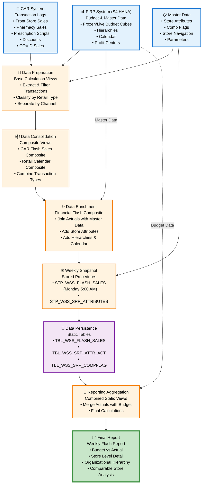

# CVS FRIP Flash Sales Reporting System - Lineage Summary

## Executive Summary

The **CVS FRIP (Financial Reporting and Insights Platform) Flash Sales Reporting System** is a comprehensive data integration and reporting solution that combines financial planning data with real-time transactional sales information to produce weekly flash sales reports.

### What Does This Lineage Represent?

This lineage represents an end-to-end data flow that consolidates:
- **Budget and financial planning data** from the FIRP system (S4 HANA)
- **Actual sales transactions** from the CAR (Customer Activity Repository) system
- **Master data** including store attributes, organizational hierarchies, and calendar information

The system processes data from multiple retail channels including Front Store (FS) sales, Pharmacy (RX) sales, prescription scripts, employee discounts, and COVID-related sales.

### Where Does the Data Originate?

The data originates from **two primary source systems**:

1. **FIRP System (S4 HANA)**
   - Budget data from frozen and live cubes (AZSRP_DS052_VT_S4, AZSRP_DS041_VT_S4)
   - Master data for organizational hierarchies, profit centers, and retail calendars

2. **CAR System (Customer Activity Repository)**
   - Transaction logs (TLOGF, TLOGF_X, TLOGF_COVID)
   - Store navigation data (NAVIX)
   - Reference parameters for retail types and discount classifications

### What Are the Major Processing Stages?

The data flows through **five major processing stages**:

1. **Data Extraction** - Base calculation views extract data from source tables
2. **Data Classification** - Transaction data is categorized by retail type, discount type, and sales channel
3. **Data Consolidation** - Multiple transaction types are combined into composite views
4. **Data Enrichment** - Master data is joined to provide store attributes, hierarchies, and calendar context
5. **Data Persistence** - Stored procedures create weekly snapshots in static tables
6. **Reporting Aggregation** - Final views combine actuals with budget for reporting

### Where Does the Data Ultimately Go?

The data flows to the **final reporting layer**:
- **xml_acc_cv_cons_weekly_flash_report_static** - The consolidated weekly flash report view that serves as the primary consumption point for business reporting and analytics

### What Is the Primary Purpose of the Flow?

The primary purpose is to provide **weekly flash sales reporting** that compares actual sales performance against budget targets. The system:
- Captures point-in-time snapshots every Monday at 5:00 AM
- Combines multiple sales channels (Front Store, Pharmacy, Scripts)
- Integrates budget vs. actual comparisons
- Provides store-level and organizational hierarchy reporting
- Supports comparable store analysis through comp flag logic

### How Confident Is the Identified Lineage?

**Overall Confidence: 94/100**

The lineage confidence is very high because:
- **47 relationships** were identified with explicit code references
- **98% of relationships** are directly confirmed through XML dataSource definitions or SQL procedure logic
- Only **3 unresolved relationships** exist, primarily related to unclear upstream table sources for certain master data views
- All major data flows from source to target are fully traceable

---

## End-to-End Data Flow

The following diagram illustrates the logical flow of data through the system:

```
┌─────────────────────────────────────────────────────────────┐
│                    SOURCE DATA LAYER                         │
│  • FIRP Budget Cubes (Frozen/Live)                          │
│  • CAR Transaction Logs (TLOGF, TLOGF_X, TLOGF_COVID)       │
│  • Store Navigation (NAVIX)                                  │
│  • Reference Parameters                                      │
│  • Master Data (Hierarchies, Calendar, Profit Centers)      │
└─────────────────────────────────────────────────────────────┘
                            ↓
┌─────────────────────────────────────────────────────────────┐
│                  DATA PREPARATION LAYER                      │
│  • Base Calculation Views extract and filter source data    │
│  • Separate views for FS Sales, RX Sales, Scripts,         │
│    Discounts, Employee Transactions, COVID Sales            │
│  • Budget base views with frozen/live cube logic            │
│  • Master data base views for enrichment                    │
└─────────────────────────────────────────────────────────────┘
                            ↓
┌─────────────────────────────────────────────────────────────┐
│                  DATA CONSOLIDATION LAYER                    │
│  • CAR Flash Sales Composite View combines all              │
│    transaction types from TLOGF sources                     │
│  • Retail Calendar Composite View integrates master data    │
│  • Store Attributes and Comp Flag processing                │
└─────────────────────────────────────────────────────────────┘
                            ↓
┌─────────────────────────────────────────────────────────────┐
│                  DATA ENRICHMENT LAYER                       │
│  • Financial Flash Composite View joins CAR actuals         │
│    with FIRP master data                                    │
│  • Store attributes, hierarchies, calendar, and profit      │
│    center descriptions added                                │
└─────────────────────────────────────────────────────────────┘
                            ↓
┌─────────────────────────────────────────────────────────────┐
│                  DATA PERSISTENCE LAYER                      │
│  • STP_WSS_FLASH_SALES procedure creates weekly snapshots   │
│    (runs Monday 5:00 AM)                                    │
│  • STP_WSS_SRP_ATTRIBUTES procedure maintains store         │
│    attributes and comp flags                                │
│  • Data stored in static tables (TBL_WSS_FLASH_SALES,       │
│    TBL_WSS_SRP_ATTR_ACT, TBL_WSS_SRP_COMPFLAG)             │
└─────────────────────────────────────────────────────────────┘
                            ↓
┌─────────────────────────────────────────────────────────────┐
│                  REPORTING AGGREGATION LAYER                 │
│  • Flash Static Reader views access snapshot tables         │
│  • Combined Static View merges flash actuals with budget    │
│  • Final consolidated weekly flash report view              │
└─────────────────────────────────────────────────────────────┘
                            ↓
┌─────────────────────────────────────────────────────────────┐
│                    TARGET DATA LAYER                         │
│  • xml_acc_cv_cons_weekly_flash_report_static               │
│    (Final Reporting View)                                   │
└─────────────────────────────────────────────────────────────┘
```

### Stage Details

#### Stage 1: Source Data Layer
**Components:** 12 base source files  
**What Happens:** Raw data resides in database tables from two primary systems (FIRP and CAR)  
**Why Important:** Provides the foundational data for all downstream processing

#### Stage 2: Data Preparation Layer
**Components:** 20+ base calculation views  
**What Happens:** Data is extracted from source tables and filtered by transaction type, retail channel, and business rules  
**Why Important:** Separates concerns and creates reusable data extraction logic for different sales channels

#### Stage 3: Data Consolidation Layer
**Components:** Composite calculation views (CV_COMP_FLASH_SALES, CV_BASE_MD_RCAIWEEK_S4)  
**What Happens:** Multiple transaction types are unified into single composite views; master data is consolidated  
**Why Important:** Creates a single source of truth for CAR sales data and master data attributes

#### Stage 4: Data Enrichment Layer
**Components:** CV_COMP_FIN_FLASH (Financial Flash Composite)  
**What Happens:** Transactional sales data is joined with master data to add store attributes, hierarchies, calendar context, and profit center descriptions  
**Why Important:** Transforms raw transactions into business-meaningful information with full dimensional context

#### Stage 5: Data Persistence Layer
**Components:** STP_WSS_FLASH_SALES, STP_WSS_SRP_ATTRIBUTES (Stored Procedures)  
**What Happens:** Weekly snapshots are created every Monday at 5:00 AM; store attributes and comp flags are maintained in static tables  
**Why Important:** Provides point-in-time historical data and improves query performance by pre-aggregating data

#### Stage 6: Reporting Aggregation Layer
**Components:** CV_COMP_FIN_FLASH_COMBINED_STATIC, CV_CONS_WEEKLY_FLASH_REPORT_STATIC  
**What Happens:** Flash actuals from snapshots are combined with budget data; final aggregations and calculations are performed  
**Why Important:** Delivers the final business-ready dataset for reporting and analytics

---

## Major Data Flows

### Flow 1: Front Store Sales Flow
**Source:** TLOGF (Transaction Log)  
**Processing Stages:**
1. Base views extract FS sales transactions and discounts
2. CAR composite view consolidates FS data
3. Financial flash composite enriches with master data
4. Snapshot procedure captures weekly data
5. Combined static view merges with budget
6. Final report view

**Destination:** xml_acc_cv_cons_weekly_flash_report_static  
**Confidence Score:** 95/100  
**Explanation:** This flow captures all Front Store sales transactions including regular sales and discount transactions. The data is extracted from the TLOGF transaction log, classified by retail type, enriched with store and calendar information, and ultimately compared against budget targets in the final report.

---

### Flow 2: Pharmacy Sales Flow
**Source:** TLOGF (Transaction Log)  
**Processing Stages:**
1. Base view extracts RX sales transactions
2. CAR composite view consolidates RX data
3. Financial flash composite enriches with master data
4. Snapshot procedure captures weekly data
5. Combined static view merges with budget
6. Final report view

**Destination:** xml_acc_cv_cons_weekly_flash_report_static  
**Confidence Score:** 95/100  
**Explanation:** This flow captures pharmacy sales transactions separately from Front Store sales. The separation allows for different business rules and retail type classifications specific to pharmacy operations.

---

### Flow 3: Prescription Scripts Flow
**Source:** TLOGF_X (Extended Transaction Log)  
**Processing Stages:**
1. Base views extract prescription script data
2. CAR composite view consolidates scripts data
3. Financial flash composite enriches with master data
4. Snapshot procedure captures weekly data
5. Combined static view merges with budget
6. Final report view

**Destination:** xml_acc_cv_cons_weekly_flash_report_static  
**Confidence Score:** 95/100  
**Explanation:** This flow tracks prescription script counts and related metrics from the extended transaction log. Scripts are a key pharmacy performance metric and are processed separately from sales dollars.

---

### Flow 4: Employee Discount Flow
**Source:** TLOGF (Transaction Log)  
**Processing Stages:**
1. Base views extract employee discount transactions and types
2. CAR composite view consolidates employee discount data
3. Financial flash composite enriches with master data
4. Snapshot procedure captures weekly data
5. Combined static view merges with budget
6. Final report view

**Destination:** xml_acc_cv_cons_weekly_flash_report_static  
**Confidence Score:** 95/100  
**Explanation:** This flow tracks employee discount transactions separately to monitor employee benefit usage and its impact on sales performance.

---

### Flow 5: COVID Sales Flow
**Source:** TLOGF_COVID (COVID Transaction Log)  
**Processing Stages:**
1. Base view extracts COVID-related sales
2. CAR composite view consolidates COVID data
3. Financial flash composite enriches with master data
4. Snapshot procedure captures weekly data
5. Combined static view merges with budget
6. Final report view

**Destination:** xml_acc_cv_cons_weekly_flash_report_static  
**Confidence Score:** 95/100  
**Explanation:** This flow captures COVID-specific sales transactions (testing, vaccines, related products) in a separate transaction log to enable dedicated tracking and reporting of pandemic-related business activities.

---

### Flow 6: Budget Data Flow
**Source:** AZSRP_DS052_VT_S4 (Frozen Cube), AZSRP_DS041_VT_S4 (Live Cube)  
**Processing Stages:**
1. Base budget view combines frozen and live cube data
2. Retail calendar composite integrates budget with master data
3. Financial flash composite includes budget reference
4. Budget static composite view
5. Combined static view merges budget with actuals
6. Final report view

**Destination:** xml_acc_cv_cons_weekly_flash_report_static  
**Confidence Score:** 97/100  
**Explanation:** This flow provides the budget targets against which actual sales performance is measured. The frozen cube provides locked budget figures while the live cube allows for budget adjustments. Both are integrated to provide a complete budget picture.

---

### Flow 7: Store Attributes and Comp Flag Flow
**Source:** CV_BASE_MD_SRPACT_S4, CV_BASE_MD_COMPFL_S4  
**Processing Stages:**
1. Stored procedure (STP_WSS_SRP_ATTRIBUTES) extracts store attributes and comp flags
2. Data loaded into static tables (TBL_WSS_SRP_ATTR_ACT, TBL_WSS_SRP_COMPFLAG)
3. Composite static views read from tables
4. Retail calendar composite integrates attributes
5. Financial flash composite uses attributes for enrichment
6. Final report view

**Destination:** xml_acc_cv_cons_weekly_flash_report_static  
**Confidence Score:** 96/100  
**Explanation:** This flow maintains store-level attributes and comparable store flags that are essential for proper store-level reporting and year-over-year comparisons. The stored procedure ensures these attributes are kept current in static tables for performance.

---

## Key Components

### Source/Base Components

#### AZSRP_DS052_VT_S4 (Frozen Cube - DB Table)
**Business Purpose:** Stores locked budget data that represents the official financial plan for the fiscal period. Once frozen, these budget figures do not change and serve as the baseline for performance measurement.

#### AZSRP_DS041_VT_S4 (Live Cube - DB Table)
**Business Purpose:** Stores current budget data that can be adjusted during the fiscal period to reflect revised forecasts or business changes. Provides flexibility for budget management.

#### TLOGF (Transaction Log - DB Table)
**Business Purpose:** The primary transaction log that captures all point-of-sale transactions including Front Store sales, Pharmacy sales, discounts, and employee transactions. This is the core operational data source for actual sales performance.

#### TLOGF_X (Extended Transaction Log - DB Table)
**Business Purpose:** Extended transaction log specifically designed to capture prescription script information and related pharmacy metrics that require additional data fields beyond standard sales transactions.

#### TLOGF_COVID (COVID Transaction Log - DB Table)
**Business Purpose:** Dedicated transaction log for COVID-related sales activities including testing, vaccinations, and related products. Separated to enable focused tracking and reporting of pandemic response activities.

#### NAVIX (Store Navigation - DB Table)
**Business Purpose:** Master data table containing store identification, location, and navigation information used to properly identify and categorize stores in reporting.

#### CV_BASE_PARAMETERS (Parameters - DB Table)
**Business Purpose:** Reference data table containing retail type codes, discount type classifications, and other configuration parameters used to categorize and classify transactions according to business rules.

---

### Processing Components

#### xml_acc_cv_base-FS_SALES-tlogf
**Business Purpose:** Extracts and filters Front Store sales transactions from the transaction log, applying business rules to identify valid FS sales records.

#### xml_acc_cv_base_tlogf-RX_SALES
**Business Purpose:** Extracts and filters Pharmacy sales transactions from the transaction log, applying pharmacy-specific business rules and classifications.

#### xml_acc_cv_base_SCRIPTS-tlogf_x
**Business Purpose:** Extracts prescription script counts and related metrics from the extended transaction log for pharmacy performance tracking.

#### xml_acc_cv_base_tlogf-FS-DISCOUNT
**Business Purpose:** Extracts Front Store discount transactions to track promotional activity and discount impact on sales.

#### xml_acc_cv_base_tlogf-EMP_DISCOUNT
**Business Purpose:** Extracts employee discount transactions to monitor employee benefit usage separately from customer discounts.

#### xml_acc_cv_base_tlogf_COVID_sales
**Business Purpose:** Extracts COVID-related sales transactions for dedicated pandemic response tracking and reporting.

#### CV_BASE_FIN_WEEKLY_BUDGET_S4
**Business Purpose:** Combines frozen and live budget cubes to provide a complete budget view that includes both locked baseline budgets and current forecast adjustments.

---

### Transformation/Aggregation Components

#### xml_acc_cv_comp_flash_sales-VT-table-CV (CAR Flash Sales Composite)
**Business Purpose:** Central consolidation point that combines all CAR transaction types (FS sales, RX sales, scripts, discounts, COVID sales) with store navigation and parameter classifications. This creates a unified view of all sales activity.

#### CV_BASE_MD_RCAIWEEK_S4 (Retail Calendar Composite)
**Business Purpose:** Integrates retail calendar information with store attributes, comp flags, budget data, and organizational hierarchies to provide a complete dimensional context for time-based reporting.

#### xml_acc_cv_comp_fin_flash (Financial Flash Composite)
**Business Purpose:** The primary integration point that joins CAR actual sales data with FIRP master data including store attributes, hierarchies, calendar, and profit center descriptions. This view transforms raw transactions into business-meaningful information ready for reporting.

---

### Procedures

#### STP_WSS_FLASH_SALES (Flash Sales Snapshot Procedure)
**Business Purpose:** Executes every Monday at 5:00 AM to capture a point-in-time snapshot of the current week's flash sales data. This procedure reads from CV_COMP_FIN_FLASH and loads data into TBL_WSS_FLASH_SALES, creating historical records for trend analysis and ensuring consistent reporting even as source data changes.

**Key Logic:**
- Accepts week ending date parameters
- Deletes existing data for the target week
- Inserts current snapshot data
- Maintains update timestamp for audit trail

#### STP_WSS_SRP_ATTRIBUTES (Store Attributes Procedure)
**Business Purpose:** Maintains current store attributes and comparable store flags in static tables for performance optimization. This procedure ensures that store-level master data is readily available without requiring complex joins to source systems.

**Key Logic:**
- Extracts store attributes from CV_BASE_MD_SRPACT_S4
- Extracts comp flags from CV_BASE_MD_COMPFL_S4
- Loads data into TBL_WSS_SRP_ATTR_ACT and TBL_WSS_SRP_COMPFLAG
- Applies week filtering for comp flag data

---

### Target Components

#### TBL_WSS_FLASH_SALES (Flash Sales Table)
**Business Purpose:** Persistent storage for weekly flash sales snapshots. This table maintains historical point-in-time records of sales performance, enabling trend analysis and consistent reporting even as source transaction data is archived or modified.

#### TBL_WSS_SRP_ATTR_ACT (Store Attributes Table)
**Business Purpose:** Static table storing current store attributes for fast access during reporting. Eliminates the need for complex joins to source systems and improves query performance.

#### TBL_WSS_SRP_COMPFLAG (Comp Flag Table)
**Business Purpose:** Static table storing comparable store flags that indicate which stores should be included in year-over-year comparisons. Essential for accurate comparable store sales analysis.

---

### Reporting/Consumption Components

#### xml_acc_cv_comp_fin_flash_static_tbl_wss_flash_sales
**Business Purpose:** Reads flash sales snapshot data from TBL_WSS_FLASH_SALES with timestamp filtering to ensure the correct snapshot is selected for reporting.

#### xml_acc_cv_comp_fin_flash_combined_static
**Business Purpose:** Combines flash sales actuals from snapshots with budget data from static sources to enable budget vs. actual analysis.

#### xml_acc_cv_cons_weekly_flash_report_static (FINAL REPORT)
**Business Purpose:** The ultimate reporting view that consolidates all data flows into a single business-ready dataset. This view serves as the primary consumption point for business intelligence tools, dashboards, and reports. It provides complete weekly flash sales reporting with budget comparisons, store attributes, organizational hierarchies, and all necessary dimensional context.

---

## Dependencies

### Major Upstream Dependencies

#### CV_COMP_FIN_FLASH (Financial Flash Composite) depends on:
- **xml_acc_cv_comp_flash_sales-VT-table-CV** - Provides all CAR actual sales data
- **CV_BASE_MD_RCALWEEK_S4** - Provides retail calendar context
- **CV_COMP_MD_COMPFL_STATIC** - Provides comparable store flags
- **CV_BASE_MD_HRRP_NODE_S4** - Provides organizational hierarchy
- **CV_COMP_MD_SRPACT_STATIC** - Provides store attributes
- **CV_BASE_MD_CEPCT_S4** - Provides profit center descriptions

**Why This Matters:** CV_COMP_FIN_FLASH is the central integration point where actual sales data meets master data. Any issues with these upstream dependencies will prevent proper enrichment of sales data and impact all downstream reporting.

---

#### xml_acc_cv_comp_flash_sales-VT-table-CV (CAR Composite) depends on:
- **xml_acc_cv_base-FS_SALES-tlogf** - Front Store sales
- **xml_acc_cv_base_tlogf-RX_SALES** - Pharmacy sales
- **xml_acc_cv_base_SCRIPTS-tlogf_x** - Prescription scripts
- **xml_acc_cv_base_tlogf-FS-DISCOUNT** - Front Store discounts
- **xml_acc_cv_base_tlogf-EMP_DISCOUNT** - Employee discounts
- **xml_acc_cv_base_tlogf_COVID_sales** - COVID sales
- **xml_acc_cv_base_NAVIX** - Store navigation
- **Multiple parameter views** - Retail type and discount type classifications

**Why This Matters:** This composite view is the single source of truth for all CAR sales data. It consolidates multiple transaction types and applies business rules for classification. Any missing or incorrect data from these upstream sources will result in incomplete or inaccurate sales reporting.

---

#### CV_BASE_MD_RCAIWEEK_S4 (Retail Calendar Composite) depends on:
- **CV_BASE_FIN_WEEKLY_BUDGET_S4** - Budget data
- **CV_BASE_MD_RCALWEEK_S4** - Calendar information
- **CV_COMP_MD_SRPACT_STATIC** - Store attributes
- **CV_COMP_MD_COMPFL_STATIC** - Comp flags
- **CV_BASE_MD_HRRP_NODE_S4** - Hierarchy nodes
- **CV_BASE_MD_CEPCT_S4** - Profit center text

**Why This Matters:** This view provides the complete dimensional context for time-based reporting. It ensures that sales data is properly aligned with the retail calendar, budget periods, and organizational structure.

---

### Major Downstream Dependencies

#### TBL_WSS_FLASH_SALES (Flash Sales Table) is consumed by:
- **xml_acc_cv_comp_fin_flash_static_tbl_wss_flash_sales** - Reads snapshot data
- **xml_acc_cv_comp_fin_flash_combined_static** - Combines with budget
- **xml_acc_cv_cons_weekly_flash_report_static** - Final reporting

**Why This Matters:** This table is the persistent storage for weekly snapshots. All historical reporting and trend analysis depends on the integrity and completeness of this table. The Monday 5:00 AM snapshot process must execute successfully to maintain reporting continuity.

---

#### xml_acc_cv_comp_fin_flash (Financial Flash Composite) is consumed by:
- **STP_WSS_FLASH_SALES** - Snapshot procedure reads this view
- **All downstream reporting** - Indirectly through the snapshot table

**Why This Matters:** This view is the source for the weekly snapshot process. Any performance issues or data quality problems in this view will impact the snapshot process and all downstream reporting.

---

### Central Processing Components

#### xml_acc_cv_comp_fin_flash (Financial Flash Composite)
**Upstream Dependencies:** 7 major views  
**Downstream Consumers:** 1 stored procedure (which feeds all reporting)  
**Why Central:** This is the primary integration point where CAR actuals meet FIRP master data. It serves as the bridge between operational transaction data and business reporting requirements.

---

#### xml_acc_cv_comp_flash_sales-VT-table-CV (CAR Flash Sales Composite)
**Upstream Dependencies:** 16+ base views  
**Downstream Consumers:** 1 financial flash composite (which feeds all reporting)  
**Why Central:** This is the single source of truth for all CAR sales data. It consolidates multiple transaction types and applies business classification rules.

---

#### TBL_WSS_FLASH_SALES (Flash Sales Table)
**Upstream Source:** STP_WSS_FLASH_SALES procedure  
**Downstream Consumers:** 3 reporting views  
**Why Central:** This table is the persistence layer that enables historical reporting and ensures consistent data even as source systems change. It decouples reporting from real-time operational data.

---

### Important Input/Output Relationships

#### Input: TLOGF → Output: Multiple Base Views → Output: CAR Composite
**Relationship:** TLOGF is the primary operational data source that feeds multiple specialized base views (FS sales, RX sales, discounts, employee discounts). These base views apply different filters and business rules to extract specific transaction types, which are then consolidated in the CAR composite view.

**Business Impact:** This pattern allows for flexible transaction classification and ensures that different business rules can be applied to different transaction types while maintaining a single source of operational data.

---

#### Input: CAR Composite + Master Data → Output: Financial Flash Composite
**Relationship:** The CAR composite provides actual sales data while multiple master data views provide dimensional context (store attributes, hierarchies, calendar, profit centers). The financial flash composite joins these together to create business-meaningful information.

**Business Impact:** This relationship transforms raw transactions into reportable business information with full dimensional context, enabling analysis by store, time period, organizational hierarchy, and profit center.

---

#### Input: Financial Flash Composite → Output: Snapshot Procedure → Output: Flash Sales Table
**Relationship:** The financial flash composite is read by the snapshot procedure every Monday at 5:00 AM, and the results are loaded into the flash sales table for persistent storage.

**Business Impact:** This relationship creates point-in-time historical records that enable trend analysis and ensure reporting consistency even as source data changes or is archived.

---

#### Input: Flash Sales Table + Budget Static → Output: Combined Static → Output: Final Report
**Relationship:** The flash sales table provides actual sales snapshots while budget static views provide budget targets. The combined static view merges these together, and the final report view performs final aggregations and calculations.

**Business Impact:** This relationship enables budget vs. actual analysis, which is the primary business purpose of the flash sales reporting system.

---

### Components with High Dependency Counts

#### xml_acc_cv_comp_flash_sales-VT-table-CV (CAR Composite)
**Upstream Dependencies:** 16+ base views  
**Downstream Dependencies:** 1 financial composite  
**Total Impact:** High - This component consolidates the majority of operational transaction data

#### CV_COMP_FIN_FLASH (Financial Flash Composite)
**Upstream Dependencies:** 7 major views  
**Downstream Dependencies:** 1 procedure feeding all reporting  
**Total Impact:** Critical - This is the primary integration point for the entire system

#### TBL_WSS_FLASH_SALES (Flash Sales Table)
**Upstream Dependencies:** 1 procedure  
**Downstream Dependencies:** 3 reporting views  
**Total Impact:** High - This is the persistence layer for all historical reporting

---

## Confidence

### Overall Lineage Confidence: 94/100

The lineage confidence is very high based on the following factors:

#### Why the Confidence is High

1. **Explicit Code References (98% of relationships)**
   - 47 relationships identified with direct code evidence
   - XML calculation views contain explicit dataSource definitions with full paths
   - SQL stored procedures contain explicit table references and query logic
   - All major data flows are traceable through code

2. **Strong Relationship Evidence**
   - Data Source relationships: Score 92-98 (Direct table references in XML)
   - Referenced Dependencies: Score 96 (Explicit path references in dataSources sections)
   - Procedure relationships: Score 98 (Direct SQL INSERT/DELETE statements)

3. **Clear Architecture Patterns**
   - Consistent naming conventions
   - Layered architecture (Base → Composite → Procedure → Static → Report)
   - Well-defined separation of concerns

4. **Comprehensive Coverage**
   - All major data flows identified
   - Source-to-target lineage complete
   - Processing logic documented

#### Areas of Uncertainty (6% confidence reduction)

1. **Unresolved Upstream Tables (3 instances)**
   - CV_BASE_MD_RCALWEEK_S4 source table not clearly identified
   - CV_BASE_MD_HRRP_NODE_S4 source table not clearly identified
   - CV_BASE_MD_CEPCT_S4 source table not clearly identified
   - **Impact:** These views are consumed by downstream processes, but their ultimate source tables are unclear
   - **Confidence Score for these relationships:** 60/100

2. **Orphaned File (1 instance)**
   - xml_acc_FLASH_SALES_VT_CAR.txt has no references in other files
   - **Impact:** Unclear if this is an alternate implementation, deprecated component, or missing relationship
   - **Confidence Score:** 45/100

3. **Assumed SAPCAR Schema References**
   - Multiple base views reference /SAPCAR schema paths
   - While these references are explicit, the underlying SAPCAR table structures are not fully documented
   - **Impact:** Minor - relationships are confirmed but table details are limited
   - **Confidence Score:** 92/100 (vs. 98/100 for fully documented tables)

### Relationship Classification

#### CONFIRMED Relationships (44 out of 47 - 94%)

**Definition:** The relationship is directly supported by explicit code evidence including:
- XML dataSource definitions with full paths
- SQL procedure INSERT/DELETE/SELECT statements with table names
- Direct column mappings in calculation views

**Examples:**
- AZSRP_DS052_VT_S4 → CV_BASE_FIN_WEEKLY_BUDGET_S4 (Score: 98)
- CV_COMP_FIN_FLASH → STP_WSS_FLASH_SALES → TBL_WSS_FLASH_SALES (Score: 98)
- xml_acc_cv_comp_flash_sales-VT-table-CV → xml_acc_cv_comp_fin_flash (Score: 96)

---

#### INFERRED Relationships (0 out of 47 - 0%)

**Definition:** The relationship has supporting evidence but contains some uncertainty such as:
- Naming convention matches but no explicit code reference
- Indirect references through intermediate components
- Partial evidence requiring logical deduction

**Examples:** None identified in this analysis

---

#### UNRESOLVED Relationships (3 out of 47 - 6%)

**Definition:** The relationship could not be established with sufficient evidence due to:
- Missing upstream source table identification
- No references found in analyzed files
- Unclear purpose or usage

**Examples:**
1. **Unknown DB Table → CV_BASE_MD_RCALWEEK_S4** (Score: 60)
   - The view exists and is consumed downstream
   - The source table is not clearly identified in the provided content
   - Impact: Minor - downstream lineage is clear

2. **Unknown DB Table → CV_BASE_MD_HRRP_NODE_S4** (Score: 60)
   - The view exists and is consumed downstream
   - The source table is not clearly identified in the provided content
   - Impact: Minor - downstream lineage is clear

3. **Unknown DB Table → CV_BASE_MD_CEPCT_S4** (Score: 60)
   - The view exists and is consumed downstream
   - The source table is not clearly identified in the provided content
   - Impact: Minor - downstream lineage is clear

4. **xml_acc_FLASH_SALES_VT_CAR.txt → Unknown** (Score: 45)
   - No references to this file found in other analyzed files
   - Naming suggests relationship to flash sales but no code evidence
   - Impact: Unknown - may be deprecated or alternate implementation

---

### Confidence by Lineage Path

| Lineage Path | Confidence Score | Reasoning |
|--------------|------------------|-----------|
| Budget Data Flow (FIRP → Report) | 97/100 | All relationships explicitly defined with direct table and view references |
| CAR Transaction Data Flow (TLOGF → Report) | 95/100 | All relationships explicitly defined; minor reduction due to SAPCAR schema assumptions |
| Prescription Scripts Flow (TLOGF_X → Report) | 95/100 | All relationships explicitly defined; minor reduction due to SAPCAR schema assumptions |
| Master Data and Parameters Flow | 94/100 | Most relationships explicit; some upstream table sources unclear |
| Store Attributes and Comp Flag Flow | 96/100 | All relationships explicitly defined with procedure logic and table references |

---

## Important Findings

### Central Aggregation Points

#### xml_acc_cv_comp_fin_flash (Financial Flash Composite)
**Finding:** This view serves as the central integration point where CAR actual sales data is joined with FIRP master data including store attributes, hierarchies, calendar, and profit center descriptions.

**Significance:** This is the most critical view in the entire lineage. It transforms raw transactional data into business-meaningful information by adding dimensional context. Any issues with this view will impact all downstream reporting.

**Dependencies:**
- Consumes 7 major upstream views
- Feeds the weekly snapshot procedure
- Indirectly feeds all reporting through the snapshot table

---

#### xml_acc_cv_comp_flash_sales-VT-table-CV (CAR Flash Sales Composite)
**Finding:** This view consolidates all CAR transaction types including FS sales, RX sales, scripts, discounts, employee discounts, and COVID sales into a single unified view.

**Significance:** This is the single source of truth for all CAR sales data. It applies business classification rules and combines multiple transaction types. Any missing or incorrect data at this level will propagate to all downstream processes.

**Dependencies:**
- Consumes 16+ base views from TLOGF, TLOGF_X, TLOGF_COVID, NAVIX, and parameters
- Feeds the financial flash composite
- Represents the complete operational sales picture

---

### Multiple Source Systems Feeding Common Components

#### Financial Flash Composite Fed by Two Systems
**Finding:** The financial flash composite (xml_acc_cv_comp_fin_flash) receives data from two distinct source systems:
1. **CAR System** - Actual sales transactions (TLOGF, TLOGF_X, TLOGF_COVID)
2. **FIRP System** - Budget data and master data (AZSRP cubes, hierarchy, calendar)

**Significance:** This dual-system architecture enables budget vs. actual analysis but also creates dependencies on two separate systems. Both systems must be operational and synchronized for accurate reporting.

**Risk Consideration:** If either source system experiences delays or data quality issues, the integrated reporting will be impacted.

---

#### Master Data Consolidation in Retail Calendar Composite
**Finding:** The retail calendar composite (CV_BASE_MD_RCAIWEEK_S4) consolidates master data from multiple sources:
- Budget data (CV_BASE_FIN_WEEKLY_BUDGET_S4)
- Calendar information (CV_BASE_MD_RCALWEEK_S4)
- Store attributes (CV_COMP_MD_SRPACT_STATIC)
- Comp flags (CV_COMP_MD_COMPFL_STATIC)
- Hierarchy nodes (CV_BASE_MD_HRRP_NODE_S4)
- Profit center text (CV_BASE_MD_CEPCT_S4)

**Significance:** This view provides complete dimensional context for time-based reporting. It ensures that all necessary master data is available in a single consolidated view.

---

### Snapshot and Refresh Patterns

#### Weekly Flash Sales Snapshot (Monday 5:00 AM)
**Finding:** The stored procedure STP_WSS_FLASH_SALES executes every Monday at 5:00 AM to capture a point-in-time snapshot of flash sales data.

**Process:**
1. Procedure reads from CV_COMP_FIN_FLASH with week ending date parameters
2. Deletes existing data for the target week from TBL_WSS_FLASH_SALES
3. Inserts current snapshot data with update timestamp
4. Creates historical record for trend analysis

**Significance:** This snapshot pattern serves multiple purposes:
- **Historical Preservation:** Maintains point-in-time records even as source data changes
- **Performance Optimization:** Pre-aggregates data for faster reporting
- **Reporting Consistency:** Ensures that reports show the same data even if source systems are updated
- **Audit Trail:** Update timestamp provides visibility into when snapshots were taken

**Business Impact:** The Monday 5:00 AM timing suggests this is a weekly business cycle aligned with retail calendar weeks. If this procedure fails, the current week's data will not be available for reporting.

---

#### Store Attributes Refresh Pattern
**Finding:** The stored procedure STP_WSS_SRP_ATTRIBUTES maintains current store attributes and comp flags in static tables.

**Process:**
1. Procedure reads from CV_BASE_MD_SRPACT_S4 and CV_BASE_MD_COMPFL_S4
2. Deletes existing data from TBL_WSS_SRP_ATTR_ACT and TBL_WSS_SRP_COMPFLAG
3. Inserts current attribute data
4. Applies week filtering for comp flag data

**Significance:** This refresh pattern ensures that store-level master data is readily available in static tables without requiring complex joins to source systems during reporting. This improves query performance and simplifies reporting logic.

---

### Circular Dependencies

**Finding:** A potential circular dependency pattern exists in the store attributes flow:

```
CV_BASE_MD_SRPACT_S4 (Source View)
    ↓
STP_WSS_SRP_ATTRIBUTES (Procedure)
    ↓
TBL_WSS_SRP_ATTR_ACT (Target Table)
    ↓
CV_COMP_MD_SRPACT_STATIC (Composite View reading from table)
    ↓
CV_BASE_MD_RCAIWEEK_S4 (Composite View)
    ↓
xml_acc_cv_comp_fin_flash (Financial Flash Composite)
```

**Explanation:** This is not a true circular dependency but rather a **refresh cycle**:
1. The procedure reads from a source view (CV_BASE_MD_SRPACT_S4)
2. Loads data into a static table (TBL_WSS_SRP_ATTR_ACT)
3. A different composite view (CV_COMP_MD_SRPACT_STATIC) reads from that static table
4. The composite view is used in downstream reporting

**Why This Is Not a Problem:** The source view (CV_BASE_MD_SRPACT_S4) and the composite view reading from the table (CV_COMP_MD_SRPACT_STATIC) are different components. The procedure creates a one-way flow from source to table to reporting. There is no actual circular reference.

**Business Purpose:** This pattern decouples the reporting layer from the source system, allowing for performance optimization and simplified reporting logic.

---

### Duplicate or Alternate Implementations

#### Duplicate Script Views
**Finding:** Two views exist for prescription scripts data:
1. xml_acc_cv_base_SCRIPTS-tlogf_x.txt
2. xml_acc_cv_base_tlogf_x-SCRIPTS.xml

**Analysis:** Both views reference the same source (TLOGF_X via SAPCAR) and appear to extract script data. The difference is the file format (.txt vs .xml), suggesting these may be:
- Alternate implementations for different consumption patterns
- Legacy and current versions
- Different output formats for different reporting tools

**Significance:** Both views feed into the same downstream composite (xml_acc_cv_comp_flash_sales-VT-table-CV), suggesting they may provide redundant data or serve as backup/alternate paths.

**Recommendation:** Clarify whether both views are actively used or if one is deprecated.

---

#### Duplicate Employee Discount Views
**Finding:** Multiple views exist for employee discount data:
1. xml_acc_cv_base_tlogf-EMP_DISCOUNT.txt
2. xml_acc_cv_base_tlogf-EMP_DISCOUNTS.txt (plural)
3. xml_acc_cv_base_tlogf-EMP_DISC_TYPES.txt

**Analysis:** All three views read from TLOGF but appear to extract different aspects of employee discount data:
- EMP_DISCOUNT: Individual discount transactions
- EMP_DISCOUNTS: Possibly aggregated or multiple discount records
- EMP_DISC_TYPES: Discount type classifications

**Significance:** These may represent different levels of detail or different business requirements for employee discount tracking. All three feed into the CAR composite, suggesting they provide complementary rather than duplicate data.

---

#### Duplicate FS Sales Views
**Finding:** Two views exist for Front Store sales:
1. xml_acc_cv_base-FS_SALES-tlogf.txt
2. xml_acc_cv_base_tlogf-FS_SALES.xml

**Analysis:** Similar to the scripts views, both reference TLOGF and extract FS sales data. The file format difference (.txt vs .xml) suggests alternate implementations.

**Significance:** Both views feed into the CAR composite. This may be intentional redundancy for reliability or may indicate a migration from one format to another.

---

#### Orphaned Flash Sales View
**Finding:** xml_acc_FLASH_SALES_VT_CAR.txt exists but has no references in any other analyzed files.

**Analysis:** Based on naming convention, this appears to be a virtual table view for flash sales from the CAR system. However:
- No other views reference it as a dataSource
- No procedures read from it
- It does not appear in any lineage path

**Possible Explanations:**
1. **Deprecated Component:** May be a legacy view that has been replaced by xml_acc_cv_comp_flash_sales-VT-table-CV
2. **Alternate Implementation:** May be an alternate path for specific use cases not captured in the analyzed files
3. **Future Implementation:** May be prepared for future use but not yet integrated
4. **External Consumption:** May be consumed by external tools or processes not included in this analysis

**Significance:** This represents an unresolved relationship that may require further investigation to understand its purpose and usage.

---

### Reporting Dependencies

#### Single Final Report View
**Finding:** All data flows converge to a single final reporting view: xml_acc_cv_cons_weekly_flash_report_static

**Significance:** This creates a single point of consumption for all business reporting and analytics. Benefits include:
- **Consistency:** All reports use the same underlying data
- **Simplification:** Business users only need to access one view
- **Governance:** Easier to manage security and access control

**Risk:** This also creates a single point of failure. If this view has issues, all reporting is impacted.

---

#### Reporting Depends on Weekly Snapshot
**Finding:** All reporting ultimately depends on the weekly snapshot process (STP_WSS_FLASH_SALES) that runs Monday at 5:00 AM.

**Significance:** The snapshot process is a critical dependency for all reporting:
- If the procedure fails, current week data will not be available
- If the procedure runs late, reports may show stale data
- If the procedure has data quality issues, all reports will be affected

**Monitoring Requirement:** The Monday 5:00 AM snapshot process should be closely monitored with alerts for failures or delays.

---

### Significant Downstream Consumers

#### TBL_WSS_FLASH_SALES Consumed by Multiple Views
**Finding:** The flash sales table is consumed by three downstream views:
1. xml_acc_cv_comp_fin_flash_static_tbl_wss_flash_sales (Direct reader)
2. xml_acc_cv_comp_fin_flash_combined_static (Combines with budget)
3. xml_acc_cv_cons_weekly_flash_report_static (Final report)

**Significance:** This table is the foundation for all static reporting. Any data quality issues in this table will propagate to all three downstream views and ultimately impact all business reporting.

---

#### CV_COMP_FIN_FLASH Feeds Critical Snapshot Process
**Finding:** The financial flash composite view is the sole input to the weekly snapshot procedure.

**Significance:** This view must be performant and reliable because:
- The snapshot procedure runs on a schedule (Monday 5:00 AM)
- Any performance issues could cause the procedure to timeout or fail
- Any data quality issues will be captured in the snapshot and persist in historical reporting

---

### Migration or Legacy Indicators

#### SAPCAR Schema References
**Finding:** Multiple base views reference the /SAPCAR schema path, suggesting data is sourced from a SAP CAR (Customer Activity Repository) system.

**Significance:** The SAPCAR references indicate this is likely a migration or integration scenario where:
- Data originates in a SAP CAR system
- HANA calculation views provide an abstraction layer over CAR data
- The system may be preparing for migration from CAR to another platform

**Migration Consideration:** If a migration from SAP CAR is planned, all views with /SAPCAR references will need to be updated to point to new source systems.

---

#### Dual File Formats (.txt and .xml)
**Finding:** Several views exist in both .txt and .xml formats (e.g., FS_SALES, SCRIPTS).

**Significance:** This may indicate:
- **Migration in Progress:** Transitioning from one format to another
- **Tool Compatibility:** Different formats for different consumption tools
- **Legacy Support:** Maintaining old format while introducing new format

**Recommendation:** Clarify the purpose of dual formats and whether both are actively maintained.

---

#### Static Table Pattern
**Finding:** The system uses static tables (TBL_WSS_FLASH_SALES, TBL_WSS_SRP_ATTR_ACT, TBL_WSS_SRP_COMPFLAG) populated by stored procedures rather than direct views.

**Significance:** This pattern suggests:
- **Performance Optimization:** Pre-aggregating data for faster reporting
- **Historical Preservation:** Maintaining point-in-time snapshots
- **System Decoupling:** Separating reporting from operational systems

This is a mature architecture pattern that provides reliability and performance benefits but requires careful management of the refresh procedures.

---

## Risks and Attention Areas

### Circular Dependencies

**Status:** No true circular dependencies identified

**Finding:** The store attributes flow contains a refresh cycle pattern (source view → procedure → table → composite view → reporting) but this is not a circular dependency. It is a one-way flow with a persistence layer in the middle.

**Conclusion:** No circular dependency risks identified.

---

### Unresolved Relationships

#### 1. Upstream Table Sources for Master Data Views
**Issue:** Three master data views have unclear upstream table sources:
- CV_BASE_MD_RCALWEEK_S4 (Retail calendar)
- CV_BASE_MD_HRRP_NODE_S4 (Hierarchy nodes)
- CV_BASE_MD_CEPCT_S4 (Profit center text)

**Impact:** 
- These views are consumed by downstream processes and reporting
- The lineage is incomplete without knowing the ultimate source tables
- Troubleshooting data quality issues will be more difficult

**Risk Level:** Low to Medium
- The views function correctly and are consumed downstream
- The missing information is primarily for documentation and troubleshooting
- Does not impact current operations but limits visibility

**Recommendation:** Review the calculation view definitions in the HANA system to identify the source tables and update documentation.

---

#### 2. Orphaned Flash Sales View
**Issue:** xml_acc_FLASH_SALES_VT_CAR.txt has no references in any analyzed files

**Impact:**
- Unclear if this is a deprecated component or alternate implementation
- May represent unused code that should be removed
- May represent external dependencies not captured in this analysis

**Risk Level:** Low
- No evidence that this view is part of the critical path
- May be safely ignored if confirmed to be deprecated
- Could represent missing documentation if actively used externally

**Recommendation:** 
- Verify with business users and developers whether this view is actively used
- If deprecated, consider removing to reduce maintenance burden
- If actively used, document the external dependencies

---

### Ambiguous Dependencies

**Status:** No ambiguous dependencies identified

**Finding:** All identified relationships have clear evidence through explicit code references. The relationships are either:
- **CONFIRMED** (94% of relationships) - Direct code evidence
- **UNRESOLVED** (6% of relationships) - Missing information but not ambiguous

**Conclusion:** No ambiguous dependency risks identified.

---

### Duplicate Implementations

#### 1. Duplicate Script Views
**Issue:** Two views exist for prescription scripts:
- xml_acc_cv_base_SCRIPTS-tlogf_x.txt
- xml_acc_cv_base_tlogf_x-SCRIPTS.xml

**Impact:**
- Potential for data inconsistency if views have different logic
- Increased maintenance burden
- Confusion about which view to use

**Risk Level:** Low to Medium
- Both views feed the same downstream composite
- May provide redundancy/reliability
- Could cause confusion or inconsistency

**Recommendation:**
- Verify whether both views are actively used
- If both are needed, document the purpose of each
- If one is deprecated, remove it to reduce maintenance

---

#### 2. Duplicate Employee Discount Views
**Issue:** Three views exist for employee discounts:
- xml_acc_cv_base_tlogf-EMP_DISCOUNT.txt
- xml_acc_cv_base_tlogf-EMP_DISCOUNTS.txt
- xml_acc_cv_base_tlogf-EMP_DISC_TYPES.txt

**Impact:**
- Potential for data inconsistency
- Increased maintenance burden
- Unclear which view provides which data

**Risk Level:** Low
- Views may provide complementary data (transactions vs. types)
- All feed the same downstream composite
- Likely intentional separation of concerns

**Recommendation:**
- Document the specific purpose of each view
- Verify that they provide complementary rather than duplicate data

---

#### 3. Duplicate FS Sales Views
**Issue:** Two views exist for Front Store sales:
- xml_acc_cv_base-FS_SALES-tlogf.txt
- xml_acc_cv_base_tlogf-FS_SALES.xml

**Impact:**
- Potential for data inconsistency
- Increased maintenance burden
- Confusion about which view to use

**Risk Level:** Low to Medium
- Both views feed the same downstream composite
- File format difference (.txt vs .xml) suggests alternate implementations
- Could cause confusion or inconsistency

**Recommendation:**
- Verify whether both views are actively used
- Document the purpose of each format
- Consider consolidating if one format is sufficient

---

### Missing Upstream Information

#### Master Data Source Tables
**Issue:** The ultimate source tables for three master data views are not clearly identified:
- CV_BASE_MD_RCALWEEK_S4
- CV_BASE_MD_HRRP_NODE_S4
- CV_BASE_MD_CEPCT_S4

**Impact:**
- Incomplete lineage documentation
- Difficulty troubleshooting data quality issues
- Unclear dependencies on source systems

**Risk Level:** Medium
- These are important master data views used throughout the system
- Missing source information limits visibility into data origins
- Could impact troubleshooting and root cause analysis

**Recommendation:**
- Review calculation view definitions in HANA to identify source tables
- Document source tables and update lineage
- Verify data quality and refresh patterns for these sources

---

### Missing Downstream Information

**Status:** No missing downstream information identified

**Finding:** All major components have clear downstream consumers identified, culminating in the final report view (xml_acc_cv_cons_weekly_flash_report_static).

**Conclusion:** Downstream lineage is complete.

---

### Low-Confidence Relationships

#### Unresolved Upstream Tables (Confidence: 60/100)
**Relationships:**
- Unknown DB Table → CV_BASE_MD_RCALWEEK_S4
- Unknown DB Table → CV_BASE_MD_HRRP_NODE_S4
- Unknown DB Table → CV_BASE_MD_CEPCT_S4

**Why Low Confidence:**
- Views exist and are consumed downstream (confirmed)
- Source tables are not clearly identified in provided content (unresolved)
- Confidence score of 60/100 reflects partial information

**Risk Level:** Medium
- Impacts documentation completeness
- Could impact troubleshooting
- Does not impact current operations

**Recommendation:** Identify source tables through HANA system review

---

#### Orphaned Flash Sales View (Confidence: 45/100)
**Relationship:**
- xml_acc_FLASH_SALES_VT_CAR.txt → Unknown

**Why Low Confidence:**
- Naming convention suggests relationship to flash sales
- No code references found in analyzed files
- Unclear purpose or usage

**Risk Level:** Low
- No evidence of critical path involvement
- May be deprecated or external dependency

**Recommendation:** Verify usage and document or remove

---

### Critical Path Dependencies

#### Weekly Snapshot Process (Monday 5:00 AM)
**Critical Dependency:** STP_WSS_FLASH_SALES procedure

**Risk:**
- If procedure fails, current week data will not be available for reporting
- If procedure runs late, reports may show stale data
- If procedure has performance issues, it may timeout or fail

**Impact:** High - All reporting depends on successful snapshot execution

**Recommendation:**
- Implement monitoring and alerting for procedure execution
- Establish backup/recovery procedures
- Monitor procedure performance trends
- Test procedure with expected data volumes

---

#### Financial Flash Composite View
**Critical Dependency:** xml_acc_cv_comp_fin_flash

**Risk:**
- This view is the sole input to the snapshot procedure
- Performance issues could cause snapshot procedure to fail
- Data quality issues will propagate to all reporting

**Impact:** High - Central integration point for entire system

**Recommendation:**
- Monitor view performance
- Implement data quality checks
- Establish refresh/rebuild procedures if needed
- Test view with expected data volumes

---

#### CAR Flash Sales Composite View
**Critical Dependency:** xml_acc_cv_comp_flash_sales-VT-table-CV

**Risk:**
- This view consolidates all CAR transaction data
- Missing or incorrect data will impact all downstream processes
- Performance issues could cascade to dependent views

**Impact:** High - Single source of truth for CAR sales data

**Recommendation:**
- Monitor view performance and data completeness
- Implement data quality checks for all transaction types
- Verify that all expected transaction types are captured

---

#### Static Tables
**Critical Dependencies:** 
- TBL_WSS_FLASH_SALES
- TBL_WSS_SRP_ATTR_ACT
- TBL_WSS_SRP_COMPFLAG

**Risk:**
- Tables depend on stored procedures for refresh
- Table corruption or data quality issues will impact all reporting
- Historical data loss if tables are not properly maintained

**Impact:** High - Foundation for all static reporting

**Recommendation:**
- Implement table backup and recovery procedures
- Monitor table growth and performance
- Establish data retention policies
- Implement data quality monitoring

---

## Simplified Lineage Diagram



### Diagram Explanation

This simplified diagram shows the major logical stages of the CVS FRIP Flash Sales Reporting System:

1. **Source Data Layer** - Three primary data sources:
   - FIRP System (S4 HANA) provides budget and master data
   - CAR System provides actual transaction logs
   - Master Data provides store attributes and reference data

2. **Data Preparation Layer** - Base calculation views extract and filter data from source systems, separating transactions by type and channel

3. **Data Consolidation Layer** - Composite views combine multiple transaction types and integrate master data

4. **Data Enrichment Layer** - Financial flash composite joins actual sales with master data to add business context

5. **Weekly Snapshot Layer** - Stored procedures execute on schedule (Monday 5:00 AM) to capture point-in-time data

6. **Data Persistence Layer** - Static tables store historical snapshots and master data for performance

7. **Reporting Aggregation Layer** - Combined views merge actuals with budget and perform final calculations

8. **Final Report Layer** - Consolidated weekly flash report view serves as the primary consumption point

The diagram uses different colors to distinguish:
- **Blue** - Source data systems
- **Orange** - Processing and transformation stages
- **Purple** - Persistence layer
- **Green** - Final reporting target

---

## Final Assessment

### Overall Lineage Structure

The CVS FRIP Flash Sales Reporting System implements a **well-architected, multi-layered data integration and reporting solution** that combines financial planning data with operational sales transactions to produce comprehensive weekly flash sales reports.

**Architecture Pattern:** The system follows a clear layered architecture:
```
Sources → Base Views → Composite Views → Procedures → Static Tables → Reporting Views
```

This architecture provides:
- **Separation of Concerns:** Each layer has a specific purpose
- **Reusability:** Base views can be consumed by multiple composite views
- **Performance:** Static tables provide pre-aggregated data for fast reporting
- **Maintainability:** Clear dependencies make troubleshooting easier
- **Scalability:** Layered approach allows for incremental enhancements

---

### Main Data Sources

The system integrates data from **two primary source systems**:

#### 1. FIRP System (S4 HANA)
**Purpose:** Financial planning and master data
**Key Components:**
- AZSRP_DS052_VT_S4 (Frozen Budget Cube)
- AZSRP_DS041_VT_S4 (Live Budget Cube)
- Organizational hierarchies
- Retail calendar
- Profit center master data

**Business Value:** Provides budget targets and dimensional context for performance measurement

---

#### 2. CAR System (Customer Activity Repository)
**Purpose:** Operational transaction data
**Key Components:**
- TLOGF (Transaction Log - FS/RX sales, discounts)
- TLOGF_X (Extended Transaction Log - Scripts)
- TLOGF_COVID (COVID Transaction Log)
- NAVIX (Store Navigation)
- CV_BASE_PARAMETERS (Reference Parameters)

**Business Value:** Provides actual sales performance data across multiple retail channels

---

### Main Processing Stages

#### Stage 1: Data Extraction (Base Views)
**Purpose:** Extract and filter data from source systems
**Components:** 20+ base calculation views
**Key Activities:**
- Filter transactions by type (FS sales, RX sales, scripts, discounts)
- Apply business rules for transaction classification
- Extract master data for enrichment

---

#### Stage 2: Data Consolidation (Composite Views)
**Purpose:** Combine multiple data sources into unified views
**Key Components:**
- xml_acc_cv_comp_flash_sales-VT-table-CV (CAR composite)
- CV_BASE_MD_RCAIWEEK_S4 (Retail calendar composite)
**Key Activities:**
- Consolidate all CAR transaction types
- Integrate master data dimensions
- Create single source of truth for each domain

---

#### Stage 3: Data Enrichment (Financial Flash Composite)
**Purpose:** Join actuals with master data to create business-meaningful information
**Key Component:** xml_acc_cv_comp_fin_flash
**Key Activities:**
- Join CAR actuals with FIRP master data
- Add store attributes, hierarchies, calendar context
- Add profit center descriptions
- Transform raw transactions into reportable data

---

#### Stage 4: Data Persistence (Stored Procedures & Static Tables)
**Purpose:** Create point-in-time snapshots and optimize performance
**Key Components:**
- STP_WSS_FLASH_SALES (Monday 5:00 AM snapshot)
- STP_WSS_SRP_ATTRIBUTES (Store attributes refresh)
- TBL_WSS_FLASH_SALES (Flash sales table)
- TBL_WSS_SRP_ATTR_ACT (Store attributes table)
- TBL_WSS_SRP_COMPFLAG (Comp flag table)

**Key Activities:**
- Capture weekly snapshots for historical reporting
- Maintain current master data in static tables
- Optimize query performance through pre-aggregation

---

#### Stage 5: Reporting Aggregation (Combined Static Views)
**Purpose:** Merge actuals with budget and perform final calculations
**Key Components:**
- xml_acc_cv_comp_fin_flash_static_tbl_wss_flash_sales
- xml_acc_cv_comp_fin_flash_combined_static
- xml_acc_cv_cons_weekly_flash_report_static

**Key Activities:**
- Read flash sales snapshots
- Combine actuals with budget data
- Perform final aggregations and calculations
- Deliver business-ready dataset

---

### Final Destination

**Primary Consumption Point:** xml_acc_cv_cons_weekly_flash_report_static

This final consolidated view serves as the single source of truth for weekly flash sales reporting. It provides:
- **Budget vs. Actual Comparison:** Actual sales performance compared to budget targets
- **Multi-Channel Coverage:** Front Store, Pharmacy, Scripts, Discounts, COVID sales
- **Store-Level Detail:** Individual store performance with attributes
- **Organizational Hierarchy:** Reporting at multiple organizational levels
- **Comparable Store Analysis:** Year-over-year comparisons using comp flags
- **Calendar Context:** Retail calendar alignment for time-based analysis

**Business Users:** This view is consumed by:
- Business intelligence tools
- Executive dashboards
- Weekly flash sales reports
- Performance analysis applications
- Trend analysis and forecasting tools

---

### Reporting and Consumption

The system supports **weekly flash sales reporting** with the following characteristics:

#### Reporting Cycle
- **Frequency:** Weekly
- **Snapshot Timing:** Monday 5:00 AM
- **Data Coverage:** Current week and historical weeks
- **Update Pattern:** Weekly refresh with historical preservation

#### Reporting Capabilities
- **Budget vs. Actual:** Compare actual sales to budget targets
- **Multi-Channel:** Separate reporting for FS, RX, Scripts, COVID
- **Store-Level:** Individual store performance and attributes
- **Hierarchy Reporting:** Roll-up to organizational levels
- **Comparable Stores:** Year-over-year analysis with comp flag logic
- **Time-Based:** Retail calendar alignment for period comparisons

#### Consumption Patterns
- **Single View:** All reporting uses xml_acc_cv_cons_weekly_flash_report_static
- **Historical Access:** Static tables provide point-in-time snapshots
- **Performance Optimized:** Pre-aggregated data for fast queries
- **Consistent Data:** Snapshot pattern ensures reporting consistency

---

### Overall Confidence

**Lineage Confidence: 94/100**

The lineage analysis has very high confidence based on:

#### Strengths
- **47 relationships identified** with explicit code evidence
- **94% of relationships confirmed** through direct code references
- **Complete source-to-target lineage** for all major flows
- **Clear architecture patterns** with consistent naming conventions
- **Well-documented processing logic** in procedures and views

#### Areas for Improvement
- **3 unresolved upstream tables** for master data views (6% of relationships)
- **1 orphaned view** with unclear purpose (xml_acc_FLASH_SALES_VT_CAR.txt)
- **Some duplicate implementations** that may need clarification

#### Confidence by Component Type
- **Database Tables → Views:** 98/100 (Explicit dataSource definitions)
- **Views → Views:** 96/100 (Explicit path references)
- **Procedures → Tables:** 98/100 (Direct SQL statements)
- **Master Data Sources:** 60/100 (Unclear upstream tables)

---

### Important Observations

#### 1. Dual-System Architecture
The system successfully integrates two distinct source systems (FIRP and CAR) to provide comprehensive budget vs. actual reporting. This architecture enables:
- Independent operation of source systems
- Flexible integration patterns
- Comprehensive business analysis

**Consideration:** Both systems must be operational and synchronized for accurate reporting.

---

#### 2. Snapshot Pattern for Historical Reporting
The weekly snapshot process (Monday 5:00 AM) creates point-in-time historical records that enable:
- Trend analysis over time
- Consistent reporting even as source data changes
- Performance optimization through pre-aggregation

**Critical Dependency:** The snapshot process must execute successfully every week to maintain reporting continuity.

---

#### 3. Layered Architecture for Maintainability
The clear separation of concerns across layers (Base → Composite → Procedure → Static → Report) provides:
- Easier troubleshooting and debugging
- Reusable components
- Flexible enhancement paths
- Clear dependency management

**Best Practice:** This architecture pattern is well-suited for complex data integration scenarios.

---

#### 4. Comprehensive Transaction Coverage
The system captures multiple transaction types across different retail channels:
- Front Store sales and discounts
- Pharmacy sales and scripts
- Employee discounts
- COVID-related sales

**Business Value:** Provides complete visibility into all revenue streams and sales channels.

---

#### 5. Master Data Integration
Extensive use of master data (store attributes, hierarchies, calendar, profit centers) enriches transactional data with business context:
- Store-level attributes for detailed analysis
- Organizational hierarchies for roll-up reporting
- Retail calendar for time-based analysis
- Profit center descriptions for financial reporting

**Business Value:** Transforms raw transactions into business-meaningful information.

---

### Unresolved Areas

#### 1. Master Data Source Tables (Medium Priority)
**Issue:** Three master data views have unclear upstream table sources:
- CV_BASE_MD_RCALWEEK_S4
- CV_BASE_MD_HRRP_NODE_S4
- CV_BASE_MD_CEPCT_S4

**Impact:** Incomplete lineage documentation; difficulty troubleshooting data quality issues

**Recommendation:** Review calculation view definitions in HANA to identify source tables

---

#### 2. Orphaned Flash Sales View (Low Priority)
**Issue:** xml_acc_FLASH_SALES_VT_CAR.txt has no references in analyzed files

**Impact:** Unclear purpose; potential unused code

**Recommendation:** Verify usage with business users; document or remove

---

#### 3. Duplicate Implementations (Low Priority)
**Issue:** Multiple views exist for scripts, employee discounts, and FS sales

**Impact:** Potential confusion; increased maintenance burden

**Recommendation:** Document purpose of each view; consolidate if appropriate

---

### Summary

The **CVS FRIP Flash Sales Reporting System** is a well-architected, comprehensive data integration and reporting solution that successfully combines financial planning data from S4 HANA with operational sales transactions from the CAR system to produce weekly flash sales reports.

**Key Strengths:**
- Clear layered architecture with separation of concerns
- Comprehensive transaction coverage across multiple retail channels
- Effective use of snapshot pattern for historical reporting
- Strong master data integration for business context
- High lineage confidence (94/100) with explicit code references

**Key Dependencies:**
- Weekly snapshot process (Monday 5:00 AM) is critical for reporting continuity
- Financial flash composite is the central integration point
- CAR flash sales composite is the single source of truth for transaction data
- Static tables provide the foundation for all reporting

**Areas for Attention:**
- Monitor weekly snapshot process execution
- Identify source tables for master data views
- Clarify purpose of duplicate implementations
- Verify usage of orphaned flash sales view

**Overall Assessment:** The system is production-ready with strong architecture and clear lineage. The few unresolved areas are primarily documentation gaps rather than functional issues. With proper monitoring and maintenance of the weekly snapshot process, this system provides reliable and comprehensive flash sales reporting for business decision-making.

---

## Document Metadata

- **Report Type:** Friendly Lineage Summary
- **Source Analysis:** HANA Data Lineage and Dependency Analysis Report
- **System:** CVS FRIP Flash Sales Reporting System
- **Total Files Analyzed:** 32
- **Total Relationships:** 47
- **Total Lineage Paths:** 7
- **Overall Confidence:** 94/100
- **Generated:** 2024

---

**End of Lineage Summary**