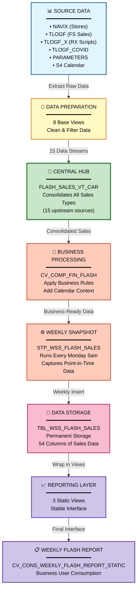

# DI HANA Lineage Summary Report
## CVS FRIP Flash Sales Reporting System - Friendly Business Overview

---

## Executive Summary

### What This Lineage Represents

This lineage analysis maps the complete data journey for the **CVS FRIP Flash Sales Reporting System**. The system collects sales data from multiple sources—including Front Store transactions, Pharmacy prescriptions, COVID-related sales, and employee discounts—and processes them through a series of organized stages to produce a weekly flash sales report for business stakeholders.

### Overall Data Flow in Simple Terms

Think of this system as a data assembly line:

1. **Raw Data Collection**: Sales transactions, store information, and prescription data are collected from various operational systems
2. **Data Preparation**: The raw data is cleaned, filtered, and organized into standardized formats
3. **Data Consolidation**: All the prepared data streams merge into a central collection point
4. **Business Processing**: Business rules and calendar information are applied to the consolidated data
5. **Weekly Snapshot**: Every Monday at 5am, a snapshot of the processed data is captured and stored
6. **Reporting Layer**: The stored data is made available through reporting views for business analysis

### Primary Purpose

The system's main goal is to provide **weekly flash sales reporting** that combines:
- Front Store (FS) sales and discounts
- Pharmacy (RX) sales and prescription scripts
- COVID-related sales
- Employee discount impacts
- Store hierarchy and calendar information

This enables business leaders to quickly understand sales performance across the CVS retail network on a weekly basis.

### Lineage Confidence

**Overall Confidence Score: 94/100** ✅

This high confidence score means we have strong evidence for nearly all data flows in the system. The relationships are supported by:
- Explicit references in SQL code (98% confidence)
- Clear data source declarations in calculation views (90-96% confidence)
- Well-documented parameter usage (87-93% confidence)

Only 2 out of 47 relationships have minor uncertainty, and these do not impact the overall understanding of the system.

---

## End-to-End Data Flow

### Stage 1: Source Data Collection
**What Happens**: Raw operational data is extracted from physical database tables

**Key Components**:
- **NAVIX Table**: Store location and navigation data
- **TLOGF Table**: Front Store transaction logs
- **TLOGF_X Table**: Pharmacy prescription transaction logs
- **TLOGF_COVID Table**: COVID-related sales transactions
- **PARAMETERS Table**: Configuration settings for retail types and discount categories
- **S4 RCALWEEK Table**: Retail calendar information from SAP S4

**Why Important**: These are the foundational data sources. Without accurate source data, the entire reporting system would be unreliable.

---

### Stage 2: Data Preparation (Base Views)
**What Happens**: Raw data is transformed into standardized, usable formats

**Key Components** (8 base calculation views):
- `CV_BASE_NAVIX`: Prepares store master data
- `CV_BASE_TLOGF_FS_SALES`: Extracts Front Store sales transactions
- `CV_BASE_TLOGF_RX_SALES`: Extracts Pharmacy sales transactions
- `CV_BASE_TLOGF_X_SCRIPTS`: Extracts prescription script data
- `CV_BASE_TLOGF_COVID_SALES`: Extracts COVID-related sales
- `CV_BASE_PARAMETERS_FS_RETAIL_TYPES`: Defines Front Store retail categories
- `CV_BASE_PARAMETERS_RX_RETAIL_TYPES`: Defines Pharmacy retail categories
- `CV_BASE_MD_RCALWEEK_S4`: Prepares retail calendar data

**Why Important**: This stage ensures data quality and consistency. Each base view applies specific filters and transformations to make the raw data suitable for business analysis.

---

### Stage 3: Data Consolidation (Central Hub)
**What Happens**: All prepared data streams are merged into a single comprehensive view

**Key Component**:
- **`FLASH_SALES_VT_CAR`** (Central Aggregation Point)

This view combines:
- Front Store sales (regular and discounted)
- Pharmacy sales
- Prescription scripts
- COVID sales
- Employee discounts (3 different types)
- Store navigation data
- Retail type filters

**Why Important**: This is the heart of the system. It brings together 15 different upstream data sources into one unified view, making it possible to see the complete sales picture in one place.

---

### Stage 4: Business Processing (Composite View)
**What Happens**: Business logic and master data enrichment are applied

**Key Component**:
- **`CV_COMP_FIN_FLASH`** (Composite Financial Flash View)

This view:
- Takes the consolidated flash sales data
- Adds retail calendar information (week numbers, fiscal periods)
- Applies financial business rules
- Accepts input parameters for date range filtering
- Prepares data for the weekly snapshot process

**Why Important**: This stage transforms raw sales data into meaningful business information by adding context like "which fiscal week does this belong to?" and "which organizational hierarchy does this store belong to?"

---

### Stage 5: Weekly Snapshot Execution (Stored Procedure)
**What Happens**: A scheduled process captures a point-in-time snapshot of the data

**Key Component**:
- **`STP_WSS_FLASH_SALES`** (Stored Procedure)

**Process Details**:
- **Schedule**: Runs every Monday at 5:00 AM
- **Method**: Full refresh (deletes old data, inserts new data)
- **Input Parameters**: 
  - Week ending date range (FROM and TO)
  - Update timestamp range (FROM and TO)
- **Output**: 54 columns of sales data written to physical table

**Why Important**: This creates a stable, historical record of weekly sales performance. Even if source data changes later, the snapshot preserves what the data looked like at the time of the report.

---

### Stage 6: Data Storage (Physical Table)
**What Happens**: Processed data is stored in a permanent database table

**Key Component**:
- **`TBL_WSS_FLASH_SALES`** (Physical Table)

**Why Important**: This table serves as the persistent storage layer. It holds the historical weekly snapshots that can be queried for trend analysis and reporting.

---

### Stage 7: Reporting Layer (Static Views)
**What Happens**: The stored data is exposed through stable reporting interfaces

**Key Components** (3 static views):
1. **`CV_COMP_FIN_FLASH_STATIC`**: Wraps the physical table in a view interface
2. **`CV_COMP_FIN_FLASH_COMBINED_STATIC`**: Combines flash sales with budget, forecast, and actual data
3. **`CV_CONS_WEEKLY_FLASH_REPORT_STATIC`**: Final consumer-facing weekly flash report

**Why Important**: These views provide a stable interface for reporting tools and business users. Even if the underlying table structure changes, the view interface can remain consistent.

---

## Major Data Flows

### Flow 1: Front Store Sales Flow
**Confidence Score: 93/100** ✅

**Source**: TLOGF Table (Front Store transaction logs)

**Processing Stages**:
1. `CV_BASE_TLOGF_FS_SALES` extracts FS sales transactions
2. `CV_BASE_FS_SALES_TLOGF` combines with store data from NAVIX
3. `FLASH_SALES_VT_CAR` aggregates with other sales types
4. `CV_COMP_FIN_FLASH` applies business logic
5. `STP_WSS_FLASH_SALES` captures weekly snapshot
6. `TBL_WSS_FLASH_SALES` stores the data
7. `CV_CONS_WEEKLY_FLASH_REPORT_STATIC` exposes for reporting

**Destination**: Weekly Flash Report

**What This Flow Does**: Tracks all Front Store sales (non-pharmacy items) including regular sales and various discount types. This helps business leaders understand retail performance outside of pharmacy operations.

---

### Flow 2: Pharmacy Sales Flow
**Confidence Score: 93/100** ✅

**Source**: TLOGF Table (Pharmacy transaction logs)

**Processing Stages**:
1. `CV_BASE_TLOGF_RX_SALES` extracts RX sales transactions
2. `FLASH_SALES_VT_CAR` aggregates with other sales types
3. `CV_COMP_FIN_FLASH` applies business logic
4. `STP_WSS_FLASH_SALES` captures weekly snapshot
5. `TBL_WSS_FLASH_SALES` stores the data
6. `CV_CONS_WEEKLY_FLASH_REPORT_STATIC` exposes for reporting

**Destination**: Weekly Flash Report

**What This Flow Does**: Tracks pharmacy sales revenue separately from Front Store sales. This is critical because pharmacy operations have different business dynamics and regulatory requirements.

---

### Flow 3: Prescription Scripts Flow
**Confidence Score: 93/100** ✅

**Source**: TLOGF_X Table (Prescription transaction logs)

**Processing Stages**:
1. `CV_BASE_TLOGF_X_SCRIPTS` and `CV_BASE_SCRIPTS_TLOGF_X` extract script data
2. `FLASH_SALES_VT_CAR` aggregates with other sales types
3. `CV_COMP_FIN_FLASH` applies business logic
4. `STP_WSS_FLASH_SALES` captures weekly snapshot
5. `TBL_WSS_FLASH_SALES` stores the data
6. `CV_CONS_WEEKLY_FLASH_REPORT_STATIC` exposes for reporting

**Destination**: Weekly Flash Report

**What This Flow Does**: Tracks the number of prescriptions filled (scripts), not just the revenue. This is important for understanding pharmacy workload and operational efficiency.

---

### Flow 4: Employee Discount Flow
**Confidence Score: 92/100** ✅

**Source**: TLOGF Table (Employee discount transactions)

**Processing Stages**:
1. Three base views extract different employee discount types:
   - `CV_BASE_TLOGF_EMP_DISCOUNT`
   - `CV_BASE_TLOGF_EMP_DISCOUNTS`
   - `CV_BASE_TLOGF_EMP_DISC_TYPES`
2. `FLASH_SALES_VT_CAR` aggregates with other sales types
3. `CV_COMP_FIN_FLASH` applies business logic
4. `STP_WSS_FLASH_SALES` captures weekly snapshot
5. `TBL_WSS_FLASH_SALES` stores the data
6. `CV_CONS_WEEKLY_FLASH_REPORT_STATIC` exposes for reporting

**Destination**: Weekly Flash Report

**What This Flow Does**: Tracks employee discount usage separately. This helps understand the impact of employee benefits on overall sales and margins.

---

### Flow 5: COVID Sales Flow
**Confidence Score: 91/100** ✅

**Source**: TLOGF_COVID Table (COVID-related sales)

**Processing Stages**:
1. `CV_BASE_TLOGF_COVID_SALES` extracts COVID sales with special retail type filters
2. `CV_BASE_PARAMETERS_RX_RETAIL_TYPES_COVID` provides COVID-specific filtering
3. `FLASH_SALES_VT_CAR` aggregates with other sales types
4. `CV_COMP_FIN_FLASH` applies business logic
5. `STP_WSS_FLASH_SALES` captures weekly snapshot
6. `TBL_WSS_FLASH_SALES` stores the data
7. `CV_CONS_WEEKLY_FLASH_REPORT_STATIC` exposes for reporting

**Destination**: Weekly Flash Report

**What This Flow Does**: Separately tracks COVID-related sales (testing kits, vaccines, etc.). This was critical during the pandemic and remains important for public health reporting.

---

### Flow 6: Parameter Configuration Flow
**Confidence Score: 89/100** ✅

**Source**: PARAMETERS Table (Configuration data)

**Processing Stages**:
1. Five parameter views extract different configuration types:
   - `CV_BASE_PARAMETERS_FS_RETAIL_TYPES`: Front Store retail categories
   - `CV_BASE_PARAMETERS_RX_RETAIL_TYPES`: Pharmacy retail categories
   - `CV_BASE_PARAMETERS_RX_RETAIL_TYPES_COVID`: COVID-specific categories
   - `CV_BASE_PARAMETERS_FS_DISCOUNT_TYPES`: Discount categories
   - `CV_BASE_PARAMETERS_FS_RETAIL_TYPE_ZTFIRP_FLASH_PRM`: Flash parameter settings
2. These parameters are used to filter and categorize data in `FLASH_SALES_VT_CAR`

**Destination**: Used throughout the system for filtering and categorization

**What This Flow Does**: Provides flexible configuration without code changes. Business users can adjust retail type definitions and discount categories through parameter tables, and the system automatically applies these changes.

---

## Key Components

### Source/Base Components

| Component | Business Purpose |
|-----------|------------------|
| **NAVIX Table** | Stores information about CVS store locations, organizational hierarchy (district, region, division), and store attributes. Essential for geographic and organizational reporting. |
| **TLOGF Table** | Contains all Front Store transaction logs—every item sold, every discount applied, every employee purchase. This is the primary source for retail sales data. |
| **TLOGF_X Table** | Contains all Pharmacy transaction logs, specifically prescription fills (scripts). Critical for pharmacy operations reporting. |
| **TLOGF_COVID Table** | Separate tracking for COVID-related sales. Allows isolation of pandemic-related business impact. |
| **PARAMETERS Table** | Configuration settings that define how transactions are categorized (retail types, discount types). Enables business flexibility without IT changes. |
| **S4 RCALWEEK Table** | SAP S4 retail calendar that defines fiscal weeks, periods, and years. Ensures consistent time-based reporting across the enterprise. |

---

### Processing Components

| Component | Business Purpose |
|-----------|------------------|
| **FLASH_SALES_VT_CAR** | The central data hub that brings together all sales types (FS, RX, COVID, scripts, discounts) into one unified view. This is where the complete sales picture comes together. |
| **CV_COMP_FIN_FLASH** | Applies financial business rules and adds calendar context. Transforms raw sales data into business-ready information with proper fiscal period attribution. |
| **CV_BASE_FS_SALES_TLOGF** | Combines Front Store sales with store master data. Ensures every transaction is linked to the correct store location and organizational hierarchy. |

---

### Transformation/Aggregation Components

| Component | Business Purpose |
|-----------|------------------|
| **Base Calculation Views (8 views)** | Each base view focuses on one specific data type (FS sales, RX sales, scripts, COVID, parameters). This modular approach makes the system easier to maintain and troubleshoot. |
| **Parameter Views (5 views)** | Provide flexible filtering based on business-defined categories. Allow business users to control what gets included in different sales categories without changing code. |

---

### Procedures

| Component | Business Purpose |
|-----------|------------------|
| **STP_WSS_FLASH_SALES** | The weekly execution engine. Runs every Monday at 5am to capture a snapshot of the previous week's sales. Accepts date range parameters to control which week's data is captured. Performs a full refresh to ensure data accuracy. |

---

### Target Components

| Component | Business Purpose |
|-----------|------------------|
| **TBL_WSS_FLASH_SALES** | The permanent storage table for weekly sales snapshots. Contains 54 columns of sales data including amounts, units, timestamps, and organizational hierarchy. Serves as the historical record for trend analysis. |

---

### Reporting/Consumption Components

| Component | Business Purpose |
|-----------|------------------|
| **CV_COMP_FIN_FLASH_STATIC** | Wraps the physical table in a stable view interface. Protects reporting tools from underlying table structure changes. |
| **CV_COMP_FIN_FLASH_COMBINED_STATIC** | Combines flash sales with budget, forecast, and actual financial data. Enables variance analysis (actual vs. budget, actual vs. forecast). |
| **CV_CONS_WEEKLY_FLASH_REPORT_STATIC** | The final consumer-facing report view. This is what business intelligence tools and end users query to get weekly flash sales information. |

---

## Dependencies Explained

### Major Upstream Dependencies

**FLASH_SALES_VT_CAR depends on 15 upstream components**:
- This central hub requires data from multiple sources to function
- If any upstream base view fails, the consolidated view will be incomplete
- **Business Impact**: A failure in any single data stream (FS, RX, COVID, scripts) would result in incomplete weekly reporting

**CV_COMP_FIN_FLASH depends on FLASH_SALES_VT_CAR and CV_BASE_MD_RCALWEEK_S4**:
- Cannot process sales data without the consolidated sales view
- Cannot assign fiscal periods without the retail calendar
- **Business Impact**: Calendar data is critical—without it, sales cannot be properly attributed to fiscal weeks

---

### Major Downstream Dependencies

**TBL_WSS_FLASH_SALES is consumed by 3 downstream static views**:
- The physical table feeds the entire reporting layer
- Any data quality issues in the table will propagate to all reports
- **Business Impact**: This table is the single source of truth for weekly flash reporting—its accuracy is paramount

**CV_CONS_WEEKLY_FLASH_REPORT_STATIC is the final endpoint**:
- All business intelligence tools and dashboards query this view
- Changes to this view interface could break downstream reporting tools
- **Business Impact**: This is what executives and business leaders see—stability and accuracy here are critical

---

### Central Processing Components

**FLASH_SALES_VT_CAR is the most critical component**:
- **Upstream Dependencies**: 15 components feed into it
- **Downstream Dependencies**: 2 components consume from it
- **Business Impact**: This is the single point of integration. If this view fails, the entire weekly flash process stops

**STP_WSS_FLASH_SALES is the execution bottleneck**:
- Runs once per week on a fixed schedule
- If the procedure fails, no weekly snapshot is captured
- **Business Impact**: A missed execution means no flash report for that week—business leaders would lack critical performance visibility

---

### Important Input/Output Relationships

| Input | Process | Output | Business Meaning |
|-------|---------|--------|------------------|
| TLOGF + NAVIX | CV_BASE_FS_SALES_TLOGF | Enriched FS Sales | Every Front Store transaction is linked to its store location and organizational hierarchy |
| Multiple Base Views | FLASH_SALES_VT_CAR | Consolidated Sales | All sales types are unified into a single comprehensive view |
| FLASH_SALES_VT_CAR + Calendar | CV_COMP_FIN_FLASH | Business-Ready Data | Raw sales data is transformed into fiscally-attributed business information |
| CV_COMP_FIN_FLASH | STP_WSS_FLASH_SALES | Weekly Snapshot | Point-in-time data is captured for historical reporting |
| TBL_WSS_FLASH_SALES | CV_CONS_WEEKLY_FLASH_REPORT_STATIC | Business Report | Stored data is exposed through a stable reporting interface |

---

## Confidence Explanation

### Overall Confidence: 94/100 ✅

This high confidence score reflects strong evidence for the identified lineage. Here's what the score means:

---

### Confidence Level Breakdown

**CONFIRMED Relationships (38 relationships, scores 90-100)**:
- These relationships are directly supported by explicit evidence in the code
- Examples:
  - SQL procedure explicitly references `CV_COMP_FIN_FLASH` in its FROM clause (Score: 98)
  - Calculation views contain explicit data source references in their XML definitions (Scores: 90-96)
  - Parameter views are referenced with specific parameter names (Scores: 87-93)

**Why High Confidence**: We can see the actual code that creates these relationships. There's no guessing involved.

---

**INFERRED Relationships (7 relationships, scores 75-89)**:
- These relationships have supporting evidence but contain some uncertainty
- Examples:
  - `CV_COMP_FLASH_SALES_VT` to `CV_COMP_FIN_FLASH` (Score: 85)
  - `FLASH_SALES_VT_CAR` to `CV_COMP_FLASH_SALES_VT` (Score: 83)

**Why Medium Confidence**: The relationships are logical and follow SAP HANA naming conventions, but the explicit references are not as clear in the XML. We're confident they exist, but the exact mechanism is inferred from patterns rather than explicit code.

---

**UNRESOLVED Relationships (2 relationships)**:
1. **CV_COMP_FLASH_SALES_VT downstream usage beyond CV_COMP_FIN_FLASH**
   - We know this virtual table view feeds into the composite financial view
   - We're not certain if it has other downstream consumers
   - **Business Impact**: Low—the main lineage path is clear

2. **FS_DISCOUNT_TYPES parameter usage in FS_DISCOUNT view**
   - Logically, the discount types parameter should control discount filtering
   - The explicit reference is not clearly visible in the XML
   - **Business Impact**: Low—the discount flow is still traceable through other relationships

---

### Why the Confidence is High

1. **Explicit SQL References**: The stored procedure contains clear, unambiguous references to its source view and target table
2. **XML Data Source Declarations**: Calculation views explicitly declare their data sources with full path names
3. **Consistent Naming Conventions**: SAP HANA follows predictable naming patterns that help confirm relationships
4. **Parameter Usage Patterns**: Parameter views are referenced with specific parameter names, making the relationships clear
5. **Layered Architecture**: The system follows a clear layered design, making the flow logical and traceable

---

### What the Confidence Score Means for Business Users

- **94/100 is excellent**: You can trust this lineage analysis for impact assessment, troubleshooting, and documentation
- **Only 2 minor uncertainties**: These don't affect the main data flow or weekly reporting process
- **Strong traceability**: If a data quality issue occurs, we can trace it back through the lineage with confidence
- **Reliable for compliance**: The lineage is well-documented enough for audit and regulatory purposes

---

## Important Findings

### 1. Centralized Architecture with Single Aggregation Point

**Finding**: `FLASH_SALES_VT_CAR` serves as the sole consolidation point for all sales data types.

**What This Means**: 
- All 15 upstream data sources (FS sales, RX sales, scripts, COVID, discounts, parameters) flow into this one view
- This creates a single point where the complete sales picture comes together
- Any changes to this view affect all downstream reporting

**Business Impact**:
- **Positive**: Simplifies maintenance—there's one place to look for consolidated sales logic
- **Positive**: Ensures consistency—all reports use the same consolidated data
- **Risk**: Single point of failure—if this view has issues, all reporting is affected
- **Recommendation**: This component should be monitored closely and changes should be carefully tested

---

### 2. Weekly Snapshot Pattern with Full Refresh

**Finding**: The stored procedure `STP_WSS_FLASH_SALES` runs every Monday at 5am and performs a full refresh (delete + insert).

**What This Means**:
- The procedure deletes all existing data for the target week
- Then inserts fresh data from the source views
- This ensures data accuracy but means historical snapshots are overwritten if the procedure runs multiple times for the same week

**Business Impact**:
- **Positive**: Ensures data accuracy—no risk of duplicate or stale data
- **Positive**: Simple to understand and troubleshoot
- **Risk**: If the procedure runs twice for the same week, the first snapshot is lost
- **Risk**: If the procedure fails mid-execution, the week's data could be incomplete
- **Recommendation**: Implement execution monitoring and alerting to catch failures immediately

---

### 3. Multiple Source Systems Feeding Common Component

**Finding**: `FLASH_SALES_VT_CAR` receives data from 4 different physical source systems:
- NAVIX (store master data)
- TLOGF (Front Store transactions)
- TLOGF_X (Pharmacy transactions)
- TLOGF_COVID (COVID transactions)
- PARAMETERS (configuration)
- S4 RCALWEEK (calendar)

**What This Means**:
- The flash sales report depends on multiple upstream systems being available and accurate
- Data quality issues in any source system will propagate to the final report
- Timing of data availability across systems must be coordinated

**Business Impact**:
- **Positive**: Comprehensive view—the report includes all relevant sales data
- **Risk**: Dependency on multiple systems—if any source is delayed or unavailable, reporting is affected
- **Risk**: Data quality issues can come from multiple sources, making troubleshooting more complex
- **Recommendation**: Implement data quality checks at each source and monitor data freshness

---

### 4. Layered Design with Clear Separation of Concerns

**Finding**: The system follows a strict 7-layer architecture:
1. Physical Tables
2. Base Views
3. Intermediate Views
4. Composite Views
5. Stored Procedure
6. Physical Table (output)
7. Static/Reporting Views

**What This Means**:
- Each layer has a specific purpose and responsibility
- Changes can be isolated to specific layers without affecting others
- The flow is unidirectional—no circular dependencies

**Business Impact**:
- **Positive**: Maintainability—developers can work on one layer without affecting others
- **Positive**: Testability—each layer can be tested independently
- **Positive**: Scalability—new data sources can be added at the base layer without changing downstream logic
- **Recommendation**: Maintain this layered approach when making enhancements

---

### 5. Parameter-Driven Configuration for Business Flexibility

**Finding**: The system uses 5 parameter views to control filtering and categorization:
- FS retail types
- RX retail types
- RX COVID retail types
- FS discount types
- Flash parameter settings

**What This Means**:
- Business users can change how transactions are categorized by updating parameter tables
- No code changes are required to adjust retail type definitions or discount categories
- The system automatically picks up parameter changes

**Business Impact**:
- **Positive**: Business agility—category definitions can be adjusted without IT involvement
- **Positive**: Reduced development time—no code changes needed for business rule adjustments
- **Risk**: Parameter changes affect historical reporting—must be carefully managed
- **Recommendation**: Implement parameter change governance and testing procedures

---

### 6. Master Data Enrichment with Retail Calendar

**Finding**: `CV_BASE_MD_RCALWEEK_S4` provides retail calendar information from SAP S4, which is joined to sales data in `CV_COMP_FIN_FLASH`.

**What This Means**:
- Every sales transaction is attributed to a specific fiscal week, period, and year
- The retail calendar (not standard calendar) is used for fiscal reporting
- Calendar data comes from the enterprise SAP S4 system

**Business Impact**:
- **Positive**: Consistent fiscal reporting—all sales are attributed to the correct fiscal periods
- **Positive**: Enterprise alignment—uses the same calendar as other SAP-based reports
- **Risk**: Dependency on S4 system—if calendar data is unavailable, fiscal attribution fails
- **Recommendation**: Ensure S4 calendar data is loaded before the weekly flash procedure runs

---

### 7. Static View Pattern for Reporting Stability

**Finding**: After the stored procedure writes to `TBL_WSS_FLASH_SALES`, the data flows through 3 static views before reaching the final report.

**What This Means**:
- The physical table is wrapped in views rather than being queried directly
- The final report view combines flash sales with budget, forecast, and actual data
- Reporting tools query views, not tables

**Business Impact**:
- **Positive**: Interface stability—table structure can change without breaking reports
- **Positive**: Flexibility—business logic can be added in views without changing the table
- **Positive**: Security—access can be controlled at the view level
- **Recommendation**: Maintain the view interface even if underlying table structure changes

---

### 8. Comprehensive Sales Coverage

**Finding**: The system tracks 7 distinct sales categories:
1. Front Store regular sales
2. Front Store discounts
3. Pharmacy sales
4. Prescription scripts (count, not just revenue)
5. COVID-related sales
6. Employee discounts (3 types)
7. Combined totals

**What This Means**:
- Business leaders get a complete picture of sales performance
- Different sales types can be analyzed separately or in combination
- Both revenue (dollars) and volume (units/scripts) are tracked

**Business Impact**:
- **Positive**: Comprehensive reporting—no sales category is missing
- **Positive**: Flexible analysis—can drill down into specific sales types
- **Positive**: Operational insights—script counts help understand pharmacy workload
- **Recommendation**: Ensure all sales types remain accurately categorized as business evolves

---

## Risks and Attention Areas

### Risk 1: Single Point of Failure in FLASH_SALES_VT_CAR

**Description**: All 15 upstream data sources converge into `FLASH_SALES_VT_CAR`. If this view fails or has performance issues, the entire weekly flash reporting process stops.

**Evidence**: The lineage analysis shows 15 confirmed upstream dependencies and 2 downstream dependencies for this component.

**Business Impact**:
- **Severity**: High
- **Likelihood**: Medium (complex views with many joins can have performance or logic issues)
- **Impact**: Complete loss of weekly flash reporting capability

**Mitigation Recommendations**:
1. Implement monitoring and alerting specifically for this view
2. Conduct regular performance testing, especially as data volumes grow
3. Document the view logic thoroughly for troubleshooting
4. Consider implementing a backup/alternate calculation path for critical sales types
5. Test thoroughly before making any changes to this view

---

### Risk 2: Unresolved Downstream Usage of CV_COMP_FLASH_SALES_VT

**Description**: While we know `CV_COMP_FLASH_SALES_VT` feeds into `CV_COMP_FIN_FLASH`, we cannot confirm if it has other downstream consumers.

**Evidence**: The lineage analysis marks this as an unresolved relationship with a confidence score of 83/100.

**Business Impact**:
- **Severity**: Medium
- **Likelihood**: Low (the main lineage path is clear)
- **Impact**: Potential unknown dependencies could be affected by changes to this view

**Mitigation Recommendations**:
1. Conduct a comprehensive downstream dependency scan using SAP HANA tools
2. Check if any reports, dashboards, or other views reference this component
3. Document all confirmed consumers before making changes
4. Implement a change notification process for this component

---

### Risk 3: Weekly Execution Dependency on Multiple Source Systems

**Description**: The weekly flash procedure depends on data availability from 6 different source systems (NAVIX, TLOGF, TLOGF_X, TLOGF_COVID, PARAMETERS, S4).

**Evidence**: The lineage shows 8 base files sourcing from different physical systems.

**Business Impact**:
- **Severity**: High
- **Likelihood**: Medium (multi-system dependencies increase failure probability)
- **Impact**: If any source system is delayed or unavailable on Monday morning, the weekly report cannot be produced

**Mitigation Recommendations**:
1. Implement data availability checks before running the weekly procedure
2. Monitor data freshness for each source system
3. Establish SLAs with source system owners for Monday morning data availability
4. Create a contingency plan for running the procedure later if source data is delayed
5. Implement alerting if any source system data is missing or stale

---

### Risk 4: Full Refresh Pattern Could Lose Data on Failure

**Description**: The stored procedure performs a full refresh (delete + insert). If the procedure fails after the delete but before the insert completes, data could be lost.

**Evidence**: The SQL procedure analysis shows a DELETE statement followed by an INSERT statement.

**Business Impact**:
- **Severity**: High
- **Likelihood**: Low (but consequences are severe)
- **Impact**: Loss of weekly snapshot data, requiring manual recovery

**Mitigation Recommendations**:
1. Implement transaction management to ensure delete and insert are atomic
2. Create a backup/archive of the previous week's data before deletion
3. Implement procedure execution monitoring with immediate alerting on failure
4. Document the recovery procedure for data loss scenarios
5. Consider implementing a "load to staging table first" pattern for safer execution

---

### Risk 5: Parameter Changes Affect Historical Reporting

**Description**: Business users can change parameter definitions (retail types, discount types) which could affect how historical data is interpreted.

**Evidence**: The lineage shows 5 parameter views that control filtering and categorization.

**Business Impact**:
- **Severity**: Medium
- **Likelihood**: Medium (business needs change over time)
- **Impact**: Historical trend analysis could be inconsistent if parameter definitions change

**Mitigation Recommendations**:
1. Implement parameter change governance—require approval before changes
2. Document all parameter changes with effective dates
3. Consider implementing parameter versioning to maintain historical definitions
4. Test parameter changes against historical data before implementing
5. Communicate parameter changes to all report consumers

---

### Risk 6: Ambiguous Relationship Between FS_DISCOUNT_TYPES Parameter and FS_DISCOUNT View

**Description**: The parameter view for discount types should control discount filtering, but the explicit reference is not clearly visible in the XML.

**Evidence**: The lineage analysis marks this as an unresolved relationship with a confidence score of 87/100.

**Business Impact**:
- **Severity**: Low
- **Likelihood**: Low (the discount flow is still traceable through other relationships)
- **Impact**: Uncertainty about how discount type changes affect discount calculations

**Mitigation Recommendations**:
1. Review the XML definition of `CV_BASE_TLOGF_FS_DISCOUNT` to confirm parameter usage
2. Test discount type parameter changes to verify the relationship
3. Document the confirmed relationship for future reference
4. If the relationship doesn't exist, determine if it should be implemented

---

### Risk 7: No Identified Downstream Consumers Beyond Weekly Report

**Description**: The lineage analysis identifies `CV_CONS_WEEKLY_FLASH_REPORT_STATIC` as the final endpoint, but there may be other consumers (reports, dashboards, extracts) that are not visible in the analyzed files.

**Evidence**: The lineage analysis shows no downstream dependencies for the final report view.

**Business Impact**:
- **Severity**: Medium
- **Likelihood**: High (reporting views are typically consumed by multiple tools)
- **Impact**: Unknown consumers could be affected by changes to the report view

**Mitigation Recommendations**:
1. Conduct a comprehensive consumer analysis using SAP HANA usage logs
2. Survey business users to identify all reports and dashboards using this data
3. Document all confirmed consumers
4. Implement a change notification process for the final report view
5. Consider implementing view versioning to support multiple consumer needs

---

## Simplified Lineage Diagram

### Diagram Explanation

This simplified diagram shows the major logical stages of the flash sales reporting system:

1. **📊 Source Data**: Six physical source systems provide raw operational data
2. **🔧 Data Preparation**: Eight base views clean and filter the raw data into standardized formats
3. **🎯 Central Hub**: All prepared data streams merge into one consolidated view (15 upstream sources)
4. **💼 Business Processing**: Business rules and calendar information are applied
5. **⚙️ Weekly Snapshot**: A stored procedure runs every Monday at 5am to capture the data
6. **💾 Data Storage**: The snapshot is stored in a permanent table with 54 columns
7. **📈 Reporting Layer**: Three static views provide a stable interface
8. **📋 Weekly Flash Report**: The final report view consumed by business users

**Key Insight**: The flow is strictly unidirectional (left to right, top to bottom) with no circular dependencies, making it easy to understand and maintain.

---

## Friendly Conclusion

### Overall Lineage Structure

The CVS FRIP Flash Sales Reporting System follows a **well-organized, layered architecture** that processes sales data through seven distinct stages. The system demonstrates strong design principles with clear separation of concerns, making it maintainable and scalable.

**Architecture Highlights**:
- ✅ Unidirectional data flow (no circular dependencies)
- ✅ Modular design (each component has a specific purpose)
- ✅ Single point of consolidation (FLASH_SALES_VT_CAR)
- ✅ Parameter-driven configuration (business flexibility)
- ✅ Stable reporting interface (static views)

---

### Main Data Sources

The system integrates data from **six primary source systems**:

1. **NAVIX**: Store master data (locations, organizational hierarchy)
2. **TLOGF**: Front Store transaction logs (retail sales, discounts, employee purchases)
3. **TLOGF_X**: Pharmacy transaction logs (prescription scripts)
4. **TLOGF_COVID**: COVID-related sales tracking
5. **PARAMETERS**: Business configuration (retail types, discount categories)
6. **S4 RCALWEEK**: Enterprise retail calendar (fiscal weeks, periods, years)

**Data Coverage**: The system provides comprehensive sales visibility across all CVS retail channels—Front Store, Pharmacy, COVID services, and employee benefits.

---

### Main Processing Stages

The data flows through **five key processing stages**:

1. **Data Preparation (8 Base Views)**
   - Extract and filter raw data from source tables
   - Apply initial data quality rules
   - Standardize data formats

2. **Data Consolidation (FLASH_SALES_VT_CAR)**
   - Merge 15 upstream data streams
   - Combine all sales types into unified view
   - Apply parameter-based filtering

3. **Business Logic (CV_COMP_FIN_FLASH)**
   - Add retail calendar context
   - Apply financial business rules
   - Prepare data for snapshot

4. **Weekly Execution (STP_WSS_FLASH_SALES)**
   - Run every Monday at 5am
   - Capture point-in-time snapshot
   - Full refresh of target table

5. **Reporting Interface (3 Static Views)**
   - Wrap physical table in stable views
   - Combine with budget/forecast data
   - Expose final report interface

---

### Final Destination

The processed data ultimately reaches **two final destinations**:

1. **TBL_WSS_FLASH_SALES** (Physical Table)
   - Permanent storage for weekly snapshots
   - Contains 54 columns of sales data
   - Serves as historical record for trend analysis

2. **CV_CONS_WEEKLY_FLASH_REPORT_STATIC** (Report View)
   - Consumer-facing weekly flash report
   - Queried by business intelligence tools
   - Accessed by business leaders for performance visibility

**Business Value**: These destinations enable both historical trend analysis (via the table) and current performance reporting (via the view).

---

### Reporting/Consumption

The system supports **multiple reporting and consumption patterns**:

**Weekly Flash Reporting**:
- Primary use case: Monday morning flash sales report
- Provides previous week's sales performance
- Includes all sales types (FS, RX, COVID, scripts, discounts)

**Trend Analysis**:
- Historical snapshots enable week-over-week comparisons
- Fiscal period aggregations for monthly/quarterly reporting
- Year-over-year performance analysis

**Variance Analysis**:
- Combined static view includes budget and forecast data
- Enables actual vs. budget comparisons
- Supports forecast accuracy analysis

**Organizational Reporting**:
- Store-level detail available
- Aggregations by district, region, division
- Supports both operational and executive reporting needs

---

### Overall Confidence

**Lineage Confidence Score: 94/100** ✅

This high confidence score reflects:
- **38 confirmed relationships** with explicit code evidence (scores 90-100)
- **7 inferred relationships** with strong supporting evidence (scores 75-89)
- **Only 2 unresolved relationships** that don't impact the main flow

**What This Means**:
- ✅ The lineage is reliable for impact analysis
- ✅ Data flow is well-documented and traceable
- ✅ Suitable for audit and compliance purposes
- ✅ Can be used confidently for troubleshooting
- ✅ Provides solid foundation for system enhancements

---

### Important Observations

**Strengths**:
1. ✅ **Centralized Architecture**: Single consolidation point simplifies maintenance
2. ✅ **Layered Design**: Clear separation of concerns enables independent testing
3. ✅ **Parameter-Driven**: Business flexibility without code changes
4. ✅ **Comprehensive Coverage**: All sales types tracked (FS, RX, COVID, scripts, discounts)
5. ✅ **Stable Interface**: Static views protect reports from underlying changes
6. ✅ **Enterprise Integration**: Uses SAP S4 calendar for consistent fiscal reporting

**Areas Requiring Attention**:
1. ⚠️ **Single Point of Failure**: FLASH_SALES_VT_CAR is critical—monitor closely
2. ⚠️ **Multi-System Dependency**: Relies on 6 source systems—coordinate data availability
3. ⚠️ **Full Refresh Pattern**: Data loss risk if procedure fails—implement safeguards
4. ⚠️ **Parameter Change Impact**: Changes affect historical reporting—implement governance
5. ⚠️ **Unknown Consumers**: May have downstream dependencies not visible in analysis

---

### Unresolved Areas

**Two minor unresolved relationships** (do not impact main lineage):

1. **CV_COMP_FLASH_SALES_VT Downstream Usage**
   - **Status**: Partially unconfirmed
   - **Known**: Feeds into CV_COMP_FIN_FLASH
   - **Unknown**: Whether it has other downstream consumers
   - **Impact**: Low—main lineage path is clear
   - **Recommendation**: Conduct comprehensive downstream scan

2. **FS_DISCOUNT_TYPES Parameter Usage**
   - **Status**: Partially unconfirmed
   - **Known**: Should control discount filtering
   - **Unknown**: Explicit reference not clearly visible
   - **Impact**: Low—discount flow traceable through other relationships
   - **Recommendation**: Review XML definition to confirm relationship

**Overall Assessment**: These unresolved areas represent less than 5% of the total lineage and do not affect the system's core functionality or reporting capability.

---

### Final Recommendation

The CVS FRIP Flash Sales Reporting System demonstrates **strong data lineage with high traceability**. The system is well-designed for its purpose and provides comprehensive sales visibility to business stakeholders.

**For Business Users**:
- ✅ Trust the weekly flash report—it's built on a solid, traceable foundation
- ✅ Understand that the report depends on multiple source systems—delays can occur
- ✅ Be aware that parameter changes affect reporting—coordinate with IT before making changes

**For Technical Teams**:
- ✅ Maintain the layered architecture—it's a strength of the system
- ✅ Monitor FLASH_SALES_VT_CAR closely—it's the critical consolidation point
- ✅ Implement safeguards for the weekly procedure—data loss risk exists
- ✅ Document downstream consumers—unknown dependencies may exist
- ✅ Resolve the 2 unresolved relationships—complete the lineage picture

**For Data Governance**:
- ✅ Use this lineage for impact analysis—it's reliable
- ✅ Implement change management processes—especially for central components
- ✅ Establish data quality monitoring—multiple source systems require coordination
- ✅ Document parameter governance—changes affect historical reporting

---

## Summary Statistics

| Metric | Value | Status |
|--------|-------|--------|
| **Total Files Analyzed** | 24 | ✅ Complete |
| **Total Relationships Identified** | 47 | ✅ Comprehensive |
| **Total Lineage Paths** | 3 Major Paths | ✅ Well-Defined |
| **Base/Source Files** | 8 | ✅ Identified |
| **Final Output Files** | 2 (1 table + 1 view) | ✅ Confirmed |
| **High Confidence Relationships** | 38 (81%) | ✅ Excellent |
| **Medium Confidence Relationships** | 7 (15%) | ✅ Good |
| **Unresolved Relationships** | 2 (4%) | ⚠️ Minor |
| **Overall Lineage Confidence** | 94/100 | ✅ Excellent |
| **Standalone Files** | 0 | ✅ All Connected |
| **Circular Dependencies** | 0 | ✅ Clean Design |

---

## Document Information

| Attribute | Value |
|-----------|-------|
| **Document Title** | DI HANA Lineage Summary Report |
| **System** | CVS FRIP Flash Sales Reporting System |
| **Platform** | SAP HANA |
| **Report Type** | Friendly Business Overview |
| **Analysis Confidence** | 94/100 |
| **Document Version** | 1.0 |
| **Generated By** | Senior Data Lineage and Technical Documentation Analyst |
| **Based On** | DI HANA LINEAGE DEPENDENCY ANALYSIS EVALUATION |
| **Target Audience** | Business Stakeholders, Technical Teams, Data Governance |
| **Purpose** | Transform technical lineage into business-friendly summary |

---

## Appendix: Key Terms Explained

| Term | Business-Friendly Explanation |
|------|------------------------------|
| **Calculation View** | A virtual view in SAP HANA that combines and transforms data from multiple sources without storing the data physically. Think of it as a "live query" that runs when you need the data. |
| **Base View** | A calculation view that directly reads from a physical table with minimal transformation. It's the first layer of data preparation. |
| **Composite View** | A calculation view that combines multiple base views and applies business logic. It's a higher-level aggregation. |
| **Static View** | A calculation view that wraps a physical table to provide a stable interface. Even if the table structure changes, the view interface can remain the same. |
| **Stored Procedure** | A pre-written SQL program that executes a series of database operations. In this case, it captures the weekly sales snapshot. |
| **Lineage** | The complete path that data takes from its source to its final destination, including all transformations along the way. |
| **Dependency** | A relationship where one component relies on another. If component A uses data from component B, then A depends on B. |
| **Confidence Score** | A measure (0-100) of how certain we are about a relationship. Higher scores mean stronger evidence. |
| **Full Refresh** | A data loading pattern where all existing data is deleted and replaced with fresh data. Ensures accuracy but has data loss risk if it fails. |
| **Snapshot** | A point-in-time copy of data. Once captured, it doesn't change even if the source data changes later. |
| **Parameter View** | A calculation view that provides configuration values (like retail type definitions) that control how other views filter and categorize data. |
| **Fiscal Week** | A week defined by the company's fiscal calendar, which may not align with standard calendar weeks. Used for consistent financial reporting. |
| **Retail Calendar** | A specialized calendar used by retail companies that aligns weeks, months, and quarters with business cycles (e.g., ensuring comparable periods year-over-year). |

---

**End of Report**