# DI HANA Lineage Summary - Friendly Business Overview

## Executive Summary

### What Does This Lineage Represent?

This lineage analysis covers the **CVS_FRIP Flash Sales Reporting System**, a comprehensive data pipeline built on SAP HANA that processes and consolidates weekly sales snapshots for CVS Financial Reporting and Planning. The system integrates sales data from multiple channels including Front Store retail sales, Pharmacy prescription sales, employee discounts, and COVID-related sales tracking.

### Where Does the Data Originate?

The data originates from **11 primary source systems and configuration tables**:

1. **NAVIX System** - Core transaction data for retail operations
2. **TLOGF Tables** - Transaction logs capturing Front Store sales, discounts, and employee transactions
3. **TLOGF_X Tables** - Prescription script and pharmacy transaction logs
4. **TLOGF_COVID Tables** - Dedicated COVID-19 sales tracking
5. **S4 Master Data** - Retail calendar week definitions for time-based reporting
6. **CAR System** - External flash sales data integration
7. **Parameter Tables** - Business rules and filtering configurations for retail types, discount types, and COVID-specific parameters

### What Are the Major Processing Stages?

The system processes data through **four distinct layers**:

**Stage 1: Data Extraction (Base Layer)**
- Raw transaction data is extracted from source systems
- Configuration parameters are loaded to control filtering and business logic
- Master data (calendar weeks) is prepared for time-based analysis

**Stage 2: Data Transformation (Base Calculation Views)**
- Front Store sales are filtered and calculated
- Pharmacy prescription sales are processed
- Employee discounts are identified and categorized
- COVID sales are tracked separately
- All data is filtered using parameter-driven business rules

**Stage 3: Data Aggregation (Composite Layer)**
- All sales channels are combined into a unified flash sales view
- Data from multiple sources is consolidated
- Business metrics are calculated and aggregated
- Calendar information is joined for weekly reporting

**Stage 4: Data Persistence and Orchestration**
- A stored procedure executes the weekly snapshot process
- Aggregated data is written to a permanent table (TBL_WSS_FLASH_SALES)
- The output table is wrapped for reporting consumption

### Where Does the Data Ultimately Go?

The final destination is **TBL_WSS_FLASH_SALES**, a persistent table that stores weekly flash sales snapshots. This table feeds:

- **CV_CONS_WEEKLY_FLASH_REPORT_STATIC** - A consolidated weekly reporting view
- **Business Intelligence Tools** - For executive dashboards and analytics
- **Financial Planning Systems** - For budget comparison and forecasting

### What Is the Primary Purpose of the Flow?

The primary purpose is to provide **weekly flash sales reporting** that enables:

- **Rapid financial visibility** - Quick snapshots of sales performance across all channels
- **Multi-channel consolidation** - Unified view of Front Store, Pharmacy, and COVID sales
- **Discount tracking** - Monitoring of employee discounts and promotional impacts
- **Time-based analysis** - Weekly trending and calendar-based reporting
- **Budget comparison** - Actual vs. budget and forecast analysis

### How Confident Is the Identified Lineage?

**Overall Confidence Score: 92/100**

The lineage analysis demonstrates **high confidence** based on:

- **98% confidence** for the core data flow from composite views through the stored procedure to the output table (explicit SQL references)
- **95-96% confidence** for most base-to-composite relationships (explicit XML datasource references)
- **92-95% confidence** for parameter-driven filtering and transformation logic
- **75-85% confidence** for a few inferred relationships (CAR system integration, some static view wrappers)

Only **3 relationships out of 67** could not be explicitly confirmed and were inferred based on naming conventions and architectural patterns.

---

## End-to-End Data Flow

The following diagram illustrates the logical flow of data through the system:

```
┌─────────────────────────────────────────────────────────────┐
│                    SOURCE DATA LAYER                         │
│  • NAVIX Transactions                                        │
│  • TLOGF Transaction Logs (FS Sales, Discounts)            │
│  • TLOGF_X Prescription Scripts                             │
│  • TLOGF_COVID COVID Sales                                  │
│  • S4 Calendar Master Data                                  │
│  • CAR System Flash Sales                                   │
│  • Parameter Configuration Tables                           │
└─────────────────────────────────────────────────────────────┘
                            ↓
┌─────────────────────────────────────────────────────────────┐
│              DATA PREPARATION LAYER                          │
│  Base Calculation Views:                                     │
│  • CV_BASE_NAVIX - Transaction data extraction              │
│  • CV_BASE_TLOGF_X - Script data extraction                 │
│  • CV_BASE_TLOGF_COVID - COVID sales extraction             │
│  • CV_BASE_MD_RCALWEEK_S4 - Calendar data                   │
│  • CV_BASE_PARAMETERS - Configuration consolidation         │
└─────────────────────────────────────────────────────────────┘
                            ↓
┌─────────────────────────────────────────────────────────────┐
│           DATA TRANSFORMATION LAYER                          │
│  Specialized Base Views:                                     │
│  • CV_BASE_FS_SALES - Front Store sales processing          │
│  • CV_BASE_TLOGF_RX_SALES - Pharmacy sales processing       │
│  • CV_BASE_SCRIPTS - Prescription script processing         │
│  • CV_BASE_TLOGF_FS_DISCOUNT - Discount processing          │
│  • CV_BASE_TLOGF_EMP_DISCOUNT - Employee discount tracking  │
└─────────────────────────────────────────────────────────────┘
                            ↓
┌─────────────────────────────────────────────────────────────┐
│              DATA AGGREGATION LAYER                          │
│  Composite Views:                                            │
│  • CV_COMP_FLASH_SALES - Unified sales aggregation          │
│  • CV_COMP_FIN_FLASH_COMBINED_STATIC - Multi-source combo   │
│  • CV_COMP_FIN_FLASH - Final composite with calendar join   │
└─────────────────────────────────────────────────────────────┘
                            ↓
┌─────────────────────────────────────────────────────────────┐
│           ORCHESTRATION & PERSISTENCE LAYER                  │
│  • STP_WSS_FLASH_SALES - Weekly snapshot procedure          │
│  • TBL_WSS_FLASH_SALES - Persistent output table            │
└─────────────────────────────────────────────────────────────┘
                            ↓
┌─────────────────────────────────────────────────────────────┐
│                  REPORTING LAYER                             │
│  • CV_COMP_FIN_FLASH_STATIC - Table wrapper for reporting   │
│  • CV_CONS_WEEKLY_FLASH_REPORT_STATIC - Weekly report view  │
│  • Business Intelligence Tools & Dashboards                  │
└─────────────────────────────────────────────────────────────┘
```

### Stage Descriptions

#### Stage 1: Source Data (11 Base Components)

**What Happens:** Raw data is extracted from operational systems and configuration tables.

**Components:**
- NAVIX transaction system
- TLOGF transaction logs (multiple variants)
- S4 master data
- CAR system
- Parameter configuration tables

**Why Important:** This stage provides the foundation for all downstream processing. The quality and completeness of source data directly impacts reporting accuracy.

---

#### Stage 2: Data Preparation (5 Base Views)

**What Happens:** Raw data is read from source tables and prepared for transformation. Configuration parameters are consolidated into a unified parameter view.

**Components:**
- `CV_BASE_NAVIX` - Extracts NAVIX transactions
- `CV_BASE_TLOGF_X` - Extracts prescription scripts
- `CV_BASE_TLOGF_COVID` - Extracts COVID sales
- `CV_BASE_MD_RCALWEEK_S4` - Provides calendar structure
- `CV_BASE_PARAMETERS` - Consolidates all configuration parameters

**Why Important:** This layer standardizes data formats and provides a consistent interface for downstream transformations. Parameter consolidation ensures consistent business rules across all processing.

---

#### Stage 3: Data Transformation (10 Specialized Views)

**What Happens:** Business logic is applied to calculate sales metrics, apply filters, categorize discounts, and process prescriptions. Each view focuses on a specific business domain.

**Components:**
- **Front Store Sales:** `CV_BASE_FS_SALES`, `CV_BASE_TLOGF_FS_SALES`
- **Pharmacy Sales:** `CV_BASE_TLOGF_RX_SALES`, `CV_BASE_SCRIPTS`
- **Discounts:** `CV_BASE_TLOGF_FS_DISCOUNT`, `CV_BASE_TLOGF_EMP_DISCOUNT`, `CV_BASE_TLOGF_EMP_DISCOUNTS`, `CV_BASE_TLOGF_EMP_DISC_TYPES`

**Why Important:** This is where business rules are enforced. Sales are categorized by channel, discounts are properly attributed, and data is filtered according to retail type and business requirements.

---

#### Stage 4: Data Aggregation (3 Composite Views)

**What Happens:** All sales channels are combined into unified views. Data from Front Store, Pharmacy, COVID sales, and employee discounts are aggregated. Calendar information is joined for time-based reporting.

**Components:**
- `CV_COMP_FLASH_SALES` - Primary aggregation point combining all sales channels
- `CV_COMP_FIN_FLASH_COMBINED_STATIC` - Combines flash sales with budget, forecast, and actual data
- `CV_COMP_FIN_FLASH` - Final composite view with calendar joins

**Why Important:** This layer provides a single, unified view of all sales activity. Business users can analyze performance across all channels without understanding the underlying complexity.

---

#### Stage 5: Orchestration & Persistence (1 Procedure + 1 Table)

**What Happens:** The stored procedure `STP_WSS_FLASH_SALES` executes on a weekly schedule, reads data from `CV_COMP_FIN_FLASH`, and writes the snapshot to `TBL_WSS_FLASH_SALES`.

**Components:**
- `STP_WSS_FLASH_SALES` - Orchestration procedure
- `TBL_WSS_FLASH_SALES` - Persistent output table

**Why Important:** This stage creates a historical record of weekly performance. The persistent table enables trend analysis and provides a stable data source for reporting tools.

---

#### Stage 6: Reporting (2 Views + BI Tools)

**What Happens:** The output table is wrapped by `CV_COMP_FIN_FLASH_STATIC` for reporting access. The consolidated weekly report view `CV_CONS_WEEKLY_FLASH_REPORT_STATIC` combines flash sales with budget and forecast data for executive reporting.

**Components:**
- `CV_COMP_FIN_FLASH_STATIC` - Table wrapper
- `CV_CONS_WEEKLY_FLASH_REPORT_STATIC` - Consolidated weekly report
- Business Intelligence tools and dashboards

**Why Important:** This layer provides business users with easy access to flash sales data through familiar reporting tools. The consolidated view enables budget vs. actual analysis.

---

## Major Data Flows

### Flow 1: Front Store Sales Flow

**Source:** NAVIX transaction system + TLOGF transaction logs

**Processing Stages:**
1. **Data Extraction:** `CV_BASE_NAVIX` extracts transaction data
2. **Parameter Application:** `CV_BASE_PARAMETERS` provides retail type and discount type filters
3. **Sales Calculation:** `CV_BASE_FS_SALES` and `CV_BASE_TLOGF_FS_SALES` calculate Front Store sales metrics
4. **Discount Processing:** `CV_BASE_TLOGF_FS_DISCOUNT` processes promotional discounts
5. **Aggregation:** `CV_COMP_FLASH_SALES` combines all Front Store data
6. **Consolidation:** `CV_COMP_FIN_FLASH_COMBINED_STATIC` merges with other data sources
7. **Final Output:** `CV_COMP_FIN_FLASH` provides the final view
8. **Persistence:** `STP_WSS_FLASH_SALES` writes to `TBL_WSS_FLASH_SALES`

**Destination:** TBL_WSS_FLASH_SALES → Weekly Flash Report → BI Tools

**Confidence Score:** 94/100

**Explanation:** This flow tracks retail sales from CVS Front Store locations. It captures product sales, applies business rules to categorize retail types, and processes promotional discounts. The high confidence score reflects explicit datasource references throughout the flow.

---

### Flow 2: Pharmacy (RX) Sales Flow

**Source:** TLOGF transaction logs + TLOGF_X prescription script logs

**Processing Stages:**
1. **Script Extraction:** `CV_BASE_TLOGF_X` extracts prescription data
2. **Script Processing:** `CV_BASE_SCRIPTS` processes prescription scripts
3. **Parameter Application:** `CV_BASE_PARAMETERS` provides RX retail type filters
4. **Sales Calculation:** `CV_BASE_TLOGF_RX_SALES` calculates pharmacy sales metrics
5. **Aggregation:** `CV_COMP_FLASH_SALES` combines RX data with other channels
6. **Consolidation:** `CV_COMP_FIN_FLASH_COMBINED_STATIC` merges with other data sources
7. **Final Output:** `CV_COMP_FIN_FLASH` provides the final view
8. **Persistence:** `STP_WSS_FLASH_SALES` writes to `TBL_WSS_FLASH_SALES`

**Destination:** TBL_WSS_FLASH_SALES → Weekly Flash Report → BI Tools

**Confidence Score:** 94/100

**Explanation:** This flow tracks prescription sales and pharmacy operations. It processes both prescription scripts (TLOGF_X) and pharmacy sales transactions (TLOGF), applying RX-specific business rules. The flow is critical for understanding pharmacy performance separately from Front Store retail.

---

### Flow 3: Employee Discount Flow

**Source:** TLOGF transaction logs

**Processing Stages:**
1. **Parameter Application:** `CV_BASE_PARAMETERS` provides discount type definitions
2. **Discount Extraction:** Three views process employee discounts:
   - `CV_BASE_TLOGF_EMP_DISCOUNT`
   - `CV_BASE_TLOGF_EMP_DISCOUNTS` (alternate implementation)
   - `CV_BASE_TLOGF_EMP_DISC_TYPES`
3. **Aggregation:** `CV_COMP_FLASH_SALES` combines employee discount data
4. **Consolidation:** `CV_COMP_FIN_FLASH_COMBINED_STATIC` merges with other data sources
5. **Final Output:** `CV_COMP_FIN_FLASH` provides the final view
6. **Persistence:** `STP_WSS_FLASH_SALES` writes to `TBL_WSS_FLASH_SALES`

**Destination:** TBL_WSS_FLASH_SALES → Weekly Flash Report → BI Tools

**Confidence Score:** 92/100

**Explanation:** This flow tracks employee discounts separately from regular promotional discounts. Multiple views exist (possibly representing different discount programs or a migration from one implementation to another). This tracking is important for understanding the impact of employee benefits on overall sales.

---

### Flow 4: COVID Sales Flow

**Source:** TLOGF_COVID dedicated COVID sales tracking table

**Processing Stages:**
1. **Parameter Application:** `CV_BASE_PARAMETERS` provides COVID-specific RX retail type filters
2. **COVID Data Extraction:** `CV_BASE_TLOGF_COVID` extracts COVID-related sales
3. **Aggregation:** `CV_COMP_FLASH_SALES` combines COVID data with other channels
4. **Consolidation:** `CV_COMP_FIN_FLASH_COMBINED_STATIC` merges with other data sources
5. **Final Output:** `CV_COMP_FIN_FLASH` provides the final view
6. **Persistence:** `STP_WSS_FLASH_SALES` writes to `TBL_WSS_FLASH_SALES`

**Destination:** TBL_WSS_FLASH_SALES → Weekly Flash Report → BI Tools

**Confidence Score:** 93/100

**Explanation:** This flow tracks COVID-19 related sales (testing kits, vaccines, related products) separately from regular pharmacy sales. The dedicated table and parameter configuration suggest this was added to support pandemic-related reporting requirements.

---

### Flow 5: Calendar Master Data Flow

**Source:** S4 master data system

**Processing Stages:**
1. **Master Data Extraction:** `CV_BASE_MD_RCALWEEK_S4` provides retail calendar week definitions
2. **Calendar Join:** `CV_COMP_FIN_FLASH` joins calendar data to sales data
3. **Persistence:** `STP_WSS_FLASH_SALES` writes to `TBL_WSS_FLASH_SALES`

**Destination:** TBL_WSS_FLASH_SALES → Weekly Flash Report → BI Tools

**Confidence Score:** 96/100

**Explanation:** This flow provides the time dimension for weekly reporting. Retail calendar weeks may differ from standard calendar weeks, so this master data ensures consistent time-based reporting across the organization.

---

### Flow 6: CAR System Integration Flow

**Source:** CAR (external system)

**Processing Stages:**
1. **External Data Access:** `FLASH_SALES_VT_CAR` provides a virtual table interface to CAR system data
2. **Integration:** `CV_COMP_FIN_FLASH` integrates CAR data (inferred relationship)
3. **Persistence:** `STP_WSS_FLASH_SALES` writes to `TBL_WSS_FLASH_SALES`

**Destination:** TBL_WSS_FLASH_SALES → Weekly Flash Report → BI Tools

**Confidence Score:** 75/100

**Explanation:** This flow integrates flash sales data from an external CAR system. The relationship is inferred based on naming conventions and placeholder patterns rather than explicit references, resulting in lower confidence. The CAR system may provide additional sales data or alternate data sources for validation.

---

### Flow 7: Consolidated Weekly Reporting Flow

**Source:** TBL_WSS_FLASH_SALES (output from previous flows)

**Processing Stages:**
1. **Table Wrapper:** `CV_COMP_FIN_FLASH_STATIC` wraps the output table for reporting access
2. **Multi-Source Consolidation:** `CV_CONS_WEEKLY_FLASH_REPORT_STATIC` combines:
   - Flash sales data
   - Budget data
   - Forecast data
   - Actual data
   - Topside adjustments
3. **Reporting Access:** BI tools and dashboards consume the consolidated view

**Destination:** Business Intelligence tools, executive dashboards, financial planning systems

**Confidence Score:** 88/100

**Explanation:** This flow provides the final reporting layer. It combines flash sales with budget and forecast data to enable variance analysis. Business users can compare actual performance against plans and identify areas requiring attention.

---

### Flow 8: Parameter Configuration Flow

**Source:** Parameter definition tables

**Processing Stages:**
1. **Parameter Consolidation:** Five parameter views are consolidated:
   - `CV_BASE_PARAMETERS-FS_RETAIL_TYPES` - Front Store retail type definitions
   - `CV_BASE_PARAMETERS-FS_DISCOUNT_TYPES` - Discount type definitions
   - `CV_BASE_PARAMETERS-RX_RETAIL_TYPES` - Pharmacy retail type definitions
   - `CV_BASE_PARAMETERS-RX_RETAIL_TYPES_COVID` - COVID-specific RX types
   - `CV_BASE_PARAMETERS-FS_RETAIL_TYPE-ztfirp_flash_prm` - Flash parameter table
2. **Unified Parameter View:** `CV_BASE_PARAMETERS` provides a single interface
3. **Parameter Application:** All base transformation views use these parameters for filtering

**Destination:** All base calculation views (FS_SALES, RX_SALES, DISCOUNTS, etc.)

**Confidence Score:** 95/100

**Explanation:** This flow provides configuration management for the entire system. Business rules for categorizing sales, filtering transactions, and applying discounts are centrally managed through parameter tables. Changes to business rules can be made in the parameter tables without modifying calculation views.

---

## Key Components

### Source/Base Components

| Component | Business Purpose | Why Important |
|-----------|------------------|---------------|
| **NAVIX** | Core transaction data system | Primary source for Front Store retail transactions. Contains detailed transaction-level data including products, quantities, prices, and timestamps. |
| **TLOGF** | Transaction log for Front Store | Captures all Front Store sales, discounts, and employee transactions. Provides the foundation for sales reporting. |
| **TLOGF_X** | Prescription script transaction log | Tracks pharmacy prescriptions and script fulfillment. Essential for pharmacy performance reporting. |
| **TLOGF_COVID** | COVID-specific sales tracking | Dedicated tracking for COVID-related products and services. Enables pandemic-related reporting and analysis. |
| **S4 Master Data** | Retail calendar definitions | Provides standardized retail calendar weeks for consistent time-based reporting across the organization. |
| **CAR System** | External flash sales data | Alternate or supplementary flash sales data source. May provide validation or additional coverage. |
| **Parameter Tables** | Business rule configuration | Centralized management of retail types, discount types, and filtering rules. Enables business rule changes without code modifications. |

---

### Processing Components

| Component | Business Purpose | Why Important |
|-----------|------------------|---------------|
| **CV_BASE_NAVIX** | NAVIX data extraction | Provides a standardized interface to NAVIX transaction data. Isolates downstream views from source system changes. |
| **CV_BASE_TLOGF_X** | Script data extraction | Extracts prescription script data in a format suitable for downstream processing. |
| **CV_BASE_TLOGF_COVID** | COVID sales extraction | Isolates COVID-related sales for separate tracking and reporting. |
| **CV_BASE_PARAMETERS** | Parameter consolidation | Provides a single, unified interface to all business rule parameters. Simplifies parameter management. |
| **CV_BASE_FS_SALES** | Front Store sales processing | Applies business logic to calculate Front Store sales metrics. Filters transactions by retail type. |
| **CV_BASE_TLOGF_RX_SALES** | Pharmacy sales processing | Calculates pharmacy sales metrics. Applies RX-specific business rules and filters. |
| **CV_BASE_SCRIPTS** | Prescription script processing | Processes prescription scripts for pharmacy reporting. Tracks script counts and fulfillment. |
| **CV_BASE_TLOGF_FS_DISCOUNT** | Discount processing | Identifies and categorizes promotional discounts. Tracks discount impact on sales. |
| **CV_BASE_TLOGF_EMP_DISCOUNT** | Employee discount tracking | Tracks employee discounts separately from promotional discounts. Monitors employee benefit usage. |

---

### Transformation/Aggregation Components

| Component | Business Purpose | Why Important |
|-----------|------------------|---------------|
| **CV_COMP_FLASH_SALES** | Multi-channel sales aggregation | **Central aggregation point** that combines Front Store sales, Pharmacy sales, COVID sales, and all discount types into a unified view. This is the most critical component in the system. |
| **CV_COMP_FIN_FLASH_COMBINED_STATIC** | Multi-source consolidation | Combines flash sales with budget, forecast, actual, and adjustment data. Enables variance analysis. |
| **CV_COMP_FIN_FLASH** | Final composite with calendar | Adds calendar dimension to consolidated data. Provides the final view consumed by the orchestration procedure. |

---

### Procedures

| Component | Business Purpose | Why Important |
|-----------|------------------|---------------|
| **STP_WSS_FLASH_SALES** | Weekly snapshot orchestration | **Orchestrates the entire flash sales process**. Executes on a weekly schedule, reads from `CV_COMP_FIN_FLASH`, and writes the snapshot to `TBL_WSS_FLASH_SALES`. This procedure is the execution engine for the entire system. |

---

### Target Components

| Component | Business Purpose | Why Important |
|-----------|------------------|---------------|
| **TBL_WSS_FLASH_SALES** | Persistent flash sales storage | **Final destination for all flash sales data**. Stores weekly snapshots for historical analysis and trending. Provides a stable data source for reporting tools. |

---

### Reporting/Consumption Components

| Component | Business Purpose | Why Important |
|-----------|------------------|---------------|
| **CV_COMP_FIN_FLASH_STATIC** | Table wrapper for reporting | Provides a calculation view interface to the output table. Enables reporting tools to access data through standard HANA interfaces. |
| **CV_CONS_WEEKLY_FLASH_REPORT_STATIC** | Consolidated weekly report | **Primary reporting view** for business users. Combines flash sales with budget and forecast for comprehensive weekly performance reporting. |

---

## Dependencies

### Major Upstream Dependencies

These components have significant dependencies on upstream data sources:

**CV_COMP_FLASH_SALES** (Central Aggregation Point)
- **Depends on 10+ base calculation views** including:
  - `CV_BASE_NAVIX` - Transaction data
  - `CV_BASE_SCRIPTS` - Prescription scripts
  - `CV_BASE_TLOGF_COVID` - COVID sales
  - `CV_BASE_FS_SALES` - Front Store sales
  - `CV_BASE_TLOGF_RX_SALES` - Pharmacy sales
  - `CV_BASE_TLOGF_FS_DISCOUNT` - Discounts
  - `CV_BASE_TLOGF_EMP_DISCOUNT` - Employee discounts
  - `CV_BASE_PARAMETERS` - Configuration parameters

**Why Important:** This component is the **central hub** of the system. Any issues with upstream base views will impact the entire downstream flow. This is the most critical dependency point in the architecture.

---

**CV_COMP_FIN_FLASH** (Final Composite View)
- **Depends on:**
  - `CV_COMP_FIN_FLASH_COMBINED_STATIC` - Consolidated data
  - `CV_BASE_MD_RCALWEEK_S4` - Calendar master data
  - `FLASH_SALES_VT_CAR` - CAR system data (inferred)

**Why Important:** This is the **final view** consumed by the orchestration procedure. It must be available and accurate for the weekly snapshot process to succeed.

---

**All Base Transformation Views**
- **Depend on:**
  - `CV_BASE_PARAMETERS` - Business rule configuration

**Why Important:** Parameter-driven filtering ensures consistent business logic across all processing. Changes to parameters affect all downstream calculations.

---

### Major Downstream Dependencies

These components are consumed by many downstream processes:

**TBL_WSS_FLASH_SALES** (Output Table)
- **Consumed by:**
  - `CV_COMP_FIN_FLASH_STATIC` - Table wrapper
  - `CV_COMP_FIN_FLASH_COMBINED_STATIC` - Consolidation view (through static wrapper)
  - `CV_CONS_WEEKLY_FLASH_REPORT_STATIC` - Weekly report
  - Business Intelligence tools
  - Financial planning systems
  - Executive dashboards

**Why Important:** This table is the **primary data source** for all flash sales reporting. Any data quality issues in this table will impact all downstream reporting and analysis.

---

**CV_BASE_PARAMETERS** (Parameter Consolidation)
- **Consumed by:**
  - All base transformation views (FS_SALES, RX_SALES, DISCOUNTS, etc.)
  - `CV_COMP_FLASH_SALES` - Aggregation view

**Why Important:** This component controls **business logic** for the entire system. Changes to parameters affect all downstream processing and reporting.

---

**CV_COMP_FIN_FLASH_COMBINED_STATIC** (Consolidated View)
- **Consumed by:**
  - `CV_COMP_FIN_FLASH` - Final composite
  - `CV_CONS_WEEKLY_FLASH_REPORT_STATIC` - Weekly report

**Why Important:** This view provides **multi-source consolidation**. It combines flash sales with budget, forecast, and actual data, enabling variance analysis.

---

### Central Processing Components

**CV_COMP_FLASH_SALES** - Central Aggregation Hub
- **Upstream Dependencies:** 10+ base views
- **Downstream Consumers:** Composite consolidation views
- **Role:** Primary aggregation point for all sales channels

**Why Critical:** This component sits at the **center of the architecture**. It receives data from all sales channels and discount types, aggregates the data, and provides a unified view for downstream processing. Any performance issues or data quality problems in this component will cascade throughout the system.

---

**STP_WSS_FLASH_SALES** - Orchestration Procedure
- **Upstream Dependencies:** `CV_COMP_FIN_FLASH`
- **Downstream Consumers:** `TBL_WSS_FLASH_SALES`
- **Role:** Execution engine for weekly snapshots

**Why Critical:** This procedure is the **execution engine** for the entire system. It orchestrates the weekly snapshot process, ensuring data is captured at the right time with the right parameters. Failure of this procedure means no flash sales data is captured.

---

### Important Input/Output Relationships

**Input Relationship: NAVIX → CV_BASE_NAVIX → CV_BASE_FS_SALES → CV_COMP_FLASH_SALES**
- **Confidence:** 95%
- **Meaning:** Front Store transaction data flows from NAVIX through base extraction and transformation into the central aggregation point.

**Input Relationship: TLOGF_X → CV_BASE_TLOGF_X → CV_BASE_SCRIPTS → CV_COMP_FLASH_SALES**
- **Confidence:** 92%
- **Meaning:** Prescription script data flows from TLOGF_X through base extraction and script processing into the central aggregation point.

**Output Relationship: CV_COMP_FIN_FLASH → STP_WSS_FLASH_SALES → TBL_WSS_FLASH_SALES**
- **Confidence:** 98%
- **Meaning:** The final composite view is read by the orchestration procedure and written to the persistent output table. This is the most critical output relationship in the system.

**Output Relationship: TBL_WSS_FLASH_SALES → CV_COMP_FIN_FLASH_STATIC → CV_CONS_WEEKLY_FLASH_REPORT_STATIC**
- **Confidence:** 88%
- **Meaning:** The output table is wrapped for reporting access and consumed by the consolidated weekly report view.

---

### Components with High Dependency Counts

| Component | Upstream Count | Downstream Count | Total Dependencies | Role |
|-----------|----------------|------------------|-------------------|------|
| **CV_COMP_FLASH_SALES** | 10+ | 2 | 12+ | Central aggregation hub |
| **CV_BASE_PARAMETERS** | 5 | 10+ | 15+ | Parameter distribution hub |
| **TBL_WSS_FLASH_SALES** | 1 | 5+ | 6+ | Output distribution hub |
| **CV_COMP_FIN_FLASH_COMBINED_STATIC** | 7+ | 2 | 9+ | Consolidation hub |

**Interpretation:** These components are **architectural hubs** with high fan-in or fan-out. They represent critical points in the data flow where many dependencies converge or diverge. Special attention should be paid to monitoring and maintaining these components.

---

## Confidence

### Overall Confidence: 92/100

The lineage analysis demonstrates **high confidence** with strong evidence supporting most relationships.

### Confidence Breakdown

**CONFIRMED Relationships: 64 out of 67 (96%)**

These relationships are directly supported by evidence in the source files:

- **Explicit SQL References (98% confidence):**
  - `STP_WSS_FLASH_SALES` explicitly references `CV_COMP_FIN_FLASH` in SELECT statement
  - `STP_WSS_FLASH_SALES` explicitly references `TBL_WSS_FLASH_SALES` in INSERT statement
  - SQL procedure header documents source and target

- **Explicit XML Datasource References (95-96% confidence):**
  - Calculation views contain `<datasource>` elements pointing to upstream views
  - Examples:
    - `CV_COMP_FIN_FLASH` references `CV_COMP_FIN_FLASH_COMBINED_STATIC`
    - `CV_COMP_FIN_FLASH` references `CV_BASE_MD_RCALWEEK_S4`
    - `CV_COMP_FLASH_SALES` references `CV_BASE_NAVIX`, `CV_BASE_SCRIPTS`, `CV_BASE_TLOGF_COVID`

- **Explicit Parameter References (95% confidence):**
  - Base transformation views reference `CV_BASE_PARAMETERS` for filtering
  - Parameter views are explicitly named in datasource references

- **Strong Naming Convention Support (90-94% confidence):**
  - Consistent naming patterns (CV_BASE_, CV_COMP_, TLOGF_) support relationship identification
  - File names match view names referenced in XML

**INFERRED Relationships: 3 out of 67 (4%)**

These relationships have supporting evidence but contain some uncertainty:

1. **FLASH_SALES_VT_CAR → CV_COMP_FIN_FLASH (75% confidence)**
   - **Evidence:** Naming convention suggests CAR system integration, placeholder patterns (IP_UPD_TIMESTAMP_FROM/TO) match those in CV_COMP_FIN_FLASH
   - **Uncertainty:** No explicit datasource reference found in CV_COMP_FIN_FLASH XML
   - **Why Inferred:** Architectural pattern suggests external system integration, but explicit connection not confirmed

2. **CV_COMP_FIN_FLASH_STATIC_TBL → CV_COMP_FIN_FLASH_COMBINED_STATIC (85% confidence)**
   - **Evidence:** CV_COMP_FIN_FLASH_COMBINED_STATIC references CV_COMP_FIN_FLASH_STATIC, naming suggests table wrapper
   - **Uncertainty:** Exact relationship to TBL_WSS_FLASH_SALES wrapper not explicitly confirmed
   - **Why Inferred:** Naming convention and architectural pattern support relationship, but explicit datasource reference not found

3. **CV_BASE_FS_SALES → CV_COMP_FLASH_SALES (90% confidence)**
   - **Evidence:** CV_COMP_FLASH_SALES references multiple TLOGF-based views, CV_BASE_FS_SALES is a TLOGF-based view for FS sales
   - **Uncertainty:** Specific inclusion of CV_BASE_FS_SALES not explicitly confirmed in analyzed content
   - **Why Inferred:** Purpose and naming suggest inclusion, but explicit datasource reference not found

**UNRESOLVED Relationships: 0 out of 67 (0%)**

No relationships were completely unresolved. All identified relationships have at least moderate supporting evidence.

---

### Why Confidence Is High

1. **Explicit SQL Evidence (98%):** The stored procedure contains clear SELECT and INSERT statements that explicitly name source and target components.

2. **XML Datasource References (95-96%):** Calculation views contain structured XML with `<datasource>` elements that explicitly reference upstream views by name and path.

3. **Consistent Architecture (90-94%):** The system follows a clear layered architecture with consistent naming conventions, making relationship identification straightforward.

4. **Parameter-Driven Design (95%):** The use of a consolidated parameter view (CV_BASE_PARAMETERS) is explicitly referenced in multiple base views, confirming the parameter flow.

5. **Documentation (94%):** The SQL procedure includes header comments that document the source and target, providing additional confirmation.

---

### Why Confidence Is Not 100%

1. **CAR System Integration (75%):** The relationship between FLASH_SALES_VT_CAR and CV_COMP_FIN_FLASH is inferred based on naming conventions and placeholder patterns rather than explicit references.

2. **Static Table Wrapper (85%):** The exact relationship between CV_COMP_FIN_FLASH_STATIC_TBL and CV_COMP_FIN_FLASH_COMBINED_STATIC is inferred through naming convention rather than explicit datasource reference.

3. **Some Base View Inclusions (90%):** While CV_COMP_FLASH_SALES references multiple TLOGF-based views, the specific inclusion of CV_BASE_FS_SALES is inferred based on purpose and naming rather than explicit confirmation.

---

### Relationship Classification Summary

| Classification | Count | Percentage | Confidence Range |
|----------------|-------|------------|------------------|
| **CONFIRMED** | 64 | 96% | 90-98% |
| **INFERRED** | 3 | 4% | 75-90% |
| **UNRESOLVED** | 0 | 0% | N/A |
| **Total** | 67 | 100% | **Overall: 92%** |

---

## Important Findings

### 1. Central Aggregation Point

**Finding:** `CV_COMP_FLASH_SALES` serves as the **central aggregation hub** for the entire system.

**Details:**
- Receives data from 10+ base calculation views
- Combines Front Store sales, Pharmacy sales, COVID sales, and all discount types
- Provides a unified view of all sales activity
- Feeds into downstream consolidation views

**Business Impact:** This component is the **most critical** in the architecture. Any performance issues, data quality problems, or availability issues with this view will impact the entire downstream reporting chain. This should be a primary focus for monitoring and optimization.

---

### 2. Multiple Source Systems Feeding Common Component

**Finding:** `CV_COMP_FLASH_SALES` integrates data from **multiple source systems**:

**Source Systems:**
- NAVIX (transaction data)
- TLOGF (Front Store transactions)
- TLOGF_X (prescription scripts)
- TLOGF_COVID (COVID sales)
- Parameter tables (business rules)

**Business Impact:** The system provides a **unified view** across multiple operational systems. This enables comprehensive reporting but also means that issues in any source system can impact the consolidated view. Data quality monitoring should cover all source systems.

---

### 3. Weekly Snapshot Pattern

**Finding:** The system implements a **weekly snapshot pattern** through the `STP_WSS_FLASH_SALES` procedure.

**Details:**
- Procedure executes on a weekly schedule
- Reads current data from `CV_COMP_FIN_FLASH`
- Writes snapshot to `TBL_WSS_FLASH_SALES`
- Creates historical record for trending

**Business Impact:** This pattern enables **point-in-time analysis** and historical trending. Business users can compare current week performance to prior weeks. However, the snapshot is only as current as the last procedure execution. If the procedure fails, no data is captured for that week.

---

### 4. Parameter-Driven Configuration

**Finding:** The system uses **centralized parameter management** through `CV_BASE_PARAMETERS`.

**Details:**
- Five parameter views are consolidated into a single interface
- Parameters control retail type filtering, discount type categorization, and COVID-specific rules
- All base transformation views reference the consolidated parameter view
- Business rules can be changed without modifying calculation views

**Business Impact:** This design provides **flexibility and maintainability**. Business rule changes can be made by updating parameter tables rather than modifying code. However, parameter changes affect all downstream processing, so changes must be carefully tested.

---

### 5. Dual Sales Channel Processing

**Finding:** The system processes **Front Store and Pharmacy sales separately** before consolidation.

**Details:**
- Front Store sales flow through `CV_BASE_FS_SALES` and related views
- Pharmacy sales flow through `CV_BASE_TLOGF_RX_SALES` and `CV_BASE_SCRIPTS`
- Both channels converge in `CV_COMP_FLASH_SALES`
- Separate parameter configurations for FS and RX retail types

**Business Impact:** This separation enables **channel-specific reporting** and analysis. Business users can understand Front Store and Pharmacy performance independently or in combination. The architecture supports different business rules for each channel.

---

### 6. COVID Sales Tracking

**Finding:** The system includes **dedicated COVID sales tracking** with separate tables and parameters.

**Details:**
- Dedicated `TLOGF_COVID` table for COVID-related sales
- Separate parameter view `CV_BASE_PARAMETERS-RX_RETAIL_TYPES_COVID`
- COVID data flows through `CV_BASE_TLOGF_COVID` into the central aggregation

**Business Impact:** This indicates the system was **adapted to support pandemic-related reporting requirements**. The dedicated tracking enables analysis of COVID-related product sales (testing kits, vaccines, etc.) separately from regular pharmacy sales. This may represent a temporary addition that could be deprecated post-pandemic.

---

### 7. Multiple Employee Discount Implementations

**Finding:** The system contains **three employee discount views**:
- `CV_BASE_TLOGF_EMP_DISCOUNT`
- `CV_BASE_TLOGF_EMP_DISCOUNTS` (alternate)
- `CV_BASE_TLOGF_EMP_DISC_TYPES`

**Details:**
- All three views feed into `CV_COMP_FLASH_SALES`
- Similar naming suggests possible duplicate or alternate implementations
- May represent different discount programs or migration from old to new implementation

**Business Impact:** This could indicate:
- **Multiple discount programs** running in parallel
- **Migration in progress** from one implementation to another
- **Legacy code** that hasn't been cleaned up

**Recommendation:** Investigate whether all three views are actively used or if some represent legacy implementations that can be deprecated.

---

### 8. Reporting Consolidation

**Finding:** `CV_CONS_WEEKLY_FLASH_REPORT_STATIC` consolidates **multiple data sources** for comprehensive reporting:

**Data Sources:**
- Flash sales data (`CV_COMP_FIN_FLASH_STATIC`)
- Budget data (`CV_COMP_FIN_BUDGET_STATIC`)
- Forecast data (`CV_COMP_FORECAST_MJE_STATIC`)
- Actual data (`CV_COMP_FIN_ACTUAL_STATIC`, `CV_COMP_SKF_ACTUAL_STATIC`)
- Topside adjustments (`CV_COMP_TOPSIDE_ADJUSTMENTS`)

**Business Impact:** This view provides **comprehensive variance analysis** by combining flash sales with budget, forecast, and actual data. Business users can identify performance gaps and understand whether variances are due to sales performance or budget/forecast accuracy.

---

### 9. External System Integration

**Finding:** The system integrates with an **external CAR system** through `FLASH_SALES_VT_CAR`.

**Details:**
- Virtual table provides interface to CAR system data
- Relationship to `CV_COMP_FIN_FLASH` is inferred (75% confidence)
- May provide alternate or supplementary flash sales data

**Business Impact:** External system integration provides **additional data sources** but also introduces **dependency risk**. If the CAR system is unavailable or provides incorrect data, it could impact flash sales reporting. The lower confidence score (75%) suggests this relationship should be validated.

---

### 10. Static View Pattern

**Finding:** The system uses **static calculation views** extensively:
- `CV_COMP_FIN_FLASH_COMBINED_STATIC`
- `CV_COMP_FIN_FLASH_STATIC`
- `CV_CONS_WEEKLY_FLASH_REPORT_STATIC`

**Details:**
- Static views provide consistent reporting interfaces
- May be optimized for query performance
- Typically used for views that don't require real-time data

**Business Impact:** Static views provide **stable reporting interfaces** and may offer **better query performance** than dynamic views. However, they may not reflect real-time changes. The weekly snapshot pattern suggests this is acceptable for flash sales reporting.

---

## Risks and Attention Areas

### 1. Central Aggregation Point Risk

**Component:** `CV_COMP_FLASH_SALES`

**Risk:** This component is a **single point of failure** for the entire system.

**Details:**
- Receives data from 10+ upstream views
- Feeds 2 downstream consolidation views
- Any failure in this component stops the entire data flow

**Impact:** If this view fails or produces incorrect results, the entire flash sales reporting system is affected. No downstream processing can occur.

**Recommendation:**
- Implement comprehensive monitoring for this component
- Set up alerts for data quality issues
- Establish clear escalation procedures for failures
- Consider implementing data validation checks before and after this aggregation

---

### 2. Unresolved CAR System Relationship

**Component:** `FLASH_SALES_VT_CAR` → `CV_COMP_FIN_FLASH`

**Risk:** The relationship is **inferred rather than confirmed** (75% confidence).

**Details:**
- No explicit datasource reference found in CV_COMP_FIN_FLASH
- Relationship based on naming convention and placeholder patterns
- Unclear whether CAR data is actually used in flash sales reporting

**Impact:** If the CAR system relationship is incorrect, the lineage documentation may be incomplete. If the relationship is correct but not explicitly defined, it may be difficult to troubleshoot issues.

**Recommendation:**
- Review CV_COMP_FIN_FLASH implementation to confirm CAR system usage
- If CAR data is used, document the integration pattern explicitly
- If CAR data is not used, remove FLASH_SALES_VT_CAR from the lineage or clarify its purpose

---

### 3. Multiple Employee Discount Implementations

**Component:** Three employee discount views

**Risk:** **Duplicate or legacy implementations** may cause confusion or data quality issues.

**Details:**
- `CV_BASE_TLOGF_EMP_DISCOUNT`
- `CV_BASE_TLOGF_EMP_DISCOUNTS` (alternate)
- `CV_BASE_TLOGF_EMP_DISC_TYPES`

**Impact:** 
- Unclear which view is authoritative
- Possible double-counting if multiple views process the same data
- Maintenance burden of supporting multiple implementations

**Recommendation:**
- Investigate whether all three views are actively used
- Determine if this represents multiple discount programs or migration in progress
- Consolidate to a single implementation if possible
- Document the purpose of each view if all are required

---

### 4. Parameter Change Impact

**Component:** `CV_BASE_PARAMETERS`

**Risk:** Changes to parameters affect **all downstream processing**.

**Details:**
- Parameter view is referenced by 10+ base transformation views
- Controls retail type filtering, discount categorization, and COVID rules
- Changes propagate throughout the entire system

**Impact:** Incorrect parameter changes can cause:
- Incorrect sales categorization
- Missing or duplicate transactions
- Incorrect discount calculations
- Reporting errors across all channels

**Recommendation:**
- Implement change control procedures for parameter updates
- Require thorough testing before parameter changes are promoted to production
- Document the impact of each parameter on downstream processing
- Consider implementing parameter versioning or audit trails

---

### 5. Weekly Snapshot Dependency

**Component:** `STP_WSS_FLASH_SALES` procedure

**Risk:** If the procedure fails, **no data is captured** for that week.

**Details:**
- Procedure executes on a weekly schedule
- Writes snapshot to TBL_WSS_FLASH_SALES
- No snapshot means no data for that week in historical reporting

**Impact:**
- Missing weeks create gaps in historical trending
- Business users cannot analyze performance for missing weeks
- Catching up after a failure may be difficult if source data has changed

**Recommendation:**
- Implement robust monitoring for procedure execution
- Set up alerts for procedure failures
- Establish procedures for manual execution if scheduled run fails
- Consider implementing a recovery process to backfill missing weeks
- Document the procedure execution schedule and dependencies

---

### 6. Multi-Source Data Quality

**Component:** Multiple source systems feeding `CV_COMP_FLASH_SALES`

**Risk:** Data quality issues in **any source system** can impact consolidated reporting.

**Details:**
- NAVIX, TLOGF, TLOGF_X, TLOGF_COVID all feed the central aggregation
- No single source system owner
- Data quality issues may be difficult to trace to source

**Impact:**
- Incorrect sales figures in consolidated reporting
- Difficulty identifying root cause of data quality issues
- Potential for conflicting data from different sources

**Recommendation:**
- Implement data quality checks at the source system level
- Establish data quality metrics and monitoring for each source
- Create clear ownership and escalation paths for each source system
- Consider implementing reconciliation processes to validate data consistency

---

### 7. Static View Wrapper Ambiguity

**Component:** `CV_COMP_FIN_FLASH_STATIC_TBL` → `CV_COMP_FIN_FLASH_COMBINED_STATIC`

**Risk:** The relationship is **inferred rather than confirmed** (85% confidence).

**Details:**
- CV_COMP_FIN_FLASH_COMBINED_STATIC references CV_COMP_FIN_FLASH_STATIC
- Exact relationship to TBL_WSS_FLASH_SALES wrapper not explicitly confirmed
- May represent a circular dependency pattern

**Impact:** If the relationship is incorrect, the lineage documentation may show an incorrect flow. If the relationship represents a circular dependency, it could cause refresh issues.

**Recommendation:**
- Review the implementation to confirm the relationship
- Document the purpose of the static table wrapper
- If a circular dependency exists, document the refresh pattern and timing

---

### 8. Missing Upstream Information

**Component:** Base TLOGF table

**Risk:** The base TLOGF table is **referenced but not provided** as a file.

**Details:**
- Multiple views reference TLOGF as a datasource
- The actual table structure and content are not documented in the analysis
- Unclear what data is available in TLOGF

**Impact:**
- Incomplete understanding of data sources
- Difficulty troubleshooting issues that originate in TLOGF
- Potential for undocumented dependencies

**Recommendation:**
- Include TLOGF table definition in the lineage documentation
- Document the structure, content, and refresh pattern for TLOGF
- Identify the system of record for TLOGF data

---

### 9. COVID Implementation Longevity

**Component:** COVID-specific views and parameters

**Risk:** COVID tracking may be **temporary** and require deprecation.

**Details:**
- Dedicated TLOGF_COVID table
- Separate COVID-specific parameters
- May no longer be needed post-pandemic

**Impact:**
- Unnecessary complexity if COVID tracking is no longer required
- Maintenance burden for unused components
- Potential for confusion if COVID views are deprecated but not removed

**Recommendation:**
- Assess whether COVID tracking is still required
- If no longer needed, plan for deprecation and removal
- If still needed, document the long-term strategy for COVID tracking
- Consider whether COVID data should be integrated into regular pharmacy sales

---

### 10. Reporting Layer Consolidation Complexity

**Component:** `CV_CONS_WEEKLY_FLASH_REPORT_STATIC`

**Risk:** The view consolidates **7+ data sources**, creating complexity.

**Details:**
- Combines flash sales, budget, forecast, actual, and adjustment data
- Multiple source views must be available and consistent
- Complex join logic may impact performance

**Impact:**
- Performance issues if any source view is slow
- Data quality issues if sources are inconsistent
- Difficulty troubleshooting issues due to complexity

**Recommendation:**
- Document the join logic and business rules for consolidation
- Implement monitoring for query performance
- Consider breaking down the consolidation into smaller, more manageable views
- Establish data quality checks to ensure source consistency

---

## Simplified Lineage Diagram

The following diagram shows the major logical stages of the flash sales reporting system:

```mermaid
flowchart TD
    %% Source Layer
    A["Source Data Layer<br/>━━━━━━━━━━━━━━━<br/>• NAVIX Transactions<br/>• TLOGF Transaction Logs<br/>• TLOGF_X Prescription Scripts<br/>• TLOGF_COVID COVID Sales<br/>• S4 Calendar Master Data<br/>• CAR System Flash Sales<br/>• Parameter Configuration"]
    
    %% Base Layer
    B["Data Preparation Layer<br/>━━━━━━━━━━━━━━━<br/>Base Calculation Views<br/>• CV_BASE_NAVIX<br/>• CV_BASE_TLOGF_X<br/>• CV_BASE_TLOGF_COVID<br/>• CV_BASE_MD_RCALWEEK_S4<br/>• CV_BASE_PARAMETERS"]
    
    %% Transformation Layer
    C["Data Transformation Layer<br/>━━━━━━━━━━━━━━━<br/>Specialized Processing<br/>• Front Store Sales (CV_BASE_FS_SALES)<br/>• Pharmacy Sales (CV_BASE_TLOGF_RX_SALES)<br/>• Prescription Scripts (CV_BASE_SCRIPTS)<br/>• Discounts (CV_BASE_TLOGF_FS_DISCOUNT)<br/>• Employee Discounts (CV_BASE_TLOGF_EMP_DISCOUNT)"]
    
    %% Aggregation Layer
    D["Data Aggregation Layer<br/>━━━━━━━━━━━━━━━<br/>Central Aggregation Hub<br/>• CV_COMP_FLASH_SALES<br/>(Combines all sales channels)"]
    
    %% Consolidation Layer
    E["Data Consolidation Layer<br/>━━━━━━━━━━━━━━━<br/>Multi-Source Consolidation<br/>• CV_COMP_FIN_FLASH_COMBINED_STATIC<br/>(Combines flash, budget, forecast)<br/>• CV_COMP_FIN_FLASH<br/>(Final composite with calendar)"]
    
    %% Orchestration Layer
    F["Orchestration & Persistence<br/>━━━━━━━━━━━━━━━<br/>Weekly Snapshot Process<br/>• STP_WSS_FLASH_SALES Procedure<br/>• TBL_WSS_FLASH_SALES Table"]
    
    %% Reporting Layer
    G["Reporting Layer<br/>━━━━━━━━━━━━━━━<br/>Business Consumption<br/>• CV_COMP_FIN_FLASH_STATIC<br/>• CV_CONS_WEEKLY_FLASH_REPORT_STATIC<br/>• BI Tools & Dashboards"]
    
    %% Flow
    A -->|"Extract & Configure"| B
    B -->|"Transform & Filter"| C
    C -->|"Aggregate All Channels"| D
    D -->|"Consolidate Multi-Source"| E
    E -->|"Execute Weekly Snapshot"| F
    F -->|"Provide Reporting Access"| G
    
    %% Styling
    classDef sourceStyle fill:#e1f5ff,stroke:#01579b,stroke-width:3px,color:#000
    classDef baseStyle fill:#c8e6c9,stroke:#2e7d32,stroke-width:3px,color:#000
    classDef transformStyle fill:#fff9c4,stroke:#f57f17,stroke-width:3px,color:#000
    classDef aggStyle fill:#ffccbc,stroke:#d84315,stroke-width:3px,color:#000
    classDef consStyle fill:#f8bbd0,stroke:#c2185b,stroke-width:3px,color:#000
    classDef orchStyle fill:#b39ddb,stroke:#4527a0,stroke-width:3px,color:#000
    classDef reportStyle fill:#ffab91,stroke:#bf360c,stroke-width:3px,color:#000
    
    class A sourceStyle
    class B baseStyle
    class C transformStyle
    class D aggStyle
    class E consStyle
    class F orchStyle
    class G reportStyle
```



### Diagram Explanation

**Source Data Layer (Blue)**
- Starting point for all data
- Includes operational systems (NAVIX, TLOGF), master data (S4), external systems (CAR), and configuration (parameters)

**Data Preparation Layer (Green)**
- Base calculation views extract data from source systems
- Provides standardized interfaces for downstream processing
- Consolidates configuration parameters

**Data Transformation Layer (Yellow)**
- Applies business logic to calculate sales metrics
- Filters data by retail type, discount type, and other parameters
- Separates processing by sales channel (Front Store, Pharmacy)

**Data Aggregation Layer (Orange)**
- **CV_COMP_FLASH_SALES** is the central hub
- Combines all sales channels into a unified view
- Primary aggregation point for the entire system

**Data Consolidation Layer (Pink)**
- Combines flash sales with budget, forecast, and actual data
- Adds calendar dimension for time-based reporting
- Provides final composite view for orchestration

**Orchestration & Persistence Layer (Purple)**
- **STP_WSS_FLASH_SALES** procedure executes weekly
- Reads from final composite view
- Writes snapshot to **TBL_WSS_FLASH_SALES** table

**Reporting Layer (Red)**
- Wraps output table for reporting access
- Provides consolidated weekly report view
- Feeds BI tools and executive dashboards

---

## Friendly Conclusion

### Overall Lineage Structure

The CVS_FRIP Flash Sales Reporting System is a **well-architected, multi-layered data pipeline** that processes weekly sales snapshots for financial reporting and planning. The system demonstrates clear separation of concerns with distinct layers for data extraction, transformation, aggregation, and reporting.

The architecture follows a **hub-and-spoke pattern** with `CV_COMP_FLASH_SALES` serving as the central aggregation hub. Data flows from multiple source systems through base calculation views, converges at the central hub, and then flows through consolidation views to a persistent output table.

---

### Main Data Sources

The system integrates data from **seven primary sources**:

1. **NAVIX** - Core transaction data for Front Store retail operations
2. **TLOGF** - Transaction logs capturing Front Store sales, discounts, and employee transactions
3. **TLOGF_X** - Prescription script and pharmacy transaction logs
4. **TLOGF_COVID** - Dedicated COVID-19 sales tracking
5. **S4 Master Data** - Retail calendar week definitions
6. **CAR System** - External flash sales data (inferred relationship)
7. **Parameter Tables** - Business rule configuration for filtering and categorization

These sources provide comprehensive coverage of CVS retail and pharmacy operations, enabling unified reporting across all sales channels.

---

### Main Processing Stages

The system processes data through **six distinct stages**:

**Stage 1: Data Extraction**
- Base calculation views extract data from source systems
- Configuration parameters are consolidated
- Master data is prepared

**Stage 2: Data Transformation**
- Business logic is applied to calculate sales metrics
- Data is filtered by retail type, discount type, and other parameters
- Sales channels are processed separately (Front Store, Pharmacy, COVID)

**Stage 3: Data Aggregation**
- All sales channels converge at `CV_COMP_FLASH_SALES`
- Unified view of all sales activity is created
- Central aggregation point for the entire system

**Stage 4: Data Consolidation**
- Flash sales are combined with budget, forecast, and actual data
- Calendar dimension is added for time-based reporting
- Final composite view is prepared for orchestration

**Stage 5: Orchestration & Persistence**
- `STP_WSS_FLASH_SALES` procedure executes weekly
- Snapshot is written to `TBL_WSS_FLASH_SALES` table
- Historical record is created for trending

**Stage 6: Reporting**
- Output table is wrapped for reporting access
- Consolidated weekly report combines flash sales with budget and forecast
- BI tools and dashboards consume the data

---

### Final Destination

The final destination is **TBL_WSS_FLASH_SALES**, a persistent table that stores weekly flash sales snapshots. This table serves as the **single source of truth** for flash sales reporting and feeds:

- **CV_CONS_WEEKLY_FLASH_REPORT_STATIC** - Consolidated weekly report for executive dashboards
- **Business Intelligence Tools** - For ad-hoc analysis and custom reporting
- **Financial Planning Systems** - For budget vs. actual analysis and forecasting

The table provides a **stable, historical record** of weekly performance that enables trending, variance analysis, and performance monitoring.

---

### Reporting/Consumption

The system provides **two primary reporting interfaces**:

**1. CV_COMP_FIN_FLASH_STATIC**
- Wraps the output table for direct reporting access
- Provides a calculation view interface to the persistent data
- Used by BI tools that need access to raw flash sales data

**2. CV_CONS_WEEKLY_FLASH_REPORT_STATIC**
- Consolidates flash sales with budget, forecast, actual, and adjustment data
- Provides comprehensive variance analysis
- Primary view for executive dashboards and weekly performance reviews

Both interfaces provide **business-friendly access** to flash sales data without requiring users to understand the underlying complexity of the data pipeline.

---

### Overall Confidence

**Confidence Score: 92/100**

The lineage analysis demonstrates **high confidence** with strong evidence supporting the vast majority of relationships:

- **64 out of 67 relationships (96%) are CONFIRMED** with explicit references in SQL or XML
- **3 out of 67 relationships (4%) are INFERRED** based on naming conventions and architectural patterns
- **0 relationships are UNRESOLVED** - all identified relationships have at least moderate supporting evidence

The high confidence score reflects:
- Explicit SQL references in the orchestration procedure (98% confidence)
- Explicit XML datasource references in calculation views (95-96% confidence)
- Consistent naming conventions and architectural patterns (90-94% confidence)
- Comprehensive documentation in procedure headers (94% confidence)

The few inferred relationships (CAR system integration, static table wrapper, some base view inclusions) represent minor gaps that do not significantly impact the overall understanding of the data flow.

---

### Important Observations

**1. Central Aggregation Hub**
- `CV_COMP_FLASH_SALES` is the **most critical component** in the system
- Receives data from 10+ upstream views and feeds all downstream processing
- Should be a primary focus for monitoring and optimization

**2. Parameter-Driven Design**
- Business rules are centrally managed through `CV_BASE_PARAMETERS`
- Provides flexibility but requires careful change control
- Parameter changes affect all downstream processing

**3. Weekly Snapshot Pattern**
- System captures point-in-time snapshots on a weekly schedule
- Enables historical trending and variance analysis
- Procedure failure means missing data for that week

**4. Multi-Channel Integration**
- Separate processing for Front Store, Pharmacy, and COVID sales
- All channels converge at the central aggregation point
- Enables both channel-specific and consolidated reporting

**5. Multiple Employee Discount Implementations**
- Three employee discount views exist (possible duplicate or migration)
- Should be investigated to determine if all are required
- May represent legacy code that can be cleaned up

**6. External System Integration**
- CAR system integration provides additional data sources
- Relationship is inferred (75% confidence) and should be validated
- Introduces dependency on external system availability

---

### Unresolved Areas

**1. CAR System Integration (75% confidence)**
- Relationship between `FLASH_SALES_VT_CAR` and `CV_COMP_FIN_FLASH` is inferred
- No explicit datasource reference found
- Should be validated to confirm whether CAR data is actually used

**2. Static Table Wrapper (85% confidence)**
- Exact relationship between `CV_COMP_FIN_FLASH_STATIC_TBL` and `CV_COMP_FIN_FLASH_COMBINED_STATIC` is inferred
- May represent a circular dependency pattern
- Should be reviewed to confirm the relationship and document the refresh pattern

**3. Base FS Sales Inclusion (90% confidence)**
- Specific inclusion of `CV_BASE_FS_SALES` in `CV_COMP_FLASH_SALES` is inferred
- Multiple TLOGF-based views are referenced, but explicit confirmation not found
- Should be validated to ensure complete lineage documentation

These unresolved areas represent **minor gaps** that do not significantly impact the overall understanding of the system. However, they should be investigated to ensure complete and accurate lineage documentation.

---

### Recommendations for Business Stakeholders

**1. Monitor Critical Components**
- Focus monitoring efforts on `CV_COMP_FLASH_SALES` (central hub) and `STP_WSS_FLASH_SALES` (orchestration procedure)
- Implement alerts for failures or data quality issues
- Establish clear escalation procedures

**2. Implement Change Control**
- Require thorough testing before parameter changes are promoted to production
- Document the impact of parameter changes on downstream processing
- Consider implementing parameter versioning or audit trails

**3. Validate Unresolved Relationships**
- Confirm CAR system integration and document the integration pattern
- Review static table wrapper relationship and document refresh pattern
- Validate base view inclusions to ensure complete lineage documentation

**4. Investigate Employee Discount Implementations**
- Determine if all three employee discount views are required
- Consolidate to a single implementation if possible
- Document the purpose of each view if all are required

**5. Plan for COVID Tracking**
- Assess whether COVID tracking is still required
- If no longer needed, plan for deprecation and removal
- If still needed, document the long-term strategy

**6. Establish Data Quality Monitoring**
- Implement data quality checks at the source system level
- Create clear ownership and escalation paths for each source system
- Consider implementing reconciliation processes to validate data consistency

---

### Summary

The CVS_FRIP Flash Sales Reporting System is a **robust, well-designed data pipeline** that successfully integrates data from multiple source systems to provide comprehensive weekly sales reporting. The system demonstrates strong architectural patterns with clear separation of concerns, parameter-driven configuration, and centralized aggregation.

With an overall confidence score of **92/100**, the lineage analysis provides a **reliable and accurate** understanding of the data flow from source systems through transformation and aggregation to final reporting. The few unresolved areas represent minor gaps that should be investigated but do not significantly impact the overall understanding.

Business stakeholders can rely on this system to provide **accurate, timely, and comprehensive** flash sales reporting that enables effective performance monitoring, variance analysis, and decision-making. The system's architecture supports both channel-specific and consolidated reporting, providing flexibility for different business needs.

The primary areas requiring attention are:
- **Monitoring of critical components** (central aggregation hub and orchestration procedure)
- **Change control for parameter updates** (to prevent unintended impacts)
- **Validation of inferred relationships** (to ensure complete documentation)
- **Investigation of duplicate implementations** (to reduce complexity and maintenance burden)

With proper monitoring, change control, and ongoing maintenance, this system will continue to provide valuable flash sales reporting for CVS Financial Reporting and Planning.

---

**Document Generated:** 2024  
**Analysis Scope:** 24 Files - CVS_FRIP Flash Sales Reporting System  
**Total Files Analyzed:** 24  
**Total Relationships Identified:** 67  
**Total Lineage Paths:** 8  
**Base/Source Files:** 11  
**Overall Confidence Score:** 92/100  
**Confirmed Relationships:** 64 (96%)  
**Inferred Relationships:** 3 (4%)  
**Unresolved Relationships:** 0 (0%)

---

*This summary provides a business-friendly overview of the technical lineage analysis. For detailed technical information including XML structures, SQL code, and explicit datasource references, please refer to the complete DI HANA Lineage Dependency Analysis Evaluation report.*