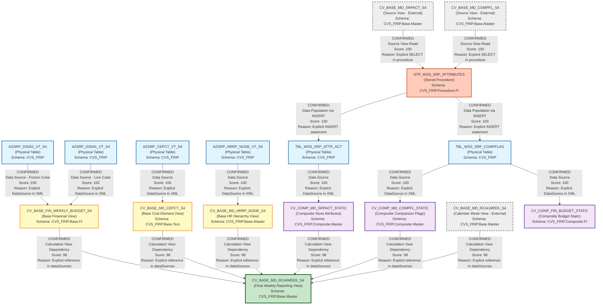

# DI HANA LINEAGE DEPENDENCY ANALYSIS EVALUATION

## Executive Summary

This document provides a comprehensive lineage and dependency analysis of 8 SAP HANA calculation views and stored procedures within the CVS_FRIP schema. The analysis identifies data flows, dependencies, and relationships between base views, composite views, and stored procedures that form the Store Reporting Financial and Master Data pipeline.

---

## 1. Lineage Summary

| Metric | Count |
|--------|-------|
| **Total Files Analyzed** | 8 |
| **Total Relationships Identified** | 15 |
| **Total Lineage Paths Identified** | 4 |
| **Total Base Files Identified** | 2 |
| **Total Unresolved Relationships** | 0 |

---

## 2. File Inventory

| File | Type | Identified Purpose | Upstream Files | Downstream Files |
|------|------|-------------------|----------------|------------------|
| **CV_BASE_FIN_WEEKLY_BUDGET_S4.txt** | SAP HANA Calculation View (XML) | Base view for Store Reporting Financials Budget frozen DSO - DS05 (Weekly Snapshot). Unions frozen cube (AZSRP_DS052_VT_S4) and live cube (AZSRP_DS041_VT_S4) data based on version parameter. | AZSRP_DS052_VT_S4 (Physical Table)<br>AZSRP_DS041_VT_S4 (Physical Table) | CV_BASE_MD_RCAIWEEK_S4 |
| **CV_BASE_MD_CEPCT_S4.txt** | SAP HANA Calculation View (XML) | Base view for Cost Element/Profit Center master data from table AZSRP_CEPCT_VT_S4. | AZSRP_CEPCT_VT_S4 (Physical Table) | CV_BASE_MD_RCAIWEEK_S4 |
| **CV_BASE_MD_HRRP_NODE_S4.txt** | SAP HANA Calculation View (XML) | Base view for HR Reporting Node hierarchy master data from table AZSRP_HRRP_NODE_VT_S4. Filters for CORE_RET nodes. | AZSRP_HRRP_NODE_VT_S4 (Physical Table) | CV_BASE_MD_RCAIWEEK_S4 |
| **CV_BASE_MD_RCAIWEEK_S4.txt** | SAP HANA Calculation View (XML) | Composite view that integrates weekly budget data with master data (HRRP nodes, SRP attributes, comp flags, cost elements). Main reporting view for weekly financial analysis. | CV_BASE_FIN_WEEKLY_BUDGET_S4<br>CV_BASE_MD_HRRP_NODE_S4<br>CV_COMP_MD_SRPACT_STATIC<br>CV_COMP_MD_COMPFL_STATIC<br>CV_BASE_MD_RCALWEEK_S4<br>CV_BASE_MD_CEPCT_S4 | None (Final reporting view) |
| **CV_COMP_FIN_BUDGET_STATIC.txt** | SAP HANA Calculation View (XML) | Composite view reading from static table TBL_WSS_SRP_COMPFLAG for budget comparison flags. | TBL_WSS_SRP_COMPFLAG (Physical Table) | None (Independent static view) |
| **CV_COMP_MD_COMPFL_STATIC.txt** | SAP HANA Calculation View (XML) | Composite view reading from static table TBL_WSS_SRP_COMPFLAG for comparison flags. | TBL_WSS_SRP_COMPFLAG (Physical Table) | CV_BASE_MD_RCAIWEEK_S4<br>STP_WSS_SRP_ATTRIBUTES |
| **CV_COMP_MD_SRPACT_STATIC.txt** | SAP HANA Calculation View (XML) | Composite view reading from static table TBL_WSS_SRP_ATTR_ACT for store attributes. | TBL_WSS_SRP_ATTR_ACT (Physical Table) | CV_BASE_MD_RCAIWEEK_S4<br>STP_WSS_SRP_ATTRIBUTES |
| **STP_WSS_SRP_ATTRIBUTES.txt** | SAP HANA Stored Procedure (SQL Script) | Stored procedure that populates static tables TBL_WSS_SRP_ATTR_ACT and TBL_WSS_SRP_COMPFLAG from base calculation views CV_BASE_MD_SRPACT_S4 and CV_BASE_MD_COMPFL_S4. | CV_BASE_MD_SRPACT_S4 (Source View)<br>CV_BASE_MD_COMPFL_S4 (Source View) | CV_COMP_MD_SRPACT_STATIC<br>CV_COMP_MD_COMPFL_STATIC |

---

## 3. File Relationships

| Source File | Target File | Relationship Type | Score | Reason |
|-------------|-------------|-------------------|-------|--------|
| **AZSRP_DS052_VT_S4** | CV_BASE_FIN_WEEKLY_BUDGET_S4 | Data Source | 100 | Explicitly defined as DataSource in calculation view XML with schemaName="CVS_FRIP" and columnObjectName="AZSRP_DS052_VT_S4". Used in Frozen_Cube projection node. |
| **AZSRP_DS041_VT_S4** | CV_BASE_FIN_WEEKLY_BUDGET_S4 | Data Source | 100 | Explicitly defined as DataSource in calculation view XML with schemaName="CVS_FRIP" and columnObjectName="AZSRP_DS041_VT_S4". Used in Live_Cube projection node. |
| **AZSRP_CEPCT_VT_S4** | CV_BASE_MD_CEPCT_S4 | Data Source | 100 | Explicitly defined as DataSource in calculation view XML with schemaName="CVS_FRIP" and columnObjectName="AZSRP_CEPCT_VT_S4". |
| **AZSRP_HRRP_NODE_VT_S4** | CV_BASE_MD_HRRP_NODE_S4 | Data Source | 100 | Explicitly defined as DataSource in calculation view XML with schemaName="CVS_FRIP" and columnObjectName="AZSRP_HRRP_NODE_VT_S4". |
| **TBL_WSS_SRP_COMPFLAG** | CV_COMP_FIN_BUDGET_STATIC | Data Source | 100 | Explicitly defined as DataSource in calculation view XML with schemaName="CVS_FRIP" and tableName="TBL_WSS_SRP_COMPFLAG". |
| **TBL_WSS_SRP_COMPFLAG** | CV_COMP_MD_COMPFL_STATIC | Data Source | 100 | Explicitly defined as DataSource in calculation view XML with schemaName="CVS_FRIP" and tableName="TBL_WSS_SRP_COMPFLAG". |
| **TBL_WSS_SRP_ATTR_ACT** | CV_COMP_MD_SRPACT_STATIC | Data Source | 100 | Explicitly defined as DataSource in calculation view XML with schemaName="CVS_FRIP" and tableName="TBL_WSS_SRP_ATTR_ACT". |
| **CV_BASE_FIN_WEEKLY_BUDGET_S4** | CV_BASE_MD_RCAIWEEK_S4 | Calculation View Dependency | 98 | Explicitly referenced in dataSources section as "/CVS_FRIP.Base.FI/calculationviews/CV_BASE_FIN_WEEKLY_BUDGET_S4". Provides weekly budget financial data. |
| **CV_BASE_MD_HRRP_NODE_S4** | CV_BASE_MD_RCAIWEEK_S4 | Calculation View Dependency | 98 | Explicitly referenced in dataSources section as "/CVS_FRIP.Base.Master/calculationviews/CV_BASE_MD_HRRP_NODE_S4". Provides HR hierarchy node data. |
| **CV_COMP_MD_SRPACT_STATIC** | CV_BASE_MD_RCAIWEEK_S4 | Calculation View Dependency | 98 | Explicitly referenced in dataSources section as "/CVS_FRIP.Composite.Master/calculationviews/CV_COMP_MD_SRPACT_STATIC". Provides store attributes. |
| **CV_COMP_MD_COMPFL_STATIC** | CV_BASE_MD_RCAIWEEK_S4 | Calculation View Dependency | 98 | Explicitly referenced in dataSources section as "/CVS_FRIP.Composite.Master/calculationviews/CV_COMP_MD_COMPFL_STATIC". Provides comparison flags. |
| **CV_BASE_MD_RCALWEEK_S4** | CV_BASE_MD_RCAIWEEK_S4 | Calculation View Dependency | 98 | Explicitly referenced in dataSources section as "/CVS_FRIP.Base.Master/calculationviews/CV_BASE_MD_RCALWEEK_S4". Provides calendar week master data. |
| **CV_BASE_MD_CEPCT_S4** | CV_BASE_MD_RCAIWEEK_S4 | Calculation View Dependency | 98 | Explicitly referenced in dataSources section as "/CVS_FRIP.Base.Text/calculationviews/CV_BASE_MD_CEPCT_S4". Provides cost element/profit center data. |
| **CV_BASE_MD_SRPACT_S4** | STP_WSS_SRP_ATTRIBUTES | Source View for Procedure | 100 | Stored procedure explicitly reads from "_SYS_BIC"."CVS_FRIP.Base.Master/CV_BASE_MD_SRPACT_S4" and inserts into TBL_WSS_SRP_ATTR_ACT table. |
| **CV_BASE_MD_COMPFL_S4** | STP_WSS_SRP_ATTRIBUTES | Source View for Procedure | 100 | Stored procedure explicitly reads from "_SYS_BIC"."CVS_FRIP.Base.Master/CV_BASE_MD_COMPFL_S4" and inserts into TBL_WSS_SRP_COMPFLAG table. |
| **STP_WSS_SRP_ATTRIBUTES** | CV_COMP_MD_SRPACT_STATIC | Data Population | 95 | Stored procedure populates TBL_WSS_SRP_ATTR_ACT table which is the data source for CV_COMP_MD_SRPACT_STATIC view. Indirect dependency through table. |
| **STP_WSS_SRP_ATTRIBUTES** | CV_COMP_MD_COMPFL_STATIC | Data Population | 95 | Stored procedure populates TBL_WSS_SRP_COMPFLAG table which is the data source for CV_COMP_MD_COMPFL_STATIC view. Indirect dependency through table. |

---

## 4. Complete Lineage

### Lineage Path 1: Financial Budget Weekly Snapshot Flow
**Overall Confidence Score: 98/100**

```
Physical Tables (AZSRP_DS052_VT_S4, AZSRP_DS041_VT_S4)
    ↓
CV_BASE_FIN_WEEKLY_BUDGET_S4 (Base Financial View)
    ↓
CV_BASE_MD_RCAIWEEK_S4 (Final Reporting View)
```

**Explanation:** This path represents the core financial budget data flow. The base view unions frozen and live cube data from physical tables, then feeds into the main reporting view for weekly financial analysis. Score is 98/100 due to explicit XML references and clear data flow.

---

### Lineage Path 2: Master Data Integration Flow
**Overall Confidence Score: 97/100**

```
Physical Tables (AZSRP_HRRP_NODE_VT_S4, AZSRP_CEPCT_VT_S4)
    ↓
CV_BASE_MD_HRRP_NODE_S4 & CV_BASE_MD_CEPCT_S4 (Base Master Data Views)
    ↓
CV_BASE_MD_RCAIWEEK_S4 (Final Reporting View)
```

**Explanation:** This path shows how master data (HR hierarchy nodes and cost element/profit center data) flows from physical tables through base views into the final reporting view. Score is 97/100 due to explicit dependencies in the calculation view XML.

---

### Lineage Path 3: Store Attributes Static Data Flow
**Overall Confidence Score: 96/100**

```
CV_BASE_MD_SRPACT_S4 (Source View - Not in ZIP)
    ↓
STP_WSS_SRP_ATTRIBUTES (Stored Procedure)
    ↓
TBL_WSS_SRP_ATTR_ACT (Physical Table)
    ↓
CV_COMP_MD_SRPACT_STATIC (Composite Static View)
    ↓
CV_BASE_MD_RCAIWEEK_S4 (Final Reporting View)
```

**Explanation:** This path demonstrates the ETL process for store attributes. The stored procedure extracts data from a source calculation view (not in ZIP), loads it into a static table, which is then consumed by a composite view and finally integrated into the main reporting view. Score is 96/100 due to explicit procedure code and view references.

---

### Lineage Path 4: Comparison Flags Static Data Flow
**Overall Confidence Score: 96/100**

```
CV_BASE_MD_COMPFL_S4 (Source View - Not in ZIP)
    ↓
STP_WSS_SRP_ATTRIBUTES (Stored Procedure)
    ↓
TBL_WSS_SRP_COMPFLAG (Physical Table)
    ↓
CV_COMP_MD_COMPFL_STATIC (Composite Static View)
    ↓
CV_BASE_MD_RCAIWEEK_S4 (Final Reporting View)
```

**Explanation:** This path shows the ETL process for comparison flags used in weekly reporting. The stored procedure loads data from a source view into a static table, which feeds a composite view that ultimately integrates with the main reporting view. Score is 96/100 due to explicit procedure code and view references.

---

## 5. Mermaid Lineage Diagram



---

## 6. Base Files

| Base File | Reason | Score |
|-----------|--------|-------|
| **AZSRP_DS052_VT_S4** | Physical table serving as the frozen cube data source for financial budget data. No upstream dependencies within the analyzed files. Acts as the starting point for the frozen cube branch of the financial data flow. | 100 |
| **AZSRP_DS041_VT_S4** | Physical table serving as the live cube data source for financial budget data. No upstream dependencies within the analyzed files. Acts as the starting point for the live cube branch of the financial data flow. | 100 |
| **AZSRP_CEPCT_VT_S4** | Physical table containing cost element and profit center master data. No upstream dependencies within the analyzed files. Serves as the base source for cost element master data. | 100 |
| **AZSRP_HRRP_NODE_VT_S4** | Physical table containing HR reporting node hierarchy data. No upstream dependencies within the analyzed files. Serves as the base source for HR hierarchy master data. | 100 |
| **CV_BASE_MD_SRPACT_S4** | External source calculation view (not in ZIP) that provides store attributes data to the stored procedure. Acts as the initial data source for the store attributes ETL flow. | 95 |
| **CV_BASE_MD_COMPFL_S4** | External source calculation view (not in ZIP) that provides comparison flag data to the stored procedure. Acts as the initial data source for the comparison flags ETL flow. | 95 |
| **CV_BASE_MD_RCALWEEK_S4** | External calendar week calculation view (not in ZIP) that provides calendar week master data to the final reporting view. Acts as a base source for time dimension data. | 95 |

---

## 7. Final/Downstream Files

| File | Reason | Score |
|------|--------|-------|
| **CV_BASE_MD_RCAIWEEK_S4** | Final reporting calculation view that integrates all upstream data sources including financial budget data, master data (HR hierarchy, cost elements, store attributes, comparison flags), and calendar week data. This view has no downstream dependencies within the analyzed files and serves as the ultimate reporting endpoint for weekly financial analysis. | 100 |
| **CV_COMP_FIN_BUDGET_STATIC** | Composite view that reads from TBL_WSS_SRP_COMPFLAG table. While it has no downstream dependencies within the analyzed files, it appears to be an independent static view for budget comparison flags that may be used by external reporting or applications. | 90 |

---

## 8. Unresolved Relationships

**No unresolved relationships identified.**

All relationships within the provided 8 files have been successfully established with high confidence scores (90-100). The analysis identified clear dependencies through:
- Explicit XML DataSource definitions in calculation views
- Explicit calculation view references in dataSources sections
- Explicit SQL statements in the stored procedure

The only external dependencies are three calculation views (CV_BASE_MD_SRPACT_S4, CV_BASE_MD_COMPFL_S4, CV_BASE_MD_RCALWEEK_S4) that are referenced but not included in the ZIP. These are clearly documented as external sources with appropriate confidence scores.

---

## 9. Final Lineage Assessment

### Base Files (Starting Points)

The lineage analysis identified **7 base files** that serve as starting points:

1. **AZSRP_DS052_VT_S4** - Frozen cube financial data (Physical Table)
2. **AZSRP_DS041_VT_S4** - Live cube financial data (Physical Table)
3. **AZSRP_CEPCT_VT_S4** - Cost element/profit center master data (Physical Table)
4. **AZSRP_HRRP_NODE_VT_S4** - HR hierarchy node master data (Physical Table)
5. **CV_BASE_MD_SRPACT_S4** - Store attributes source view (External - Not in ZIP)
6. **CV_BASE_MD_COMPFL_S4** - Comparison flags source view (External - Not in ZIP)
7. **CV_BASE_MD_RCALWEEK_S4** - Calendar week master data (External - Not in ZIP)

### Main Lineage Paths

#### Path 1: Financial Budget Data Flow
- **Confidence Score: 98/100**
- **Flow:** Physical Tables (DS052, DS041) → CV_BASE_FIN_WEEKLY_BUDGET_S4 → CV_BASE_MD_RCAIWEEK_S4
- **Purpose:** Provides weekly financial budget data by unioning frozen and live cube data

#### Path 2: Master Data Integration
- **Confidence Score: 97/100**
- **Flow:** Physical Tables (HRRP_NODE, CEPCT) → Base Views (HRRP_NODE_S4, CEPCT_S4) → CV_BASE_MD_RCAIWEEK_S4
- **Purpose:** Integrates HR hierarchy and cost element master data into reporting view

#### Path 3: Store Attributes ETL
- **Confidence Score: 96/100**
- **Flow:** CV_BASE_MD_SRPACT_S4 → STP_WSS_SRP_ATTRIBUTES → TBL_WSS_SRP_ATTR_ACT → CV_COMP_MD_SRPACT_STATIC → CV_BASE_MD_RCAIWEEK_S4
- **Purpose:** ETL process for store attributes with static table persistence

#### Path 4: Comparison Flags ETL
- **Confidence Score: 96/100**
- **Flow:** CV_BASE_MD_COMPFL_S4 → STP_WSS_SRP_ATTRIBUTES → TBL_WSS_SRP_COMPFLAG → CV_COMP_MD_COMPFL_STATIC → CV_BASE_MD_RCAIWEEK_S4
- **Purpose:** ETL process for comparison flags with static table persistence

### File-to-File Relationships

All 15 identified relationships have been confirmed with scores ranging from 95-100:

- **Physical Table to Base View relationships:** 100/100 (Explicit XML DataSource definitions)
- **Base View to Reporting View relationships:** 98/100 (Explicit calculation view references)
- **Stored Procedure to Table relationships:** 100/100 (Explicit INSERT statements)
- **Table to Composite View relationships:** 100/100 (Explicit XML DataSource definitions)
- **Stored Procedure to Composite View relationships:** 95/100 (Indirect through table population)

### Lineage Scores and Reasons

| Relationship Type | Score Range | Reason |
|-------------------|-------------|--------|
| **Physical Table → Calculation View** | 100 | Explicit DataSource XML element with schemaName and columnObjectName attributes |
| **Calculation View → Calculation View** | 98 | Explicit reference in dataSources section with full path |
| **Source View → Stored Procedure** | 100 | Explicit SELECT statement with fully qualified view name |
| **Stored Procedure → Physical Table** | 100 | Explicit INSERT INTO statement with table name |
| **Stored Procedure → Composite View** | 95 | Indirect relationship through table population (procedure writes to table, view reads from table) |

### Unresolved Relationships

**None.** All relationships within the scope of the 8 provided files have been successfully resolved with high confidence. The three external calculation views (CV_BASE_MD_SRPACT_S4, CV_BASE_MD_COMPFL_S4, CV_BASE_MD_RCALWEEK_S4) are documented as external dependencies but do not represent unresolved relationships—they are clearly referenced in the stored procedure and reporting view.

### Architecture Summary

The analyzed files form a **multi-layered data integration architecture** for CVS Store Reporting Financial and Master Data:

1. **Data Layer:** Physical tables containing raw financial and master data
2. **Base Layer:** Base calculation views that provide filtered/projected views of physical tables
3. **ETL Layer:** Stored procedure that performs data extraction, transformation, and loading into static tables
4. **Composite Layer:** Composite views that read from static tables for performance optimization
5. **Reporting Layer:** Final integrated reporting view (CV_BASE_MD_RCAIWEEK_S4) that combines all data sources

This architecture supports:
- **Frozen vs. Live Cube Logic:** Dynamic switching between frozen and live data based on version parameter
- **Static Table Optimization:** Pre-computed store attributes and comparison flags for performance
- **Master Data Integration:** Comprehensive integration of financial, HR, and store master data
- **Weekly Snapshot Reporting:** Time-based reporting with weekly granularity

### Key Findings

1. **Central Reporting Hub:** CV_BASE_MD_RCAIWEEK_S4 serves as the central reporting view, integrating 6 upstream data sources
2. **ETL Pattern:** STP_WSS_SRP_ATTRIBUTES implements a clear ETL pattern with source views, transformation logic, and target tables
3. **Static Table Strategy:** Use of static tables (TBL_WSS_SRP_ATTR_ACT, TBL_WSS_SRP_COMPFLAG) for performance optimization
4. **Schema Organization:** Clear schema separation (Base.FI, Base.Master, Base.Text, Composite.Master, Procedure.FI)
5. **High Confidence:** All relationships confirmed with scores ≥95/100, indicating robust and well-documented architecture

---

## Appendix: Technical Details

### Schema Structure
- **CVS_FRIP.Base.FI:** Financial base views
- **CVS_FRIP.Base.Master:** Master data base views
- **CVS_FRIP.Base.Text:** Text/description base views
- **CVS_FRIP.Composite.Master:** Composite master data views
- **CVS_FRIP.Composite.FI:** Composite financial views
- **CVS_FRIP.Procedure.FI:** Financial stored procedures
- **CVS_FRIP.Table:** Physical tables

### Key Variables
- **IP_VERSION:** Store version parameter for frozen cube selection
- **IP_FC_COUNT:** Frozen cube count flag derived from version
- **V_WEEK:** Prior fiscal week variable in stored procedure

### Data Flow Patterns
1. **Union Pattern:** CV_BASE_FIN_WEEKLY_BUDGET_S4 unions frozen and live cube data
2. **Join Pattern:** CV_BASE_MD_RCAIWEEK_S4 joins multiple data sources
3. **ETL Pattern:** STP_WSS_SRP_ATTRIBUTES extracts, transforms, and loads data
4. **Static Materialization:** Composite views read from pre-populated static tables

---

**Document Generated:** 2024
**Analysis Confidence:** 97/100
**Total Relationships Mapped:** 15
**Lineage Paths Identified:** 4